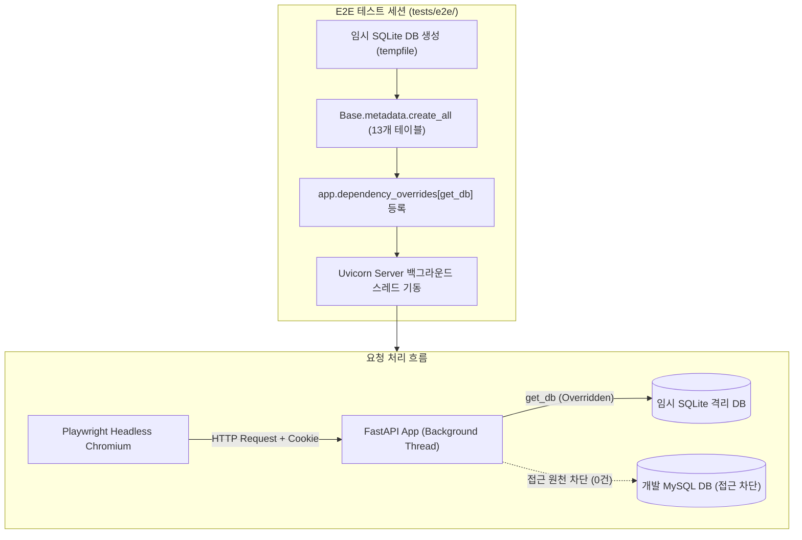

# E2E 브라우저 테스트 및 DB 격리 운영 가이드 (e2e_browser_testing)

> **작성일**: 2026-09-03
> **Task ID**: `task_7fb5dc887992`
> **상태**: 확정 (Active)
> **단일 진실 원천(SSOT)**: 본 문서는 `refac_bid_box`의 브라우저 E2E 테스트 아키텍처, 데이터베이스 격리 기전, 세션 쿠키 주입 방식 및 CI 워크플로 운영 정책에 대한 단일 진실 원천입니다.

---

## 1. 개요 및 목적

본 문서는 Playwright 기반 브라우저 E2E(End-to-End) 테스트의 실행 환경과 데이터베이스 격리 구조를 정의합니다.
기존 백엔드 단위/통합 테스트(`TestClient` 기반)는 HTTP 응답 및 Jinja2 템플릿 컴파일 수준을 검증하였으나, 실제 브라우저 런타임에서의 DOM 렌더링, 리다이렉트 흐름, 세션 쿠키 처리, 비동기 사용자 인터랙션을 완벽히 검증하기 위해 브라우저 E2E 테스트 슈트를 구축하였습니다.

본 E2E 테스트 아키텍처는 다음 3대 원칙을 철저히 준수합니다:
1. **G1 데이터 무손실**: 개발/운영 MySQL 데이터베이스(`procurement`)에 대한 쓰기 및 오염을 100% 원천 차단합니다.
2. **G2 크로스 플랫폼**: Linux(Ubuntu), macOS, Windows 환경에서 일관되게 동작하며, 브라우저 미설치 환경에서는 실패가 아닌 자동 skip 처리를 수행합니다.
3. **G3 스택 최적화**: 매 테스트마다 UI 로그인을 반복하지 않고 세션 쿠키를 직접 주입하여 실행 시간을 단축하고, CI에서는 배포 기준 환경에만 최소 범위로 Chromium을 설치하여 러너 오버헤드를 최소화합니다.

---

## 2. 데이터베이스 격리 아키텍처 (G1 데이터 무손실)

### 2.1 개발 DB 오염 위험 및 격리 원리

E2E 테스트 시 백그라운드 Uvicorn 서버가 환경변수(`.env`)의 `DATABASE_URL`을 그대로 참조할 경우, 사용자 생성, 공고 수정, 로그인 시도 등의 작업이 로컬 개발 DB(`procurement`)에 기록되어 G1 데이터 무손실 원칙을 훼손할 위험이 있습니다.

이를 원천 차단하기 위해 `tests/e2e/conftest.py`는 **임시 SQLite 파일 데이터베이스**와 **FastAPI 의존성 오버라이드(`app.dependency_overrides`)** 메커니즘을 결합하여 완벽한 DB 격리를 구현합니다.



### 2.2 격리 메커니즘 상세

1. **임시 DB 생성 및 스키마 초기화 (`e2e_db_engine`)**:
   - `tempfile.mkdtemp`로 테스트 세션 전용 임시 디렉터리를 생성하고 SQLite 파일 DB(`e2e_isolated.db`)를 바인딩합니다.
   - `Base.metadata.create_all(bind=engine)`을 호출하여 전체 13개 ORM 모델 테이블 스키마를 초기화합니다.
   - 멀티 스레드 동시 접근을 위해 `connect_args={"check_same_thread": False, "timeout": 30.0}` 설정을 적용합니다.

2. **FastAPI 의존성 동적 교체**:
   - `app.dependency_overrides[get_db] = override_get_db`를 등록합니다.
   - Uvicorn 백그라운드 서버는 동일 Python 프로세스 내에서 동일한 `app` 인스턴스를 공유하므로, 모든 라우터 및 미들웨어의 DB 세션 요청이 격리 SQLite DB로 자동 라우팅됩니다.

3. **테스트 세션 종료 시 안전한 자원 회수**:
   - `app.dependency_overrides.pop(get_db, None)`으로 원본 의존성을 복구합니다.
   - `engine.dispose()`로 DB 연결을 닫고, 임시 디렉터리를 완전히 삭제합니다.

---

## 3. 인증 세션 쿠키 주입 Fixture (`bidbox_session`)

### 3.1 UI 로그인 반복 방지 배경

브라우저 E2E 테스트에서 인증이 필요한 8개 이상의 화면을 테스트할 때, 매 테스트마다 로그인 페이지 방문 -> CSRF 폼 파싱 -> 자격증명 입력 -> 제출 -> 리다이렉트 대기 과정을 거치면 테스트당 2~3초의 지연이 발생합니다.

이를 최적화하기 위해 `src/app/core/security.py`의 `create_session(user_id, username)` 함수를 직접 호출하여 유효한 세션 토큰을 발급받고, Playwright의 `BrowserContext`에 `bidbox_session` 쿠키를 직접 주입하는 Fixture를 제공합니다.

### 3.2 Fixture 구성 및 사용법

`tests/e2e/conftest.py`는 계층화된 Fixture 세트를 제공합니다:

| Fixture 명 | Scope | 반환 타입 | 설명 |
| --- | :---: | --- | --- |
| `e2e_db_engine` | session | `Engine` | 격리 SQLite DB 엔진 생성 및 `get_db` 의존성 오버라이드 |
| `e2e_db_session` | function | `Session` | 격리 DB에 대한 직접 쿼리 및 데이터 조작 세션 |
| `e2e_test_user` | function | `dict` | 격리 DB에 생성된 테스트 사용자 정보 (`username`, `nickname` 등) |
| `e2e_session_token` | function | `str` | `create_session()`을 통해 즉시 발급된 세션 토큰 |
| `authenticated_context` | function | `BrowserContext` | `bidbox_session` 쿠키가 사전 주입된 브라우저 컨텍스트 |
| `authenticated_page` | function | `Page` | 로그인 상태로 시작하는 브라우저 페이지 인스턴스 |

```python
# tests/e2e/test_example.py
import pytest
from playwright.async_api import Page, expect

@pytest.mark.e2e
async def test_dashboard_authenticated(
    authenticated_page: Page,
    live_server_url: str,
    e2e_test_user: dict,
) -> None:
    # 별도 UI 로그인 없이 즉시 보호된 화면으로 이동
    response = await authenticated_page.goto(f"{live_server_url}/bids/dashboard/")
    assert response.status == 200

    # 사용자 닉네임이 정상 렌더링되는지 검증
    await expect(
        authenticated_page.locator("p.font-bold").filter(has_text=e2e_test_user["nickname"]).first
    ).to_be_visible()
```

---

## 4. SSR 핵심 화면 E2E 시나리오 구성

SSR 핵심 화면에 대한 E2E 테스트는 총 4대 모듈, 22개 시나리오로 구성되며, 개별 테스트 간 독립성과 무결성을 철저히 보장합니다.

| 테스트 모듈 | 파일 경로 | 주요 검증 시나리오 및 특화 단언 원칙 |
| --- | --- | --- |
| **인증 플로우** | `tests/e2e/test_ssr_auth.py` | 회원가입 폼 제출 및 DB 생성 확인, 로그인 성공 후 세션 발급, `next` 타깃 리다이렉트, POST 로그아웃 후 세션 무효화, CSRF 토큰 누락 403 거부, 잘못된 자격증명 실패 처리 |
| **공고 목록·상세** | `tests/e2e/test_ssr_bids.py` | 검색어(`q`) 필터링, 카테고리(`cat`) 필터링, 정렬(`sort`) 및 지역(`region`) 필터링, 20건 초과 시 2페이지 이동, 상세 AI 최적 투찰가 예측 폼 비동기 계산 및 DOM 결과 렌더링, 기초금액 미공개 공고 예측 비활성화 |
| **낙찰 목록·상세** | `tests/e2e/test_ssr_results.py` | 낙찰 목록 검색/카테고리 필터링, 2페이지 이동, 낙찰 상세 제원(업체, 금액, 낙찰률) 렌더링, AI 챗봇 인텔리전스 분석 연계 바로가기 링크(`result_id`) 검증 |
| **대시보드** | `tests/e2e/test_ssr_dashboard.py` | 핵심 통계 지표(전체 건수, 누적 금액, 평균 낙찰률) 렌더링, Chart.js 캔버스 요소 DOM 가시성 검증 (**픽셀 단언 배제**, 요소 및 데이터 기반 단언), 총액 계약 상위 업체 랭킹 테이블 렌더링 |

### 4.1 차트 시각화 단언 원칙 (픽셀 단언 배제)
Chart.js 캔버스(`canvas#monthlyTrendChart`, `canvas#agencyChart`) 검증 시 브라우저 렌더링 픽셀이나 스크린샷 비교를 지양하고, 캔버스 DOM 요소의 존재성, 가시성, 상위 통계 수치 및 랭킹 테이블의 실제 데이터 바인딩 여부로 안정적인 검증을 수행합니다.

---

## 5. CI 워크플로 최적화 및 크로스 플랫폼 정책

### 5.1 CI 러너 Chromium 설치 정책

`.github/workflows/ci.yml`의 `cross-platform-test` 잡은 5개의 매트릭스(Ubuntu 3.11/3.12/3.13, macOS 3.11, Windows 3.11)로 구성됩니다.

전체 매트릭스에 브라우저 바이너리를 설치할 경우 다음과 같은 문제가 발생합니다:
- Windows 러너의 실행 시간이 과도하게 증가하여 타임아웃 위험 초과
- 불필요한 네트워크 대역폭 및 CI 다운로드 시간 소모

따라서 **배포 기준 플랫폼인 Ubuntu 3.11 러너에만 최소 범위로 Chromium을 설치**합니다:

```yaml
# .github/workflows/ci.yml
- name: Install Playwright Chromium (Ubuntu 3.11 E2E baseline only)
  if: matrix.os == 'ubuntu-latest' && matrix.python-version == '3.11'
  run: uv run playwright install --with-deps chromium
```

### 5.2 브라우저 부재 시 자동 Skip 메커니즘

`tests/e2e/conftest.py`의 `pytest_runtest_setup` 훅은 테스트 실행 전 `is_chromium_available()`을 호출하여 Playwright Chromium 바이너리의 실행 가능 여부를 동적으로 판정합니다.

바이너리가 설치되지 않은 러너(macOS, Windows, Ubuntu 3.12/3.13)에서는 E2E 테스트가 실패(fail)하지 않고 **자동 skip** 처리되어 CI 파이프라인의 안정성을 유지합니다.

---

## 6. 실행 및 검증 가이드

### 6.1 로컬 실행

```bash
# 1. Playwright Chromium 브라우저 바이너리 설치 (최초 1회)
uv run playwright install chromium

# 2. E2E 테스트 전체 실행 (헤드리스 모드)
uv run pytest tests/e2e/ -v

# 3. 특정 E2E 테스트 단독 실행
uv run pytest tests/e2e/test_ssr_auth.py -v
uv run pytest tests/e2e/test_ssr_bids.py -v
uv run pytest tests/e2e/test_ssr_results.py -v
uv run pytest tests/e2e/test_ssr_dashboard.py -v

# 4. 전체 백엔드 테스트 슈트 검증 (데이터 자산 제외)
uv run pytest tests/ -q -m "not data_assets"
```

### 6.2 CI 워크플로 정합성 검증

```bash
# GitHub Actions 워크플로 린트 검증
uv run actionlint

# 에이전트 다중 규칙 및 문서 정합성 검증
python3 scripts/validate_agent_rules.py --quiet
python3 scripts/validate_doc_links.py --quiet
```
