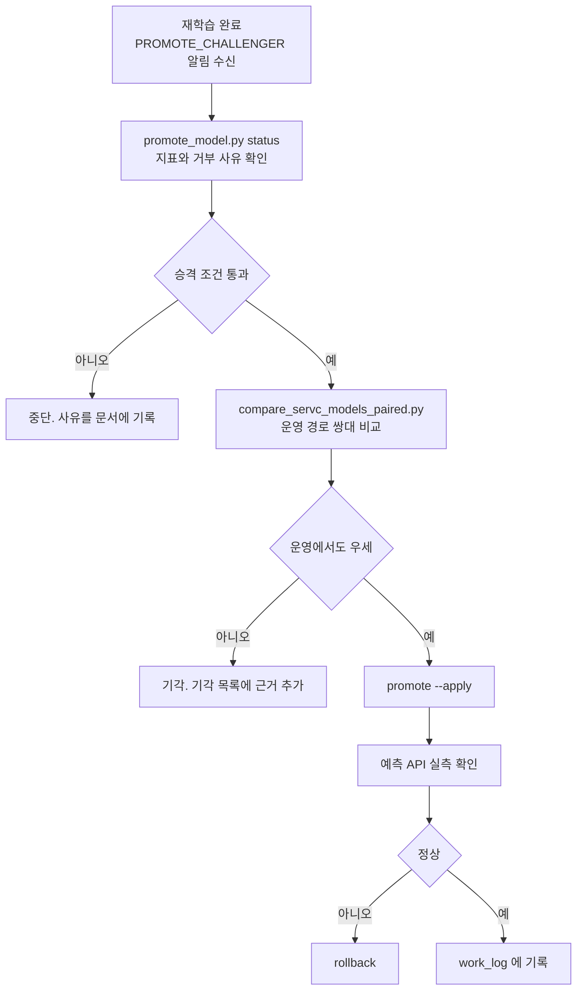

# 모델 승격·롤백 런북

> **작성일**: 2026-08-05
> **버전**: v1.0.0
> **상태**: 도구 구현 완료. 실서빙 적용은 담당자 판단

---

## 1. 왜 수동인가

승격은 자동으로 일어나지 않습니다. 재학습 태스크는 `PROMOTE_CHALLENGER` 권고만 남기고 멈춥니다.

근거는 실측입니다. 2026-08-05 에 `num_leaves` 127 이 승격 게이트 4개를 전부 통과하고 홀드아웃에서 champion 을 이겼으나, 운영 경로 쌍대 비교에서 제곱오차가 유의하게 나빴습니다(t=2.13). 자동 승격이었다면 서비스가 조용히 나빠졌을 것입니다. 홀드아웃 이득이 운영에서 재현되지 않은 사례가 그 시점까지 세 번입니다.

**수동이라는 것과 도구가 없다는 것은 다릅니다.** 이 런북은 그 조작을 절차로 고정합니다.

---

## 2. 명령

| 목적 | 명령 |
| --- | --- |
| 현황 확인 | `uv run python scripts/promote_model.py status` |
| 승격 예행 | `uv run python scripts/promote_model.py promote --model <이름>` |
| 승격 실행 | `uv run python scripts/promote_model.py promote --model <이름> --category <코드> --apply` |
| 롤백 | `uv run python scripts/promote_model.py rollback --model <이름>` |

`--apply` 가 없으면 아무것도 바꾸지 않습니다. 되돌리기 어려운 변경이라 예행이 기본입니다.

---

## 3. 표준 절차



4단계(쌍대 비교)를 건너뛰지 마십시오. 홀드아웃 지표만 보고 승격한 판단이 세 번 뒤집혔습니다. 요약값 비교로 우열을 말하지 말고 같은 공고에 대한 쌍대 검정을 쓰십시오.

---

## 4. 승격 게이트

`src/ml/promotion.py::check_promotion_criteria` 가 집행합니다. 하나라도 걸리면 `--force` 없이는 승격되지 않습니다.

| 조건 | 근거 |
| --- | --- |
| 홀드아웃 분리 성공 | 분리 실패 시 지표가 학습 구간 자기 점수입니다 |
| 시계열 분할 | 무작위 분할은 미래 정보가 학습에 샙니다 |
| 어느 폴드도 R2 > 0.99 아닐 것 | `ssh_hist_premium` 타깃 누수 사고(5폴드 중 3개가 R2 0.9999999999999998) 재발 방지 |
| 서빙 가능한 특징만 요구 | `features.py` 가 만들지 못하는 특징을 요구하면 추론이 상수로 떨어집니다 |

`--force` 는 담당자 확인을 거친 경우에만 씁니다.

### 4.1 champion 은 서빙 슬롯에서 읽습니다 (2026-08-06)

재학습의 비교 대상은 **실제 서빙 중인 모델**입니다(`data/model_files/<모델>/metadata.json` 의 `source_metrics`). 레지스트리의 최신 버전이 아닙니다.

이전에는 "지표를 가진 가장 최근 레지스트리 버전" 을 champion 으로 골랐습니다. 승격된 적 없는 실험 아티팩트가 비교 대상이 되는 구조였고, `quantum_leap_v25_pro` 가 실제로 그 상태였습니다.

| 항목 | 값 |
| --- | --- |
| 서빙본 | 25.1 (원본 이식 가중치, 지표 없음) |
| 당시 비교 대상 | `v_20260802_064546_937` (표본 2개, R2 -35999) |
| 결과 | `improved_r2 = challenger.r2 >= -35999 + 최소개선` 이라 어떤 챌린저든 통과 |

**서빙본에 지표가 없으면 비교 불가로 기각합니다.** 예전 cold start 값(`rmse=inf`)은 어떤 챌린저든 자동으로 이기게 만들었습니다. 주석은 "무조건 승격되지 않도록" 이라 적혀 있었으나 동작은 정반대였습니다.

비교 불가는 조용한 기각이 아니라 경고 알림으로 나갑니다. 게이트가 판단을 못 한 상태이므로 담당자가 직접 봐야 합니다.

### 4.2 서빙 모델 지표 실측 (2026-08-06)

원본에서 이식한 모델은 학습 이력이 없어 지표가 없습니다. 그렇다고 서빙 `metadata.json` 에 지표를 써넣으면 안 됩니다. **그 파일은 체크섬 매니페스트에 포함돼 있어 한 글자만 바꿔도 G1 무손실 검증이 깨집니다.**

실측은 `data/model_metrics/<모델>.json` 사이드카에 씁니다.

```bash
uv run python scripts/measure_serving_model.py --model quantum_leap_v25_pro \
    --category Thng --since 2026-01-01 --sample 3000          # 미리보기
uv run python scripts/measure_serving_model.py --model ... --apply   # 기록
```

측정은 `SingletonPredictor.predict` 를 그대로 태웁니다. 학습 프레임에서 잰 값이 아니라 **사용자가 실제로 받는 예측**을 재므로, 서빙에서만 달라지는 결함이 있으면 이 값에 드러납니다.

사이드카는 **버전이 일치할 때만** 쓰입니다. 모델이 교체됐는데 옛 측정값을 물려주면 없는 근거로 승격을 판단하게 됩니다. 승격이 기록한 `source_metrics` 가 있으면 그쪽이 정본입니다.

#### `quantum_leap_v25_pro` 실측 결과

| 지표 | 값 |
| --- | ---: |
| RMSE | 6.3769 |
| MAE | 5.4942 |
| MAPE | 5.9648% |
| **R2** | **-0.2133** |
| 편향 | -0.0774 |

물품 2026-01-01 이후 3,000건, 실패 0건입니다. **R2 가 음수입니다 — 평균값으로 예측하는 것보다 못합니다.** 편향은 거의 없으므로 값의 중심은 맞으나 변별력이 없습니다.

이 모델은 `quantum_leap_rule` 형 규칙 기반 보조 모델이며 학습된 적이 없습니다. 물품 학습 경로를 세우면 이 값을 넘는 것은 어렵지 않을 것으로 보이나, 승격 판단은 실측 비교를 거쳐야 합니다.

2026-08-06에 784,266행으로 재학습한 `v_20260806_043408_749`를 운영 쌍대
검증 후 승격했습니다. 승격 후 전체 특징 서빙 측정 3,000건에서 MAE 2.8958,
R2 0.4160이었으며 상세는
[`thng_retraining_20260806.md`](../design/thng_retraining_20260806.md)에 기록했습니다.

---

## 5. 롤백

승격은 직전 서빙본을 `data/model_backups/<모델명>/` 으로 옮긴 뒤 교체합니다. 롤백은 그 백업본을 서빙 자리로 되돌리고, 물러난 현재 서빙본을 백업 자리에 넣습니다.

따라서 **롤백은 되돌릴 수 있습니다.** 잘못 되돌렸으면 같은 명령을 한 번 더 실행하면 제자리입니다. 보관되는 것은 직전 한 세대뿐입니다.

승격 도중 실패하면 자동으로 직전 서빙본이 복원됩니다. 반쯤 쓰인 디렉터리를 남기면 다음 기동에서 모델 로드가 깨지기 때문입니다.

---

## 6. 알림과의 연결

`PROMOTE_CHALLENGER` 판정이 나오면 `src/tasks/notifier.py` 가 웹훅으로 두 버전의 지표와 이 런북의 명령을 함께 보냅니다. 정상 기각은 보내지 않습니다. 상세는 [`docs/design/mlops_notification_20260805.md`](../design/mlops_notification_20260805.md).

`MLOPS_WEBHOOK_URL` 이 비어 있으면 알림은 생략되며, 그때는 `promote_model.py status` 로 직접 확인해야 합니다. 2026-08-06 기준 Slack 웹훅이 설정돼 실환경 수신까지 확인된 상태입니다.

---

## 7. 검증

`tests/test_promotion_cli.py` 가 다음을 고정합니다.

| 대상 | 검증 |
| --- | --- |
| `--apply` 없는 승격 | 서빙 디렉터리가 생기지 않을 것 |
| 조건 위반 | 예행에서 사유를 출력하고 종료 코드 1 |
| 승격 -> 롤백 | 직전 버전으로 복원될 것 |
| 롤백 두 번 | 제자리로 돌아올 것 |
| 백업 없음 | 명확한 사유와 함께 실패할 것 |
| 분위 아티팩트 | `model_q*.bin` 이 함께 복사될 것 |
