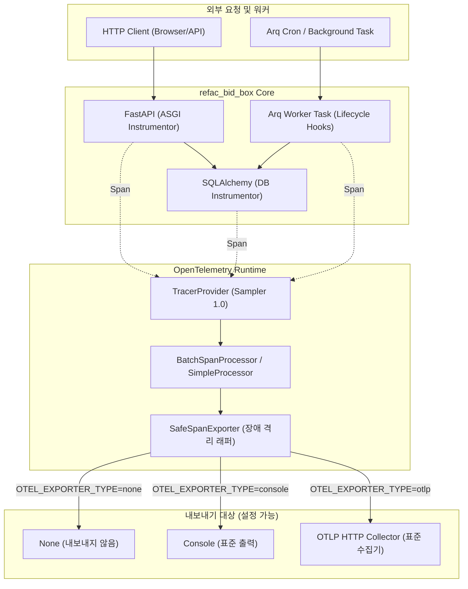

# OpenTelemetry 관측성 및 분산 추적 가이드

> **작성일**: 2026-09-03
> **상태**: 구현 완료 (계측 배선)
> **버전**: v1.0.0
> **문서 유형**: 운영 및 아키텍처 가이드

---

## 1. 개요 및 설계 원칙

본 문서는 `refac_bid_box`의 요청 지연 원인 식별 및 장애 진단을 위한 OpenTelemetry 기반 분산 추적(Distributed Tracing) 계측 아키텍처와 운영 지침을 정의합니다.

### 1.1 핵심 설계 원칙

1. **벤더 중립성**: 특정 상용 모니터링 벤더 SDK(Datadog, New Relic 등)에 종속되지 않고, 표준 OpenTelemetry API/SDK 및 표준 OTLP(OpenTelemetry Protocol) 프로토콜을 사용합니다.
2. **비활성화 기본값 및 무비용(Zero Overhead)**: 기본값은 비활성화(`OTEL_ENABLED=false`)이며, 비활성 시에는 TracerProvider 할당 및 span 생성 등의 연산이 일절 수행되지 않아 개발 및 테스트 환경에 오버헤드를 발생시키지 않습니다.
3. **핵심 3개 계층 전수 계측**: HTTP 요청(ASGI/FastAPI), 데이터베이스 질의(SQLAlchemy), 비동기 백그라운드 태스크(Arq 워커) 3개 계층의 지연과 오류를 일관된 형식으로 추적합니다.
4. **수집 실패 격리(Resilience)**: 백엔드 수집기(Collector) 장애나 네트워크 단절 시에도 애플리케이션 요청이 지연되거나 중단되지 않도록 보호하며, 내보내기 실패 상태는 로그와 상태 함수로 관측 가능하게 기록합니다.
5. **보안 및 비밀 누출 방지**: 데이터베이스 접속 비밀번호, 인증 토큰, 쿠키, 세션 등 민감 정보가 trace span 속성에 절대 포함되지 않도록 원천 필터링합니다.

---

## 2. 계측 아키텍처



---

## 3. 환경 변수 및 설정 가이드

관측성 동작은 `.env` 환경 변수와 `src/app/core/config.py`의 `Settings`를 통해 단일 플래그로 제어됩니다.

| 환경 변수명 | 기본값 | 허용 값 | 설명 |
| --- | --- | --- | --- |
| `OTEL_ENABLED` | `false` | `true`, `false` | OpenTelemetry 계측 활성화 여부. 비활성 시 계측 비용 0 |
| `OTEL_SERVICE_NAME` | `refac_bid_box` | 문자열 | 분산 추적 상에 표시될 서비스 식별 이름 |
| `OTEL_EXPORTER_TYPE` | `none` | `none`, `console`, `otlp` | Span 내보내기 대상 유형 |
| `OTEL_EXPORTER_OTLP_ENDPOINT` | `""` | URL 문자열 | OTLP HTTP 수집기 엔드포인트 (예: `http://localhost:4318/v1/traces`) |
| `OTEL_SAMPLING_RATIO` | `1.0` | `0.0` ~ `1.0` | 트레이스 샘플링 비율 (1.0 = 100% 수집) |

---

## 4. 계층별 계측 대상 및 Span 속성 목록

### 4.1 HTTP 계층 (FastAPI / ASGI)

FastAPI 요청 진입부터 응답 반환까지의 전체 수명 주기를 계측합니다.

| 속성명 (Span Attribute) | 설명 | 예시 | 민감 정보 여부 |
| --- | --- | --- | --- |
| `http.method` | HTTP 메서드 | `GET`, `POST` | 안전 (기록) |
| `http.route` | 등록된 라우트 템플릿 | `/api/v1/bids/{bid_id}` | 안전 (기록) |
| `http.status_code` | HTTP 응답 상태 코드 | `200`, `404`, `500` | 안전 (기록) |
| `http.target` | 요청 URI 경로 | `/api/v1/health` | 안전 (기록) |
| `http.scheme` | 프로토콜 스킴 | `http`, `https` | 안전 (기록) |
| `http.flavor` | HTTP 버전 | `1.1` | 안전 (기록) |
| `http.user_agent` | 클라이언트 식별자 | `Mozilla/5.0...` | 안전 (기록) |
| `Authorization`, `Cookie` | 인증 및 세션 헤더 | - | **제외 (절대 미기록)** |

### 4.2 데이터베이스 계층 (SQLAlchemy)

MySQL 쿼리 수행 및 연결(connect) 구간의 지연과 오류를 계측합니다.

| 속성명 (Span Attribute) | 설명 | 예시 | 민감 정보 여부 |
| --- | --- | --- | --- |
| `db.system` | 데이터베이스 시스템 종류 | `mysql`, `sqlite` | 안전 (기록) |
| `db.name` | 데이터베이스 스키마 이름 | `procurement` | 안전 (기록) |
| `db.statement` | 실행된 SQL 구문 템플릿 | `SELECT 1`, `SELECT * FROM bid_items WHERE id = %s` | 안전 (파라미터 값 제외) |
| `net.peer.name` | 데이터베이스 호스트 주소 | `localhost`, `db` | 안전 (기록) |
| `net.peer.port` | 데이터베이스 포트 | `3306` | 안전 (기록) |
| `db.user` | 접속 데이터베이스 계정명 | `root` | 안전 (기록) |
| `db.password` | 접속 비밀번호 | - | **제외 (URL 마스킹 처리)** |

### 4.3 백그라운드 태스크 계층 (Arq Worker)

수집, 색인, 모델 검증, 재학습 등 장시간 실행 작업의 시작/종료/오류를 계측합니다.

| 속성명 (Span Attribute) | 설명 | 예시 | 민감 정보 여부 |
| --- | --- | --- | --- |
| `task.name` | Arq 태스크 함수 이름 | `collect_bids_task`, `manual_retrain_task` | 안전 (기록) |
| `task.id` | Arq 작업 식별자 | `job_971584ddb4a0` | 안전 (기록) |
| `task.try` | 태스크 재시도 회차 | `1`, `2` | 안전 (기록) |
| `task.system` | 태스크 큐 시스템 식별자 | `arq` | 안전 (기록) |
| `task.param.*` | 태스크 파라미터 (비민감 키) | `task.param.model=servc` | 필터링 후 안전한 키만 기록 |
| `password`, `secret`, `token` | 인자에 포함된 비밀 파라미터 | - | **제외 (`_is_sensitive_key` 차단)** |

---

## 5. 비밀 정보 보호 정책 (Security & Privacy)

분산 추적 시스템에 시스템 자격증명이나 개인정보가 유출되는 사고를 방지하기 위해 다음 규칙을 강제합니다:

1. **민감 키 자동 필터링**: `password`, `secret`, `token`, `key`, `auth`, `credential`, `cookie`, `session`, `private` 단어가 포함된 키는 span 속성에서 자동 제외됩니다.
2. **SQLAlchemy 쿼리 파라미터 미바인딩**: SQL 구문 원문 템플릿만 남기며, 쿼리에 바인딩되는 실제 파라미터 값은 span 속성에 남기지 않습니다.
3. **HTTP 인증 헤더 수집 비활성화**: `Authorization`, `Cookie`, `Set-Cookie` 등의 헤더는 캡처 대상에서 명시적으로 제외됩니다.

---

## 6. 장애 격리 및 관측성 상태 (SafeSpanExporter)

원격 OTLP 수집기(Collector) 장애나 네트워크 지연이 본 애플리케이션의 가용성에 영향을 주지 않도록 `SafeSpanExporter` 래퍼를 적용했습니다.

### 6.1 동작 방식
- **비동기 일괄 전송**: `BatchSpanProcessor`를 사용하여 백그라운드 워커 스레드에서 내보내기를 수행하므로 HTTP 요청 처리 루프에 블로킹이 발생하지 않습니다.
- **예외 차단**: Exporter 내부에서 `ConnectionRefusedError`, `TimeoutError`, HTTP 5xx 등이 발생해도 예외를 내부에서 흡수하며 상위 프로세스로 전파하지 않습니다.
- **오류 상태 기록**: 실패 시 카운터를 증가시키고 `logger.warning`으로 오류 사유를 출력하며, `get_observability_status()` 함수에 마지막 에러 내역을 보존합니다.

### 6.2 상태 조회 함수
```python
from src.app.core.observability import get_observability_status

status = get_observability_status()
# 반환 예시:
# {
#     "enabled": True,
#     "initialized": True,
#     "service_name": "refac_bid_box",
#     "exporter_type": "otlp",
#     "endpoint": "http://localhost:4318/v1/traces",
#     "spans_exported": 1520,
#     "export_errors": 0,
#     "last_export_error": None,
#     "last_export_at": "2026-09-03T08:20:00+00:00",
#     "instrumentations": {
#         "fastapi": True,
#         "sqlalchemy": True,
#         "arq": True
#     }
# }
```

---

## 7. 미결 사항 (Pending)

본 작업 범위에서는 관측성 계측(Instrumentation) 인프라 배선만을 다루며, 아래 항목은 관측성 백엔드가 최종 선정된 이후 구성하도록 미결로 둡니다:

| 항목 | 상태 | 향후 계획 |
| --- | --- | --- |
| **관측성 백엔드 선정** | 미결 (Pending) | Prometheus, Grafana Tempo, Jaeger, 클라우드 관리형 중 선정 |
| **SLO (Service Level Objective)** | 미결 (Pending) | 백엔드 저장소 선정 후 P95/P99 엔드포인트별 응답 지연 목표치 설정 |
| **알람 규칙 (Alert Rules)** | 미결 (Pending) | Alertmanager / Grafana Alerting 연동을 통한 에러율/지연 임계치 경보 구성 |
