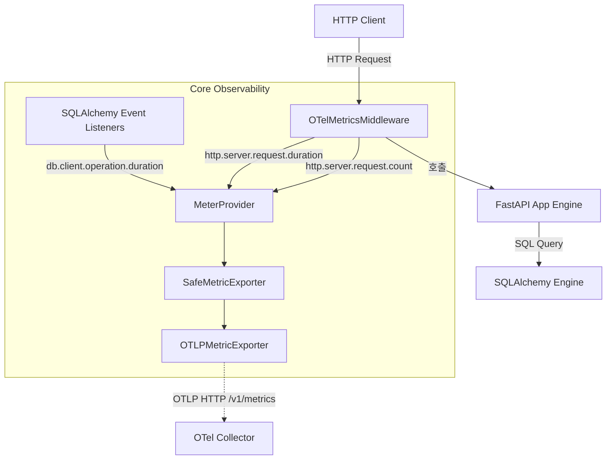

# OpenTelemetry 메트릭 계측 및 관측성 2단계 선행 작업 보고서

> **작성일**: 2026-09-11
> **작성자**: Orca Builder (task_3d80b2899f28)
> **대상 모듈**: [`src/app/core/observability.py`](../../src/app/core/observability.py), [`src/app/core/config.py`](../../src/app/core/config.py), [`tests/test_observability_metrics.py`](../../tests/test_observability_metrics.py)
> **문서 목적**: Prometheus 메트릭 수집(관측성 2단계) 선행 조건인 애플리케이션 내부 메트릭 계측 구현 및 라벨 설계, 잔여 과업을 기록합니다.

---

## 1. 개요 및 배경

본 과업은 refac_bid_box 관측성 2단계(Prometheus 메트릭 수집 및 대시보드 구성)의 필수 선행 조건인 애플리케이션 계측 레이어를 구현한 작업입니다.

기존 관측성 1단계에서 구축된 OpenTelemetry Tracing 구조 위에 `MeterProvider`와 OTLP 메트릭 익스포터를 통합 배선하였으며, 외부 의존성을 일절 추가하지 않고 기존 패키지(`opentelemetry-api`, `opentelemetry-sdk`, `opentelemetry-exporter-otlp-proto-http`)를 단일 소스로 활용하였습니다.

또한 `OTEL_ENABLED=False` 환경에서는 어떠한 메트릭 자원(Provider, Exporter, 백그라운드 스레드, 미들웨어)도 할당되지 않고 조기 반환(Early return)되어 런타임 오버헤드 0 원칙을 엄격하게 준수합니다.

---

## 2. 계측 대상 및 표준 규약

OpenTelemetry 표준 시맨틱 컨벤션을 준수하여 3대 핵심 계측기를 등록하였습니다.

### 2.1 계측기 명세

| 계측기 명칭 | 계측기 유형 | 기본 단위 | 설명 | 사용 라벨 (Attributes) |
| --- | --- | :---: | --- | --- |
| `http.server.request.duration` | Histogram | `s` (초) | HTTP 서버 인바운드 요청 처리 소요 시간 | `http.route`, `http.request.method`, `http.response.status_code` |
| `db.client.operation.duration` | Histogram | `s` (초) | SQLAlchemy 데이터베이스 질의 실행 소요 시간 | `db.system`, `db.operation` |
| `http.server.request.count` | Counter | `{request}` | HTTP 서버에서 처리한 누적 요청 수 | `http.route`, `http.request.method`, `http.response.status_code` |

### 2.2 표준 시맨틱 컨벤션 준수 이유

지연(Latency) 측정 지표의 단위를 초(`s`)로 표준화하고 표준 명칭을 유지함으로써, 향후 Prometheus 스크랩 및 Grafana 메트릭 변환 시 별도의 쿼리 수정이나 변환 레이어 없이 표준 대시보드 템플릿과 PromQL 연동이 가능하도록 보장합니다.

---

## 3. 라벨 설계 원칙 및 안전장치

메트릭 시스템에서 고차원 라벨은 Prometheus TSDB의 카디널리티 폭발(Cardinality Explosion) 및 메모리 고갈을 유발하는 주요 원인입니다. 이를 방지하기 위해 엄격한 라벨 정제 원칙을 적용하였습니다.

### 3.1 라벨링 세부 원칙

1. **경로 템플릿 강제 (`http.route`)**:
   - `/api/v1/bids/20260901-0001`과 같은 실제 동적 파라미터가 포함된 경로는 절대 라벨로 사용하지 않습니다.
   - FastAPI의 `APIRoute.path`를 조회하여 `/api/v1/bids/{bid_id}`와 같은 템플릿 문자열만을 라벨로 기록합니다.
   - 404 Not Found 또는 매칭되는 라우트가 없는 임의의 인바운드 URL 요청은 모두 `"unmatched"` 단일 문자열로 수렴시켜 공격자나 스캐너에 의한 카디널리티 증가를 차단합니다.

2. **DB 연산자 제한 (`db.operation`, `db.system`)**:
   - SQL 원문 전체나 WHERE 절 조건, 파라미터는 라벨에 일절 포함하지 않습니다.
   - 사전 정의된 13종의 표준 SQL 명령어(`SELECT`, `INSERT`, `UPDATE`, `DELETE`, `COMMIT`, `ROLLBACK`, `BEGIN`, `CREATE`, `ALTER`, `DROP`, `PRAGMA`, `SHOW`, `SET`)만 추출하고, 그 외 비표준 명령어는 `"OTHER"`로 수렴합니다.
   - `db.system`은 엔진 방언(`mysql`, `sqlite`)만을 명시합니다.

3. **민감값 마스킹 (`_is_sensitive_key`)**:
   - 비밀번호, 토큰, 세션, 개인정보(`password`, `secret`, `token`, `key`, `auth`, `cookie`, `session`, `private` 등) 키 패턴을 포함하는 모든 속성은 라벨 추출 단계에서 사전에 필터링되어 유출을 차단합니다.

4. **익스포터 장애 격리 (`SafeMetricExporter`)**:
   - OTLP 수집기(Collector)의 일시적 다운이나 네트워크 단절로 내보내기가 실패하더라도, 비동기 스레드 및 Safe 래퍼 내부에서 예외를 처리하여 실제 사용자 HTTP 요청이나 데이터베이스 트랜잭션이 실패하지 않도록 격리하였습니다.

---

## 4. 메트릭 아키텍처 다이어그램

---

## 5. 관측성 2단계(Prometheus) 잔여 과업

애플리케이션 OTLP 메트릭 방출, Prometheus 스크랩, HTTP/DB 지연 대시보드 provision,
메트릭 켜짐 예측 API 레이턴시 쌍대 실측까지 완료되었습니다.

| 과업 | 상세 내용 | 상태 |
| --- | --- | --- |
| Collector Prometheus Exporter 활성화 | `docker/otel-collector-config.yaml` 에 `prometheus` exporter(`0.0.0.0:8889`)와 metrics 파이프라인(`otlp` -> `batch` -> `prometheus`)을 추가. traces 파이프라인은 유지 | 완료 |
| Prometheus 컨테이너 배선 | `docker-compose.prod.yml` 에 Prometheus 서비스와 `prometheus_data` 볼륨을 등록. `internal` 전용, 호스트 포트 없음, Collector `expose: ["8889"]` | 완료 |
| Prometheus Scrape 잡 구성 | `docker/prometheus.yml` 이 `otel-collector:8889` 를 15s 간격으로 스크랩 | 완료 |
| Grafana Prometheus 데이터소스 | `docker/grafana/provisioning/datasources/prometheus.yaml` 에 Prometheus 데이터소스 provision | 완료 |
| Grafana HTTP/DB 지연 대시보드 | `docker/grafana/dashboards/http_db_latency.json` 과 dashboards provision. PromQL 은 `http.server.request.duration` / `db.client.operation.duration` / `http.server.request.count` 의 Prometheus 변환명 | 완료 |
| 정식 성능 및 레이턴시 검증 | 예측 API c10 600x3 쌍대 실측. off 최악 P95 48.71ms, on 56.74ms, 둘 다 100ms 한도 통과. [`otel_metrics_latency_ab_20260911.md`](otel_metrics_latency_ab_20260911.md) | 완료 |
