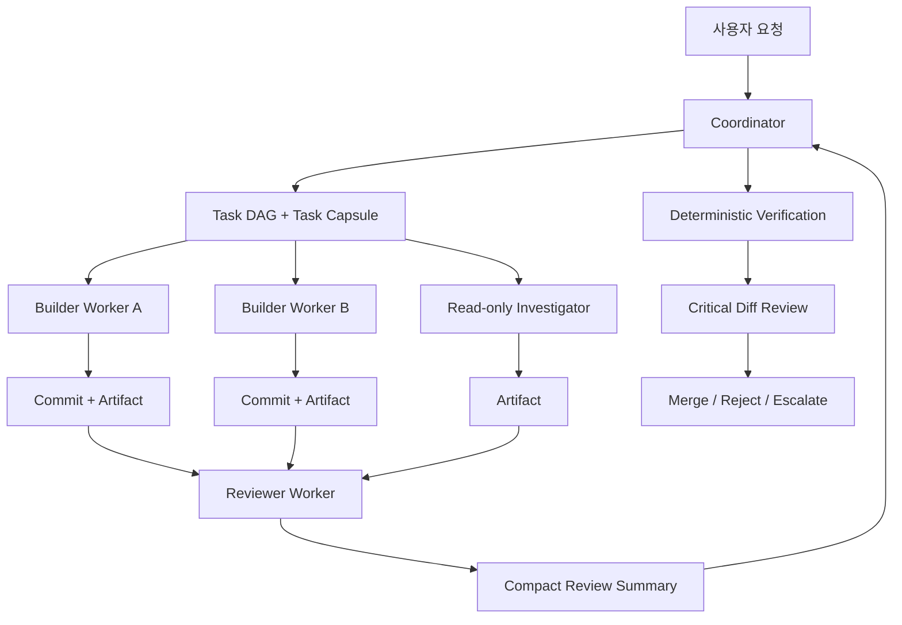
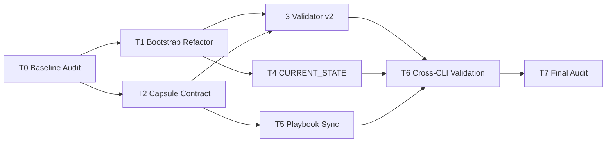

# Orca Coordinator Token Optimization v2

> **작성일**: 2026-08-14  
> **대상 저장소**: `refac_bid_box`  
> **상태**: 구현 승인용 설계안  
> **목표**: 코디네이터의 컨텍스트·추론 토큰을 계획, 검증, 통합, 최종 판정에 집중시키고 탐색·구현·측정·문서화는 워커에게 위임합니다.  
> **비협상 원칙**: 데이터 무손실(G1), train/serve 특징 단일화, 크로스 플랫폼(G2), 실측 기반 G3, Orca Run/Task/`worker_done` 계보는 유지합니다.

---

## 1. 결론

현재 저장소의 Orca 체계는 이미 `Run -> Task -> Dispatch -> worker_done -> coordinator verification -> merge` 구조와 코디네이터 토큰 절감 원칙을 갖고 있습니다. 문제는 **전역 에이전트 부트스트랩 규칙이 Orca 워커 최적화 규칙과 충돌**한다는 점입니다.

현재 `SKILLS.md`는 모든 에이전트가 시작할 때 `README.md`, `docs/design/REFACTORING_DESIGN.md`, `AGENTS.md`, 작업별 문서를 순서대로 읽도록 요구합니다. 반면 `docs/ops/orca_orchestration_playbook.md`와 `.agents/skills/orca-section-coordination/SKILL.md`는 워커 사양을 자족적으로 만들고 `README.md`·`AGENTS.md`·`SKILLS.md` 재독을 금지하도록 요구합니다.

v2의 핵심은 다음 네 가지입니다.

1. **자동 주입 컨텍스트를 최소 공통 규칙만 남깁니다.**
2. **Coordinator Plane과 Worker Plane의 부트스트랩을 분리합니다.**
3. **워커는 프로젝트 전체 문맥 대신 Task Capsule만 받습니다.**
4. **워커의 긴 산출물은 artifact에 남기고 코디네이터에게는 제한된 구조화 요약만 전달합니다.**

최종 목표 구조는 다음과 같습니다.



---

## 2. 현재 저장소에서 확인된 문제

### 2.1 전역 Mandatory Startup과 Orca 워커 규칙이 충돌합니다

현재 `SKILLS.md`의 `MANDATORY STARTUP SEQUENCE`는 모든 에이전트가 다음 문서를 읽도록 요구합니다.

- `README.md`
- `docs/design/REFACTORING_DESIGN.md`
- `AGENTS.md`
- 작업 유형별 추가 문서

반면 다음 두 파일은 Orca 워커에게 반대 원칙을 요구합니다.

- `docs/ops/orca_orchestration_playbook.md`
- `.agents/skills/orca-section-coordination/SKILL.md`

해당 문서들은 Task 사양을 자족적으로 만들고, 확정 사실은 재조사하지 않으며, `README.md`·`AGENTS.md`·`SKILLS.md`를 다시 읽지 않도록 규정합니다.

**v2에서는 Orca 규칙을 예외가 아니라 기본 워커 계약으로 승격합니다.**

### 2.2 오래된 전역 문서가 새 워커에게 잘못된 사실을 주입할 수 있습니다

현재 `README.md`에는 예측 API warm c10 P95가 `199.18ms`, 목표 미달로 남아 있습니다. 그러나 최신 handoff인 `docs/handoff/2026-08-14_late_session_handoff.md`에는 c10 P95 `56.45ms`, 목표 통과로 기록되어 있습니다.

즉 날짜 없는 baseline 문서가 최신 운영 사실보다 뒤처질 수 있습니다. 모든 새 워커가 README를 정본처럼 다시 읽는 구조에서는 **토큰 낭비와 stale-context 위험이 동시에 발생**합니다.

### 2.3 OpenCode 자동 주입이 중복됩니다

현재 `opencode.json`은 다음 두 파일을 모두 `instructions`에 넣습니다.

```json
{
  "instructions": [
    "AGENTS.md",
    "SKILLS.md"
  ]
}
```

동시에 `AGENTS.md`에는 `@SKILLS.md`가 존재합니다. 현재 프로젝트의 자체 문서와 최근 handoff에서도 `AGENTS.md + SKILLS.md` 자동 로드가 작은 컨텍스트 모델/Cerebras 워커에 부담이 된 사례가 기록되어 있습니다.

v2에서는 자동 로드는 `AGENTS.md` 하나로 줄이고 `SKILLS.md`를 필요 시 선택적으로 읽는 인덱스로 변경합니다.

### 2.4 worker_done이 코디네이터 컨텍스트를 다시 키울 수 있습니다

현 규칙은 `worker_done`에 많은 증거를 요구하는 방향은 맞지만, 자유형 긴 보고가 들어오면 위임으로 줄인 토큰을 코디네이터가 다시 소비합니다.

v2에서는 다음을 분리합니다.

- **원시 로그·긴 분석·벤치마크 JSON**: 파일 artifact
- **Orca worker_done**: 최대한 짧은 구조화 요약
- **최종 판정**: 코디네이터의 deterministic verification + critical diff

---

## 3. 설계 목표와 비목표

### 3.1 목표

| 목표 | 기준 |
| --- | --- |
| 자동 부트스트랩 최소화 | 모든 에이전트가 자동으로 읽는 텍스트를 최소 공통 규칙으로 제한 |
| 워커 격리 | 워커는 Task Capsule과 허용된 파일만 사용 |
| 코디네이터 토큰 보호 | 탐색·대량 로그·대량 diff·반복 측정을 워커 컨텍스트에 격리 |
| 최신 사실 단일화 | 날짜별 handoff 대신 `CURRENT_STATE.md`를 현재 상태 정본으로 사용 |
| 검증 유지 | 위임 때문에 품질 게이트를 약화하지 않음 |
| 모델 독립성 | Codex, Claude Code, Antigravity, OpenCode, Cursor에 동일 계약 적용 |
| 저가 모델 활용성 확대 | 좁은 Task Capsule로 65K급 모델도 안전하게 사용 가능하게 함 |

### 3.2 비목표

- 코디네이터 검증을 없애지 않습니다.
- 90% 이상 무조건적인 토큰 절감을 목표로 하지 않습니다.
- 워커에게 merge 권한을 주지 않습니다.
- 공유 DB, Docker, ML 학습 장치의 동시 쓰기를 허용하지 않습니다.
- 기존 Orca Run/Task/Dispatch/`worker_done` 계보를 제거하지 않습니다.
- G1/G2/G3 품질 게이트를 완화하지 않습니다.

---

## 4. 역할별 컨텍스트 계층

### 4.1 Layer 0: 모든 에이전트 자동 로드

자동 로드 대상은 **`AGENTS.md` 하나**를 원칙으로 합니다.

`AGENTS.md`에는 다음만 남깁니다.

- 프로젝트 한 문단 설명
- 데이터 무손실 등 non-negotiable
- 코드·Git의 절대 금지 규칙
- Orca coordination 적용 조건
- 역할별 bootstrap 선택 규칙
- `CURRENT_STATE.md`와 skill 위치 안내

다음은 자동 로드하지 않습니다.

- 전체 README
- 743줄 규모의 리팩토링 설계서
- 날짜별 handoff
- 전체 skill index 본문
- 전체 Orca playbook

### 4.2 Layer 1A: Coordinator bootstrap

Coordinator가 새 세션에서 기본으로 읽는 파일은 다음으로 제한합니다.

1. 자동 로드된 `AGENTS.md`
2. `docs/context/CURRENT_STATE.md`
3. `.agents/skills/project-orchestrator/SKILL.md` 또는 현재 작업에 필요한 skill 하나
4. Orca 다중 섹션 작업일 때만 `.agents/skills/orca-section-coordination/SKILL.md`

과거 handoff나 `REFACTORING_DESIGN.md`는 **현재 Task의 근거가 부족할 때만 선택 조회**합니다.

### 4.3 Layer 1B: Worker bootstrap

Orca 워커는 다음만 사용합니다.

1. 자동 로드된 최소 `AGENTS.md`
2. 코디네이터가 전달한 `ORCA_TASK_CAPSULE_V2`
3. Task Capsule의 `allowed_read_files`
4. Task Capsule이 명시한 검증 명령

워커에게 다음을 지시합니다.

- `README.md`, `SKILLS.md`, 전체 설계서, 전체 handoff 재독 금지
- 사양에 있는 확정 사실은 재조사 금지
- 허용 파일 외 추가 문맥이 필요하면 먼저 `escalation` 또는 `question`
- 전체 저장소 grep은 기본 금지하고 `search_scope`가 허용할 때만 수행

### 4.4 Layer 1C: Reviewer bootstrap

Reviewer는 구현 워커보다 더 좁게 봅니다.

- Task Capsule
- 변경된 파일 목록
- `git diff` 또는 split diff
- acceptance criteria
- 테스트 결과 요약

Reviewer는 프로젝트 전체 탐색을 하지 않습니다. 결함이 의심되나 diff만으로 판단할 수 없으면 필요한 파일명을 `requested_context`에 적습니다.

---

## 5. 컨텍스트 예산

아래 수치는 운영 목표이며 하드 오류 한계가 아닙니다.

| 항목 | 목표 |
| --- | ---: |
| 자동 주입 공통 규칙 | 8,000자 이하 권장 |
| `CURRENT_STATE.md` | 8,000자 이하 권장 |
| 일반 Task Capsule | 4,000자 이하 권장 |
| 복잡 Task Capsule | 8,000자 이하 권장 |
| worker_done 본문 | 2,000자 이하 권장 |
| Reviewer summary | 2,000자 이하 권장 |
| 한 Reviewer가 보는 diff | 약 20,000자 이하 권장, 초과 시 파일/관심사별 분할 |

핵심 원칙은 **컨텍스트가 커지면 모델을 키우는 것이 아니라 Task를 더 작게 나누는 것**입니다.

---

## 6. `CURRENT_STATE.md` 설계

새 파일:

```text
docs/context/CURRENT_STATE.md
```

이 파일은 날짜별 handoff를 대체하지 않습니다. handoff는 증거와 히스토리이고, `CURRENT_STATE.md`는 **현재 세션이 즉시 알아야 하는 운영 정본**입니다.

### 6.1 필수 섹션

```markdown
# Current Project State

> updated_at: 2026-08-14T...
> source_commit: <main HEAD>

## Gates
- G1: ...
- G2: ...
- G3: ...

## Current Metrics
- predict_c10_p95_ms: 56.45
- ...

## Active Priorities
1. ...
2. ...

## Do Not Repeat
- uvicorn workers 3/4: rejected because ...
- ...

## Active Orca Work
- run/task/owner/dependency summary

## Critical Invariants
- no DB schema mutation
- no model promotion without gate
- ...

## Evidence Pointers
- docs/ops/...
- docs/handoff/...
```

### 6.2 갱신 규칙

- 운영 지표나 gate 판정이 바뀌면 같은 커밋에서 `CURRENT_STATE.md`도 갱신합니다.
- `CURRENT_STATE.md`에는 긴 실험 로그를 넣지 않습니다.
- 수치는 evidence path를 반드시 가집니다.
- 충돌 시 우선순위는 `실제 코드/실측 artifact > CURRENT_STATE > README > 과거 handoff`로 둡니다.
- README는 소개·안정 baseline 중심으로 유지하고 빠르게 변하는 실측값은 `CURRENT_STATE.md`로 이동하는 것을 권장합니다.

---

## 7. Task Capsule v2

### 7.1 목적

Task Capsule은 워커에게 필요한 프로젝트 문맥을 코디네이터가 미리 압축한 **자족적 실행 계약**입니다.

### 7.2 표준 포맷

```yaml
schema: ORCA_TASK_CAPSULE_V2
mode: worker
run_id: <run_id>
task_id: <task_id>
role: builder | investigator | reviewer | benchmarker | documenter

objective: >
  한 문단으로 완료 상태를 정의합니다.

why_now: >
  이 Task가 현재 필요한 이유를 1~3문장으로 적습니다.

ground_truth:
  - fact: "predict c10 P95 is 56.45ms"
    evidence: "docs/ops/..."
    recheck: false
  - fact: "uvicorn workers 3/4 was rejected"
    evidence: "docs/ops/..."
    recheck: false

allowed_read_files:
  - src/...
  - tests/...

allowed_write_files:
  - src/...
  - tests/...

search_scope:
  mode: deny_by_default
  allowed_globs: []

forbidden:
  - "README.md 전체 재독"
  - "SKILLS.md 전체 재독"
  - "docs/design/REFACTORING_DESIGN.md 전체 재독"
  - "DB schema 변경"
  - "main 직접 수정"

shared_resources:
  - resource: docker
    ownership: exclusive | none
  - resource: db
    ownership: exclusive | read_only | none

required_change:
  - "구체적인 변경 1"
  - "구체적인 변경 2"

acceptance:
  - "정확한 완료 조건"

verification_commands:
  - "uv run pytest ..."
  - "python scripts/validate_agent_rules.py"

artifact_paths:
  - "docs/analysis/<task>.md"
  - "data/benchmarks/<task>.json"

escalate_when:
  - "허용 범위 밖 파일 수정이 필요함"
  - "ground_truth와 실제 코드가 충돌함"
  - "새 dependency가 필요함"
  - "데이터 삭제/스키마 변경이 필요함"

return_contract: ORCA_WORKER_DONE_V2
```

### 7.3 Capsule 작성 원칙

1. 이미 확인된 사실은 `ground_truth`에 넣고 `recheck: false`로 둡니다.
2. 워커가 저장소 구조를 탐색해서 목적을 추측하게 하지 않습니다.
3. `allowed_write_files`는 최대한 좁힙니다.
4. 공용 자원 소유권은 기존 Orca dependency 규칙을 유지합니다.
5. 성공/실패를 코디네이터가 한두 명령으로 재검산할 수 있게 합니다.
6. `objective`와 `acceptance`는 분리합니다. 목표가 맞아도 검증을 통과하지 못하면 완료가 아닙니다.

---

## 8. Worker Done v2

### 8.1 원칙

`worker_done`은 작업 보고서가 아니라 **코디네이터 판정을 위한 인덱스**입니다.

긴 설명, 원시 로그, 대량 표는 artifact로 보냅니다.

### 8.2 표준 포맷

```json
{
  "schema": "ORCA_WORKER_DONE_V2",
  "task_id": "<task_id>",
  "status": "succeeded|failed|blocked",
  "branch": "feat/...",
  "commit": "abc1234",
  "commit_count": 1,
  "changed_files": [
    "src/...",
    "tests/..."
  ],
  "verification": [
    {"command": "uv run pytest ...", "result": "18 passed"},
    {"command": "python scripts/validate_agent_rules.py", "result": "PASS"}
  ],
  "metrics": {
    "before": null,
    "after": null
  },
  "verdict": "candidate|reject|needs_review",
  "blocking_issues": [],
  "remaining_risks": [],
  "artifacts": [
    "docs/analysis/..."
  ],
  "reproduce": [
    "<코디네이터가 그대로 실행 가능한 명령>"
  ]
}
```

### 8.3 금지

- 터미널 전체 로그를 worker_done에 붙이지 않습니다.
- `git diff` 전체를 worker_done에 붙이지 않습니다.
- 테스트 성공을 자연어로만 주장하지 않습니다.
- 커밋이 필요한 Task에서 `commit_count: 0`이면 `succeeded`를 보내지 않습니다.
- 워커가 merge 가능 여부를 확정하지 않습니다.

---

## 9. Builder -> Reviewer -> Coordinator 구조

현재 저장소 기록상 워커 산출물의 오류가 코디네이터 검증에서 여러 번 발견되었습니다. 따라서 워커 결과를 무검증 신뢰하는 대신 **검증 비용의 일부도 별도 워커에게 위임**합니다.

### 9.1 Builder

Builder는 구현과 targeted test까지만 책임집니다.

### 9.2 Reviewer

Reviewer는 read-only이며 다음 계약으로 동작합니다.

```json
{
  "schema": "ORCA_REVIEW_DONE_V2",
  "task_id": "<task_id>",
  "verdict": "pass|fail|insufficient_context",
  "blocking_issues": [],
  "unverified_claims": [],
  "missing_tests": [],
  "requested_context": [],
  "commands_to_verify": []
}
```

Reviewer는 스타일 선호가 아니라 다음을 우선합니다.

1. acceptance criteria 불충족
2. 회귀 가능성
3. 데이터 무손실 위반
4. train/serve skew
5. concurrency/async 오류
6. 테스트가 주장과 일치하는지
7. Task 범위를 넘어선 수정

### 9.3 Coordinator

Coordinator는 다음에 집중합니다.

- Task 분해와 dependency
- shared resource ownership
- architecture 및 비가역 결정
- deterministic verification 재실행
- Reviewer blocking issue 확인
- 핵심 diff만 직접 검토
- merge/reject/promotion 최종 판정

Coordinator는 일반적인 소스 탐색, 전체 로그 요약, 반복 벤치마크 실행을 직접 수행하지 않습니다.

---

## 10. Deterministic Verification First

워커가 완료되면 코디네이터가 바로 긴 diff를 읽지 않습니다.

### Level 1: 기계 검증

작업별 최소 명령을 먼저 실행합니다.

예:

```bash
git diff --stat main...HEAD
git diff --name-only main...HEAD
uv run pytest <targeted-tests>
python scripts/validate_agent_rules.py
```

운영 코드 Task면 기존 프로젝트 규칙에 따라 필요한 전체/도메인 테스트를 추가합니다.

Level 1이 실패하면 상세 코드 리뷰 전에 Task를 반려합니다.

### Level 2: Reviewer Worker

Task Capsule + diff + test summary를 독립 검토합니다.

### Level 3: Coordinator Critical Review

다음만 직접 읽습니다.

- 새 알고리즘과 핵심 조건문
- 데이터 변형/삭제 경로
- DB/모델 승격/보안 관련 변경
- 공유 자원 및 concurrency 변경
- Reviewer가 지적한 파일/라인
- 테스트가 커버하지 못하는 경계

---

## 11. 모델 라우팅 정책

모델 이름보다 **역할과 실패 비용**을 먼저 봅니다.

| 역할 | 기본 모델 풀 | 추론 수준 원칙 |
| --- | --- | --- |
| Coordinator | 상위 GPT/Claude | Medium 기본, architecture/최종 gate만 High 이상 |
| Builder | Antigravity Gemini Flash | High 기본 |
| Investigator | Gemini Flash / 저가 모델 | Medium~High, read-only |
| Reviewer | 다른 제공자의 강한 모델 | High 권장, read-only |
| Mechanical docs/config | Luna급/무료 모델 | Low~Medium |
| Critical promotion/cutover | Coordinator | High 이상, 필요 시 최상위 |

### 11.1 GPT-5.6 사용 원칙

OpenAI 공식 Codex 모델 가이드는 다음과 같이 구분합니다.

- **Sol**: 복잡하고 개방적인 고가치 작업
- **Terra**: 일상적인 강한 추론·도구 사용의 균형형
- **Luna**: 명확하고 반복 가능한 고용량 작업

reasoning은 **Medium을 균형점으로 시작**하고, 측정된 품질 이득이 있을 때 High/xHigh로 올리며 Max는 가장 어려운 quality-first 작업에만 쓰는 것이 권장됩니다.

공식 문서:

- https://developers.openai.com/codex/models
- https://developers.openai.com/api/docs/guides/latest-model
- https://developers.openai.com/codex/pricing

### 11.2 이 v2 자체를 구현할 때의 권장 GPT

이 설계서는 수정 범위와 acceptance criteria를 미리 고정하므로 구현 작업은 개방형 architecture 탐색보다 **정의된 리팩터링 작업**에 가깝습니다.

따라서 기본 권장은:

```text
GPT-5.6 Terra / Medium
```

입니다.

다음 경우에만 일시적으로 올립니다.

```text
Terra High:
- validate_agent_rules.py의 새 정합성 계약 설계가 애매할 때
- 5개 CLI의 자동 로드 규칙 충돌을 해결할 때
- migration 중 기존 세션 호환성 문제가 발생할 때

Sol High:
- 실제 적용 후 규칙 간 모순이 남아 원인 규명이 어려울 때
- 최종 architecture audit 1회
```

**Sol High를 전체 구현 세션의 기본값으로 사용하지 않습니다.**

---

## 12. 수정 대상 파일

### 12.1 필수 수정

| 파일 | 변경 |
| --- | --- |
| `AGENTS.md` | 최소 공통 규칙 + role bootstrap 분기만 남기도록 축소 |
| `SKILLS.md` | Mandatory Startup 제거, 선택형 skill/context index로 전환 |
| `opencode.json` | `instructions`를 `AGENTS.md` 단일 자동 로드로 축소 |
| `.agents/skills/orca-section-coordination/SKILL.md` | Task Capsule/Worker Done/Reviewer 계약 추가 |
| `.claude/skills/orca-section-coordination/SKILL.md` | 정본 미러 |
| `.opencode/skills/orca-section-coordination/SKILL.md` | 정본 미러 |
| `docs/ops/orca_orchestration_playbook.md` | v2 실행 절차와 schema 반영 |
| `docs/ops/multi_agent_setup.md` | 자동 로드 architecture 갱신 |
| `scripts/validate_agent_rules.py` | 기존 `@SKILLS.md`/OpenCode 이중 주입을 요구하는 검증을 v2 계약으로 변경 |

### 12.2 필수 신규 파일

| 파일 | 목적 |
| --- | --- |
| `docs/context/CURRENT_STATE.md` | 최신 운영 상태 정본 |
| `docs/ops/orca_task_capsule_v2.md` | Task Capsule / worker_done / review schema 정본 |

### 12.3 선택 신규 파일

```text
.agents/templates/task_capsule_v2.yaml
.agents/templates/worker_done_v2.json
.agents/templates/review_done_v2.json
```

템플릿은 사람이 복붙할 가능성이 높다면 추가하고, Orca가 동적으로 생성한다면 문서만 유지해도 됩니다.

---

## 13. `AGENTS.md` 변경 사양

### 13.1 제거/이동

- 최상단 `@SKILLS.md` 자동 import 제거
- 긴 기술 스택 표는 README/설계 문서로 이동 가능
- 세션마다 필요 없는 구축 이력 축소
- 전체 skill 내용이 아니라 위치만 안내

### 13.2 반드시 유지

- G1/G2/G3 비협상 원칙
- dependency 사전 합의
- `.env` 보호
- DB schema 보존
- train/serve 특징 단일화
- main 직접 작업 금지
- merge는 coordinator만 수행
- Orca coordination 적용 조건
- 한국어/이모지 금지 등 프로젝트 고유 규칙

### 13.3 새 역할 분기 예시

```markdown
## Agent Bootstrap Modes

### Coordinator mode
- `docs/context/CURRENT_STATE.md`를 읽습니다.
- 현재 작업에 필요한 skill만 추가로 읽습니다.
- Orca 다중 Task 작업이면 `orca-section-coordination`을 읽습니다.
- 과거 handoff/전체 설계서는 필요할 때만 조회합니다.

### Orca worker mode
- Dispatch된 `ORCA_TASK_CAPSULE_V2`가 작업 문맥의 정본입니다.
- Capsule에 명시되지 않은 README/SKILLS/전체 설계서/과거 handoff를 재독하지 않습니다.
- 허용 범위를 넘어선 문맥 또는 수정이 필요하면 escalation합니다.
```

---

## 14. `SKILLS.md` 변경 사양

파일 목적을 다음과 같이 변경합니다.

현재:

```text
모든 에이전트의 Mandatory Startup Sequence
```

v2:

```text
Coordinator/standalone agent용 선택형 Project Context & Skill Index
```

삭제 또는 변경할 항목:

- `MANDATORY STARTUP SEQUENCE`
- README 전체 읽기 강제
- REFACTORING_DESIGN 전체 읽기 강제
- 세션 시작 체크리스트의 전 문서 읽기 항목

대신 다음을 둡니다.

- 작업 유형 -> 읽을 skill/문서 매핑
- `CURRENT_STATE.md` 안내
- standalone agent가 프로젝트 전체 작업을 맡을 때의 full-context 경로
- Orca worker는 Task Capsule만 따른다는 명시

---

## 15. `opencode.json` 변경 사양

목표:

```json
{
  "instructions": [
    "AGENTS.md"
  ]
}
```

Cerebras provider 설정은 그대로 유지합니다.

이 변경은 **OpenCode/Cerebras의 작은 컨텍스트·TPM 부담을 줄이는 목적**이며 모델 설정 변경과 섞지 않습니다.

---

## 16. `validate_agent_rules.py` v2 계약

현재 validator는 다음을 성공 조건으로 강제합니다.

- `AGENTS.md`에 `@SKILLS.md` 존재
- `opencode.json`에 `AGENTS.md`, `SKILLS.md` 둘 다 존재

v2에서는 이 두 검증을 반대로 바꿔야 합니다.

### 16.1 제거/변경

```text
check_agents_imports_skills()
check_opencode_json()의 SKILLS.md 필수 조건
```

### 16.2 새 검증

권장 검증:

1. `AGENTS.md` 존재 및 핵심 non-negotiable 키워드 포함
2. `AGENTS.md`에 `@SKILLS.md` 자동 import가 **없음**
3. `opencode.json.instructions == ["AGENTS.md"]` 또는 최소한 `SKILLS.md`가 없음
4. `docs/context/CURRENT_STATE.md` 존재
5. `CURRENT_STATE.md`에 `updated_at`, `source_commit`, `G1`, `G2`, `G3`, `Evidence Pointers` 존재
6. Task Capsule v2 문서 존재
7. `.agents/.claude/.opencode` skill mirror 정합성 유지
8. Antigravity rules의 기존 12,000자 제한 유지
9. `AGENTS.md` 권장 크기 상한 경고 추가
10. `CURRENT_STATE.md` 권장 크기 상한 경고 추가

크기 상한은 초기에는 FAIL보다 warning으로 시작해 운영 데이터를 보고 강화합니다.

---

## 17. 구현 Task DAG

이 설계 자체의 적용도 한 에이전트가 저장소 전체를 한 번에 수정하지 않습니다.



### T0 — Baseline Audit

**read-only**

- 현재 auto-load 파일과 크기 기록
- `validate_agent_rules.py --quiet` 결과 기록
- 5개 CLI별 실제 자동 로드 경로 확인
- 현재 `main` HEAD 기록

### T1 — Bootstrap Refactor

수정:

- `AGENTS.md`
- `SKILLS.md`
- `opencode.json`
- 필요 시 `.antigravity/rules.md`, Cursor core rule

### T2 — Capsule Contract

수정/추가:

- `docs/ops/orca_task_capsule_v2.md`
- `.agents/skills/orca-section-coordination/SKILL.md`
- mirrors

### T3 — Validator v2

수정:

- `scripts/validate_agent_rules.py`
- validator 자체 테스트가 존재하면 추가

### T4 — CURRENT_STATE

추가:

- `docs/context/CURRENT_STATE.md`

최신 실측으로 stale README 값을 그대로 복사하지 않습니다.

### T5 — Playbook Sync

수정:

- `docs/ops/orca_orchestration_playbook.md`
- `docs/ops/multi_agent_setup.md`
- 필요하면 `docs/ops/agent_worker_launch_reference.md`

### T6 — Cross-CLI Validation

가능한 CLI에서 짧은 worker task를 실제로 1회씩 실행합니다.

검증 목표:

- 불필요한 전체 문서 재독이 발생하지 않음
- Task Capsule이 실제 프롬프트에 도달함
- worker_done v2가 coordinator에게 도달함
- OpenCode/Cerebras가 이중 instructions 없이 기동함
- 기존 G1/G2/G3 규칙이 누락되지 않음

### T7 — Final Audit

강한 Reviewer가 read-only로 다음만 검토합니다.

- 변경 diff
- validator 결과
- CLI smoke 결과
- non-negotiable 누락 여부
- bootstrap 모순 여부

Coordinator가 최종 merge를 판정합니다.

---

## 18. 구현 중 모델 배정

GPT 주간 예산을 보호하려면 구현 자체도 이 문서가 제안하는 방식으로 진행합니다.

### Coordinator

```text
GPT-5.6 Terra / Medium
```

역할:

- T0~T7 Task 생성
- Capsule 작성
- dependency/ownership
- worker_done 판정
- deterministic verification
- final merge decision

### 주력 Builder

```text
Antigravity Gemini 3.7 Flash High
```

권장 배정:

- T1 Bootstrap Refactor
- T2 Capsule Contract
- T4 CURRENT_STATE
- T5 Playbook Sync

### Validator Builder

```text
Gemini 3.7 Flash High
```

- T3 validator 수정과 테스트

### Reviewer

가능하면 GPT 주간 풀과 다른 제공자를 사용합니다.

```text
Antigravity Claude 계열 또는 강한 Gemini read-only reviewer
```

### GPT를 워커로 추가해야 할 경우

```text
GPT-5.6 Luna / Medium
```

용도:

- 문서 sync
- JSON/template 생성
- 기계적 mirror 확인
- 작은 diff audit

핵심 설계 재판정에는 Luna를 사용하지 않습니다.

---

## 19. 23% 주간 GPT 잔량 기준 운영 규칙

잔여량이 낮을 때는 모델보다 **GPT가 맡는 작업 수를 줄이는 것**이 먼저입니다.

### 권장 예산 정책

| 잔량 | GPT 사용 정책 |
| ---: | --- |
| 50% 이상 | Terra Medium 기본, 중요한 Task는 Sol Medium/High 선택 가능 |
| 25~50% | Terra Medium coordinator, GPT worker 최소화 |
| **10~25%** | **현재 권장: Terra Medium coordinator만 유지, 구현/리뷰는 타 제공자에 위임** |
| 5~10% | Terra/Luna를 최종 통합 판정에만 사용, 새 탐색 금지 |
| 5% 미만 | GPT를 reserve로 유지, merge/gate가 아니면 사용하지 않음 |

현재 23%라면 다음을 금지합니다.

- Sol High를 장시간 coordinator 기본값으로 사용
- GPT worker를 2~3대 병렬로 띄우기
- GPT에게 README/설계서/과거 handoff 전체를 재독시키기
- Ultra를 이번 구현의 기본으로 사용
- 같은 문제를 GPT와 Gemini에게 중복 조사시키기

### 현재 가장 추천하는 조합

```text
Coordinator: GPT-5.6 Terra / Medium
Builder 1~3: Gemini 3.7 Flash High
Reviewer: Antigravity Claude 또는 Gemini의 별도 read-only 세션
GPT fallback worker: GPT-5.6 Luna / Medium
Final architecture exception: GPT-5.6 Sol / High 1회성
```

---

## 20. GPT Coordinator용 구현 프롬프트

다음 프롬프트를 구현 세션의 첫 요청으로 사용할 수 있습니다.

```text
이 저장소에 docs/ops/orca_coordinator_token_optimization_v2.md 설계를 구현하십시오.

당신은 구현 코디네이터입니다.

중요:
- 저장소 전체를 처음부터 재분석하지 마십시오.
- 설계 문서의 T0~T7 DAG를 정본으로 사용하십시오.
- 직접 대량 구현하지 말고 독립 Task를 Orca worker에게 위임하십시오.
- 각 worker에게 ORCA_TASK_CAPSULE_V2 형식의 자족적 사양을 주십시오.
- worker 사양에는 README.md, SKILLS.md, REFACTORING_DESIGN.md, 과거 handoff 전체 재독 금지를 명시하십시오.
- Builder는 가능한 한 Gemini 3.7 Flash High를 사용하십시오.
- GPT worker는 필수인 경우에만 사용하십시오.
- worker_done은 ORCA_WORKER_DONE_V2로 짧게 받고 원시 출력은 artifact path로 남기십시오.
- Builder 결과는 read-only Reviewer를 거친 뒤 deterministic verification을 직접 재실행하십시오.
- merge는 당신만 판정하십시오.
- 데이터/DB/ML serving behavior는 이 작업에서 변경하지 마십시오.
- 새 dependency를 추가하지 마십시오.
- 기존 main의 미관련 변경을 되돌리지 마십시오.

완료 기준:
1. AGENTS.md 자동 컨텍스트가 최소 공통 규칙 중심으로 축소됨
2. SKILLS.md Mandatory Startup이 선택형 index로 변경됨
3. opencode.json이 SKILLS.md를 중복 자동 주입하지 않음
4. CURRENT_STATE.md가 생성되고 최신 증거를 가리킴
5. Task Capsule/worker_done/reviewer v2 계약이 문서와 skill에 반영됨
6. validate_agent_rules.py가 v2 architecture를 검증함
7. skill mirrors가 일치함
8. python scripts/validate_agent_rules.py 통과
9. 관련 테스트 통과
10. 최소 1개의 실제 Orca worker smoke에서 전체 문서 재독 없이 Task Capsule -> worker_done 흐름이 확인됨

각 Task가 끝날 때마다 긴 설명 대신 상태, 커밋, 테스트, 위험만 요약하십시오.
```

---

## 21. 실패·에스컬레이션 정책

워커는 다음 상황에서 스스로 범위를 넓히지 않습니다.

- Task Capsule의 사실과 코드가 충돌
- 허용하지 않은 파일 수정이 필요
- 새 dependency 필요
- DB schema/data mutation 필요
- 다른 Task가 소유한 shared resource가 필요
- acceptance criteria가 모순
- 테스트 실패가 Task 범위 밖 원인으로 보임

이때 `escalation`에 다음만 보냅니다.

```json
{
  "task_id": "...",
  "blocked_by": "...",
  "evidence": ["file:line", "command/result"],
  "minimum_extra_scope": ["필요한 파일/자원"],
  "recommended_action": "..."
}
```

코디네이터가 scope expansion을 승인한 뒤 Capsule을 갱신합니다.

---

## 22. 롤백

이 변경은 애플리케이션 런타임보다 에이전트 운영 규칙에 영향을 줍니다.

롤백 조건:

- Codex/Claude/Antigravity/OpenCode 중 주요 CLI가 필수 규칙을 더 이상 자동 인식하지 못함
- worker가 Task Capsule 없이 실행되는 경로가 발생
- non-negotiable 누락으로 validator가 잡지 못하는 회귀가 발견됨
- 오히려 coordinator가 매 Task마다 규칙을 수동 복사해야 해 토큰이 증가함

롤백 시:

1. v2 변경 commit을 revert하는 별도 브랜치를 만듭니다.
2. 기존 `AGENTS.md`/`SKILLS.md` bootstrap으로 복귀합니다.
3. 실패 CLI와 원인을 artifact로 남깁니다.
4. 전체 v2를 포기하기보다 해당 CLI만 compatibility adapter를 추가하는 방향을 우선 검토합니다.

---

## 23. 성공 지표

v2 도입 전후 최소 5개 대표 Task로 비교합니다.

| 지표 | 기대 방향 |
| --- | --- |
| 워커 첫 유효 작업까지 시간 | 감소 |
| 워커가 읽은 bootstrap 문서 수 | 감소 |
| Task당 coordinator 왕복 횟수 | 감소 |
| coordinator가 직접 읽는 raw log/diff 양 | 감소 |
| worker timeout/idle | 감소 |
| worker 오류 발견률 | Reviewer 도입으로 coordinator 이전 단계에서 증가 |
| 최종 회귀 | 증가하면 안 됨 |
| G1/G2/G3 gate | 기존과 동일 또는 강화 |

토큰 수를 직접 얻을 수 있는 CLI에서는 다음을 추가 기록합니다.

- coordinator input/output/reasoning usage
- worker별 usage
- Task Capsule 길이
- worker_done 길이

직접 토큰 계측이 불가능하면 문자 수, 읽은 파일 수, 왕복 횟수를 proxy로 사용합니다.

---

## 24. 최종 운영 원칙

v2의 핵심은 모델을 더 싼 것으로 바꾸는 것이 아닙니다.

**비싼 모델이 읽어야 하는 정보를 줄이고, 비싼 모델이 내려야 하는 결정만 남기는 것**입니다.

운영 규칙을 한 문장으로 압축하면 다음과 같습니다.

> Coordinator는 목표·경계·게이트를 결정하고, Worker는 좁은 Capsule 안에서 탐색·구현·측정하며, Reviewer는 diff를 공격적으로 검증하고, Coordinator는 기계 검증과 핵심 diff만으로 최종 판정합니다.

이 구조가 안정화되면 GPT 코디네이터는 프로젝트 전체를 반복해서 기억하는 모델이 아니라 **작업 DAG와 품질 게이트를 관리하는 제어면(control plane)**이 됩니다.
