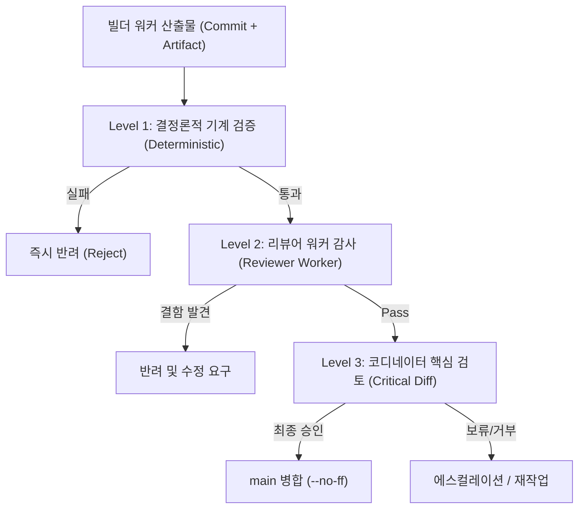

# Orca Task Capsule v2 및 보고 계약 규약

> **작성일**: 2026-08-15
> **버전**: v2.0.0
> **상태**: 확정 정본
> **대상**: Orca 코디네이터, 빌더 워커, 리뷰어 워커, 감사 에이전트
> **상위 설계**: [`orca_coordinator_token_optimization_v2.md`](orca_coordinator_token_optimization_v2.md)
> **관련 문서**: [`orca_orchestration_playbook.md`](orca_orchestration_playbook.md), [`agent_worker_launch_reference.md`](agent_worker_launch_reference.md), [`../../.agents/skills/orca-section-coordination/SKILL.md`](../../.agents/skills/orca-section-coordination/SKILL.md)

---

## 1. 개요 및 목적

Orca Task Capsule v2는 다중 에이전트 협업 환경에서 코디네이터의 컨텍스트 예산을 극대화하고 워커 모델의 불필요한 탐색을 제거하기 위해 정의된 **자족적 실행 계약(Self-Contained Execution Contract)**입니다.

과거 체계에서는 워커가 시작 시 저장소 전역 문서(`README.md`, `SKILLS.md`, `REFACTORING_DESIGN.md`)를 중복 정독하면서 토큰 낭비, TPM 초과, 오래된 baseline 수치로 인한 컨텍스트 오염이 발생했습니다. v2에서는 코디네이터가 작업에 필요한 모든 문맥을 사전에 압축하여 Task Capsule 형태로 워커에 주입하고, 워커는 좁은 실행 범위 내에서 작업을 완수합니다.

### 1.1 핵심 원칙

| 원칙 | 내용 |
| --- | --- |
| **자족적 캡슐 (Self-Contained)** | 워커는 Task Capsule과 지정된 `allowed_read_files`만으로 작업을 완수할 수 있어야 합니다. |
| **기본 거부 탐색 (Deny-by-Default Search)** | 저장소 전체 grep/탐색은 기본 금지되며, `search_scope`에 명시된 경로로 제한됩니다. |
| **컴팩트 보고 (Compact Outcome Index)** | `worker_done` 및 `review_done`은 수천 줄의 로그나 diff를 포함하지 않고 정형화된 JSON 요약만 전달합니다. |
| **수명주기 명령과 아티팩트 분리** | 상세 분석 문서는 파일 아티팩트로 보존하되, Orca 수명주기 완료 통보는 반드시 `orca orchestration send --type worker_done` 명령으로 수행합니다. |
| **3단계 검증 (3-Tier Verification)** | 기계적 결정론 검증 -> 리뷰어 워커 검증 -> 코디네이터 핵심 diff 검토 순으로 검증을 진행합니다. |

---

## 2. Task Capsule v2 스키마 사양

Task Capsule v2는 언어 중립적인 YAML 포맷을 사용하며, 코디네이터가 워커를 Dispatch할 때 전달합니다. 템플릿 파일은 [`.agents/templates/task_capsule_v2.yaml`](../../.agents/templates/task_capsule_v2.yaml)에 위치합니다.

### 2.1 표준 YAML 스키마

```yaml
schema: ORCA_TASK_CAPSULE_V2
version: "2.0.0"
mode: worker # worker | reviewer | investigator | benchmarker
run_id: "<run_id>"
task_id: "<task_id>"
role: "builder" # builder | investigator | reviewer | benchmarker | documenter

objective: >
  한 문단으로 명확하고 측정 가능한 작업 완료 상태를 정의합니다.

why_now: >
  현재 이 작업이 필요한 이유와 선행/후속 맥락을 1~3문장으로 기술합니다.

ground_truth:
  - fact: "확정된 운영 지표 또는 아키텍처 사실"
    evidence: "docs/context/CURRENT_STATE.md"
    recheck: false

allowed_read_files:
  - "src/..."
  - "tests/..."

allowed_write_files:
  - "src/..."
  - "tests/..."

search_scope:
  mode: deny_by_default # deny_by_default | allowed_globs
  allowed_globs: []

forbidden:
  - "README.md 전체 재독 금지"
  - "SKILLS.md 전체 재독 금지"
  - "docs/design/REFACTORING_DESIGN.md 전체 재독 금지"
  - "DB 스키마 및 원본 데이터 변경 금지"
  - "main 브랜치 직접 수정 및 커밋 금지"
  - "Pull Request 생성 금지"

shared_resources:
  - resource: docker # docker | db | serving_model_root | features_py | main_merge
    ownership: none # exclusive | read_only | none

required_change:
  - "요구되는 구체적 코드 또는 문서 변경 사항 1"
  - "요구되는 구체적 코드 또는 문서 변경 사항 2"

acceptance:
  - "구체적 완료 조건 및 기능/성능 만족 기준"

verification_commands:
  - "uv run pytest tests/ -q"
  - "python3 scripts/validate_agent_rules.py --quiet"

artifact_paths:
  - "docs/analysis/<task_name>.md"

escalate_when:
  - "allowed_write_files 범위를 벗어난 파일 수정이 필요한 경우"
  - "ground_truth와 실제 코드/동작이 충돌하는 경우"
  - "새로운 외부 패키지/의존성 추가가 필요한 경우"
  - "DB 스키마 변경 또는 데이터 삭제가 필요한 경우"
  - "공유 자원의 동시 점유 충돌이 발생한 경우"
  - "테스트 실패 원인이 Task 범위 밖의 레거시 결함인 경우"

return_contract: ORCA_WORKER_DONE_V2 # ORCA_WORKER_DONE_V2 | ORCA_REVIEW_DONE_V2
```

### 2.2 필드별 정의 및 제약 사항

| 필드명 | 타입 | 필수 | 설명 |
| --- | --- | --- | --- |
| `schema` | string | 예 | 반드시 `ORCA_TASK_CAPSULE_V2` |
| `version` | string | 예 | 스키마 버전 (`2.0.0`) |
| `mode` | enum | 예 | `worker`, `reviewer`, `investigator`, `benchmarker` |
| `run_id` | string | 예 | 바인딩된 Orca Run ID |
| `task_id` | string | 예 | 할당된 Orca Task ID |
| `role` | string | 예 | 담당 역할명 (예: `Antigravity Gemini Flash High`) |
| `objective` | string | 예 | 작업의 최종 완료 상태를 기술한 단일 문단 |
| `why_now` | string | 예 | 작업 착수 이유 및 상위 의존성 맥락 (1~3문장) |
| `ground_truth` | list[object] | 예 | 이미 검증된 불변 사실 목록. `recheck: false` 명시로 재조사 방지 |
| `allowed_read_files` | list[string] | 예 | 워커가 읽을 수 있는 파일 또는 경로 glob 목록 |
| `allowed_write_files` | list[string] | 예 | 워커가 생성/수정할 수 있는 파일 목록 (최소 범위 격리) |
| `search_scope` | object | 예 | `mode: deny_by_default` 기본 적용. 허용 glob 외 전역 탐색 차단 |
| `forbidden` | list[string] | 예 | 절대 금지 항목 (전역 문서 재독, DB 변경, main 직접 수정 등) |
| `shared_resources` | list[object] | 예 | Docker, DB, 서빙 모델 루트 등 공유 자원의 소유권 수준 |
| `required_change` | list[string] | 예 | 구체적으로 수행해야 하는 변경 항목 목록 |
| `acceptance` | list[string] | 예 | 객관적으로 검증 가능한 완료 판정 기준 |
| `verification_commands` | list[string] | 예 | 워커가 로컬에서 실행하고 통과해야 하는 검증 명령어. Level 1 게이트 3 이 그대로 실행하므로 허용 목록(`uv run pytest ...`, `npm ci`, `npm run <script>`, `docker build`, `docker compose config`, `uv run actionlint`)만 쓸 수 있고, 변경이 요구하는 검증 능력을 전부 덮어야 합니다 |
| `artifact_paths` | list[string] | 선택 | 생성될 상세 보고서/벤치마크 데이터 파일 경로 |
| `escalate_when` | list[string] | 예 | 자의적 판단 대신 코디네이터에게 에스컬레이션해야 하는 조건 |
| `return_contract` | enum | 예 | 반환 보고 형식 (`ORCA_WORKER_DONE_V2` 또는 `ORCA_REVIEW_DONE_V2`) |

---

## 2.9 Capsule 배치 규약 (필수)

**Capsule 파일을 여러 Task 가 공유하는 디렉터리에 두지 마십시오.** 2026-08-15 T6
실행 검증에서 워커가 자기 Capsule 과 함께 **다른 Task 의 사양과 런처를 읽은** 사례가
확인됐습니다. 근거는
[`orca_v2_runtime_smoke_20260815.md`](orca_v2_runtime_smoke_20260815.md) V.3.1 입니다.

원인은 워커의 일탈이 아니라 코디네이터의 배치였습니다.

| 원인 | 내용 |
| --- | --- |
| Capsule 경로가 허용 목록에 없음 | 워커는 자기 계약을 읽기 위해 반드시 `allowed_read_files` 밖으로 나가야 했습니다 |
| 그 경로가 공유 디렉터리 | 다른 Task 의 사양·런처가 이웃에 있었고 막을 장치가 없었습니다 |
| `search_scope: deny_by_default` 의 사각 | 저장소 검색을 겨냥한 설정이며 외부 디렉터리를 덮지 않습니다 |

### 2.9.1 규칙

1. **Task 하나당 디렉터리 하나**를 씁니다. 다른 Task 의 파일이 같은 디렉터리에
   있으면 안 됩니다.

   ```text
   <scratch>/<task_id>/capsule.yaml       권장
   <worktree>/.orca/capsule.yaml          권장
   <scratch>/capsule_<이름>.yaml           금지 (이웃 노출)
   ```

2. **`allowed_read_files` 에 Capsule 자신의 경로를 반드시 넣습니다.** 넣지 않으면
   계약을 읽는 행위 자체가 위반이 되어 경계가 무의미해집니다.

3. 런처 스크립트도 같은 Task 디렉터리에 두고 허용 목록에 넣거나, 프롬프트를
   인자로 직접 전달해 파일을 만들지 않습니다.

### 2.9.2 `allowed_read_files` 를 보안 경계로 신뢰하지 마십시오

이 필드는 **워커에게 주는 지시이며 강제 장치가 아닙니다.** 파일 시스템 권한으로
막히지 않습니다. 따라서 다음이 따릅니다.

- 비밀값이 든 파일은 애초에 워커가 접근 가능한 경로에 두지 않습니다
- 다른 Task 의 산출물·사양은 물리적으로 분리합니다
- 준수 여부는 `worker_done` 의 `read_files` 로 **사후 확인**합니다

`ORCA_WORKER_DONE_V2` 에 `read_files` 를 요구하는 이유가 이것입니다. 코디네이터는
그 목록을 `allowed_read_files` 와 대조하고, 초과가 있으면 원인이 워커인지 배치인지
가려 기록합니다.

### 2.9.3 `report_path` 는 Dispatch 마다 다른 경로여야 합니다

같은 Task 에 후속 Dispatch 를 내리면 워커는 같은 `report_path` 에 새 보고를
**덮어씁니다.** 그러면 이전 Dispatch 의 보고가 사라져 반려·재작업 이력을 사후에
복원할 수 없습니다.

2026-08-15 에 실제로 발생했습니다. 후속 작업을 받은 워커가 자기 보고를
덮어써서, 첫 Dispatch 의 `report_chars` 와 `changed_files` 를 지표 원장에
기록할 수 없었습니다.

| 형태 | 판정 |
| --- | --- |
| `<scratch>/<task_id>/worker_done.json` | 단일 Dispatch 만 있을 때 허용 |
| `<scratch>/<task_id>/worker_done_<dispatch_id>.json` | 권장 |
| 후속 Dispatch 에 같은 경로 재사용 | 금지 |

반려 후 재작업을 지시할 때는 `report_path` 를 새 경로로 바꿔 함께 전달합니다.

---

## 3. Worker Done v2 계약 (`ORCA_WORKER_DONE_V2`)

빌더/조사 워커가 작업을 마쳤을 때 코디네이터에게 반환하는 구조화 계약입니다. 템플릿 파일은 [`.agents/templates/worker_done_v2.json`](../../.agents/templates/worker_done_v2.json)에 위치합니다.

### 3.1 JSON 스키마

```json
{
  "schema": "ORCA_WORKER_DONE_V2",
  "version": "2.0.0",
  "task_id": "<task_id>",
  "dispatch_id": "<dispatch_id>",
  "status": "succeeded",
  "branch": "kwanbum217/feat-example",
  "commit": "<commit_sha>",
  "commit_count": 1,
  "changed_files": [
    "src/example.py",
    "tests/test_example.py"
  ],
  "read_files": [
    "scripts/orca_contract.py",
    "docs/ops/orca_task_capsule_v2.md"
  ],
  "verification": [
    {
      "command": "uv run pytest tests/test_example.py -q",
      "result": "5 passed",
      "exit_code": 0,
      "passed": 5,
      "failed": 0,
      "skipped": 0
    },
    {
      "command": "python3 scripts/validate_agent_rules.py --quiet",
      "result": "PASS (6/6)"
    }
  ],
  "metrics": {
    "before": null,
    "after": null
  },
  "verdict": "candidate",
  "blocking_issues": [],
  "remaining_risks": [],
  "artifacts": [
    "docs/analysis/example_report.md"
  ],
  "reproduce": [
    "uv run pytest tests/test_example.py -q"
  ]
}
```

### 3.1.1 verification 배열 항목의 선택 필드와 건수 대조 규칙

`verification` 배열의 각 항목은 `command`와 `result` 외에 아래 선택 필드를 추가할 수 있습니다. 선택 필드를 적으면 게이트가 결과 문자열 파싱보다 선택 필드를 우선하여 실제 재실행 결과와 대조합니다.

| 필드 | 타입 | 설명 |
| --- | --- | --- |
| `exit_code` | integer (선택) | 실제 실행 종료 코드. 기재 시 재실행 종료 코드와 일치해야 합니다. |
| `passed` | integer (선택) | 통과 테스트 건수. 기재 시 재실행 출력에서 파싱한 건수와 일치해야 합니다. |
| `failed` | integer (선택) | 실패 테스트 건수. 기재 시 재실행 출력에서 파싱한 건수와 일치해야 합니다. |
| `skipped` | integer (선택) | 건너뜀 테스트 건수. 기재 시 재실행 출력에서 파싱한 건수와 일치해야 합니다. |

**건수 대조 규칙:**

1. `passed`, `failed`, `skipped` 중 하나라도 기재하면 게이트가 재실행 출력과 건수를 대조합니다. 실제와 다르면 Level 1 게이트를 실패시킵니다.
2. 위 선택 필드를 하나도 적지 않으면 `result` 문자열에서 건수를 파싱합니다. `result` 문자열에서도 건수를 파싱하지 못하면 대조를 건너뜁니다(하위 호환).
3. `exit_code`를 기재하면 실제 종료 코드와 대조합니다. 불일치 시 건수 대조 전에 먼저 실패 처리합니다.
4. `result` 문자열만 있고 건수가 없는 기존 형식 보고서는 건수 대조를 건너뛰고 `pass/fail` 진위 판정만 적용합니다.

**예시 — 건수 불일치가 게이트 실패를 유발하는 경우:**

```json
{
  "command": "uv run pytest tests/ -q",
  "result": "500 passed in 9.9s"
}
```

실제 재실행이 `43 passed in 1.0s` 를 출력하면 보고된 `500 passed` 와 실제 `43 passed` 가 다르므로 Level 1 게이트가 실패합니다.

**예시 — 건수를 적지 않은 기존 형식 보고서(통과):**

```json
{
  "command": "uv run pytest tests/ -q",
  "result": "all tests passed"
}
```

`result` 에서 건수를 파싱할 수 없으므로 건수 대조를 건너뛰고 기존 `pass/fail` 진위 판정만 적용합니다.


### 3.1.2 verification 재실행 타임아웃 규칙

Level 1 게이트 6 및 `summarize_worker_report`는 `verification` 항목 중 화이트리스트 명령을 저장소 환경에서 재실행하여 진실성을 대조합니다. 이때 명령의 특성에 따라 서로 다른 타임아웃을 적용합니다.

| 명령 종류 | 판별 기준 | 기본 타임아웃 | 설정 근거 |
| --- | --- | --- | --- |
| `pytest` 계열 | `pytest ...`, `uv run pytest ...`, `python -m pytest ...` | 900초 (15분) | 저장소 전량 pytest 실행 실측이 63~117초 소요되며, 단일 고정 30초 적용 시 정상 실행이 잘리는 형식 실패를 방지 |
| `validate_agent_rules` 계열 | `validate_agent_rules.py`, `python3 scripts/validate_agent_rules.py` | 30초 | 규칙 정적 검사 스크립트로 수 초 이내에 완료 |
| 기타 화이트리스트 외 명령 | 화이트리스트 외 명령 | 재실행하지 않음 (`unverified` 기록) | 게이트 재실행 대상이 아니며 비검증 상태로 다이제스트에 표기 |

**타임아웃 처리 원칙:**

1. **명령별 차등 적용**: `verify_verification_truth`는 명령 종류를 자동으로 판별하여 위 기본값을 적용합니다. 호출자가 `timeout` 인자를 명시적으로 전달한 경우 해당 값이 최우선 적용됩니다.
2. **Fail-Closed 유지**: 재실행 중 타임아웃이 발생하면 게이트는 실패(fail-closed)로 처리되며 실효 verdict는 `blocked`로 격하됩니다.
3. **타임아웃과 실행 실패의 구분**: 타임아웃 발생 시 결과 상세(`detailed_results`)에 `timed_out: true` 및 적용된 `timeout_seconds`, `command_type`이 기록되며 위반 메시지에 `재실행 타임아웃 ({command_type}, {timeout_seconds}초)` 형태로 명시됩니다.

`read_files`는 작업 중 실제로 읽은 파일 목록을 담는 필수 필드입니다 (규약 2.9.2 참조).

### 3.2 아티팩트 보고서와 Orca 수명주기 완료 통보의 관계 (중요)

> **규약 핵심 원칙**:
> 상세 분석 문서(Artifact Report)는 Orca 수명주기 `worker_done` 통보를 **보강(augment)**하는 것이며, 결코 **대체(replace)**할 수 없습니다.

1. **파일 아티팩트의 역할**:
   - 수십~수백 줄의 상세 분석 결과, 벤치마크 표, 로그 분석, 설계 판단 근거는 `docs/analysis/`, `docs/ops/`, `data/benchmarks/` 등의 파일 아티팩트로 저장소에 커밋합니다.
2. **Orca 수명주기 명령의 역할**:
   - 작업 완료 시 반드시 CLI 명령(`orca orchestration send --type worker_done ...`)을 실행해야만 Orca 런타임 상의 Task 상태가 `completed`로 전환되고 코디네이터가 후속 DAG 작업을 디스패치할 수 있습니다.
   - CLI의 `--body`에는 3문장 이내의 핵심 요약(수행 내역, 발견 사항, 잔여 리스크)을 기재하고, payload에 `reportPath` 또는 `artifacts`를 명시하여 코디네이터가 필요한 경우에만 아티팩트를 열어보도록 합니다.
3. **금지 사항**:
   - 아티팩트 파일만 작성하고 `orca orchestration send --type worker_done`을 호출하지 않은 채 세션을 종료하는 행위 금지.
   - 반대로 CLI 명령의 `--body`에 수백 줄의 마크다운 보고서나 diff 전체를 붙여넣어 코디네이터 컨텍스트를 오염시키는 행위 금지.

### 3.3 Worker Done 작성 금지 규칙

- 터미널 원시 출력(stdout/stderr) 전체를 본문에 복사하지 않습니다.
- `git diff` 전체 텍스트를 본문에 복사하지 않습니다.
- 테스트 통과를 객관적 수치 없이 자연어 주장으로만 표현하지 않습니다.
- 코드 변경이 요구된 작업에서 `commit_count: 0`인 상태로 `status: "succeeded"`를 전송하지 않습니다.
- 워커 스스로 `main` 병합 권한을 행사하거나 완료를 확정하지 않습니다.

---

## 4. Review Done v2 계약 (`ORCA_REVIEW_DONE_V2`)

독립된 리뷰어 워커가 빌더의 산출물을 검토한 후 코디네이터에게 보고하는 구조화 계약입니다. 템플릿 파일은 [`.agents/templates/review_done_v2.json`](../../.agents/templates/review_done_v2.json)에 위치합니다.

### 4.1 JSON 스키마

```json
{
  "schema": "ORCA_REVIEW_DONE_V2",
  "version": "2.0.0",
  "task_id": "<task_id>",
  "dispatch_id": "<dispatch_id>",
  "verdict": "pass",
  "blocking_issues": [],
  "unverified_claims": [],
  "missing_tests": [],
  "requested_context": [],
  "commands_to_verify": [
    "git diff --stat main...HEAD",
    "uv run pytest tests/ -q",
    "python3 scripts/validate_agent_rules.py --quiet"
  ]
}
```

### 4.1.1 `review_checklist` 와 `checklist_results` (v2.1 필수)

**2026-08-15 첫 실사용에서 Reviewer 2대가 실재 결함 3건을 놓치고 `pass` 를
냈습니다.** 원인 분석은
[`orca_v2_reviewer_plane_20260815.md`](orca_v2_reviewer_plane_20260815.md) 입니다.
서술형 우선순위(4.2)만 주면 검토가 얕아지므로 **예/아니오로 답할 수 있는
체크리스트를 Capsule 이 지정**하고 Reviewer 가 항목별로 답하게 합니다.

#### Capsule 측 (코디네이터가 작성)

```yaml
review_checklist:
  - id: "C1"
    question: "모든 subprocess.run 호출에 timeout 인자가 있는가"
    how: "grep -c 'subprocess.run(' 과 grep -c 'timeout=' 를 비교"
    defect_when: "no"
  - id: "C2"
    question: "정규식이 여러 줄을 넘어 매칭될 수 있는가"
    how: "\\D, \\s, . 이 줄바꿈을 포함하는지 확인하고 반례 입력으로 재현"
    defect_when: "yes"
  - id: "C3"
    question: "검사 대상 파일이 없을 때 통과로 처리되는 경로가 있는가"
    how: "빈 임시 디렉터리로 함수를 직접 호출"
    defect_when: "yes"
```

**`defect_when` 은 필수입니다.** 질문의 극성이 항목마다 다르기 때문입니다.
"timeout 이 있는가" 는 `no` 가 결함이고 "줄을 넘는가" 는 `yes` 가 결함입니다.
이 필드가 없으면 아래 4.1.2 조건 3 을 기계로 판정할 수 없습니다.

**질문은 서술이 아니라 판정 가능한 형태로 씁니다.** "예외 처리를 확인한다" 가
아니라 "모든 `subprocess.run` 에 `timeout` 이 있는가" 로 씁니다.

#### 보고 측 (Reviewer 가 채움)

```json
{
  "schema": "ORCA_REVIEW_DONE_V2",
  "version": "2.1.0",
  "verdict": "pass",
  "checklist_results": [
    {
      "id": "C1",
      "answer": "no",
      "evidence": "scripts/x.py:123 subprocess.run 2회 중 timeout 0회",
      "command": "grep -c 'subprocess.run(' scripts/x.py"
    }
  ],
  "blocking_issues": [],
  "unverified_claims": [],
  "missing_tests": [],
  "requested_context": [],
  "commands_to_verify": []
}
```

### 4.1.2 `verdict: pass` 의 성립 조건

**근거 없는 `pass` 는 판정으로 받지 않습니다.** 다음을 모두 만족해야 유효합니다.

| 조건 | 내용 |
| --- | --- |
| 1 | `review_checklist` 의 모든 `id` 에 대응하는 `checklist_results` 항목이 있다 |
| 2 | 각 항목이 `answer` 와 **`evidence`(file:line 또는 명령 출력)** 를 가진다 |
| 3 | 결함을 시사하는 `answer` 가 있으면 대응하는 `blocking_issues` 항목이 있고, **그 항목이 체크리스트 `id` 를 포함한다** |
| 4 | `verdict` 가 `pass` 인데 `checklist_results` 가 비어 있으면 **`insufficient_context` 로 간주한다** |

네 조건은 손으로 대조하지 않고 **기계로 판정합니다.**

```bash
uv run python scripts/validate_review_report.py \
  --capsule <capsule.yaml> --report <review_report.json>
```

조건을 어기면 종료 코드가 0 이 아니며, `verdict: pass` 인데 조건 4 에 걸리면
**실효 판정을 `insufficient_context` 로 바꿔 출력**합니다. 코디네이터는 그 경우
리뷰를 받지 않고 재실행합니다.

조건 3 이 **`blocking_issues` 항목에 체크리스트 `id` 를 넣으라고 요구하는 이유**는
대응 관계를 기계로 확인할 수 있게 하기 위함입니다. `file:line` 만 적으면 어느
체크리스트 항목에 대한 것인지 자동으로 이을 수 없습니다.

2026-08-15 감도 시험에서 Reviewer 한 대가 조건 3 을 어겼고(체크리스트에서 결함을
확인했으나 `blocking_issues` 로 옮기지 않음) **코디네이터가 손으로 대조해 겨우
발견했습니다.** 다른 한 대는 옮겼으나 `id` 를 넣지 않아 기계 확인이 불가능했습니다.
조항이 있어도 강제 수단이 없으면 놓칩니다.

**보고를 `--body` 에 인라인 JSON 으로 넣지 마십시오.** 같은 시험에서 한 대의 보고가
정규식 문자열의 `\D` 때문에 **유효한 JSON 이 아니었습니다.** 4.1.3 의 `report_path`
를 쓰면 이 문제가 생기지 않습니다.

**이 조항의 목적은 Reviewer 를 신뢰하는 것이 아니라 빈 검토를 드러내는
것입니다.** 첫 실사용에서 `blocking_issues: []` 만으로는 "결함이 없다" 와
"찾지 않았다" 가 구분되지 않았습니다.
### 4.1.3 `report_path` — 상세는 파일로, `--body` 는 최소로

**중첩 JSON 을 `--body` 로 보내면 셸 이스케이프에서 실패합니다.** 2026-08-15 감도
시험에서 Reviewer 가 `blocking_issues` 의 dict 배열을 `orca orchestration send
--body` 로 전달하려다 실패해 파일 우회를 택했습니다
([`orca_v2_reviewer_sensitivity_20260815.md`](orca_v2_reviewer_sensitivity_20260815.md) 5장).

설계 8.1 의 "worker_done 은 인덱스이고 긴 내용은 artifact 로" 원칙을 **리뷰 보고
자체에도 적용합니다.**

| 위치 | 내용 |
| --- | --- |
| `report_path` 가 가리키는 파일 | 전체 `ORCA_REVIEW_DONE_V2` JSON. `checklist_results`, `blocking_issues` 상세 |
| `--body` | `schema`, `task_id`, `verdict`, `report_path`, 그리고 개수만 |

```bash
# 1. 상세를 파일로 씁니다 (인용 부호 문제가 없습니다)
cat > <capsule 디렉터리>/review_report.json <<'JSON'
{ "schema": "ORCA_REVIEW_DONE_V2", "version": "2.1.0", ... }
JSON

# 2. 인덱스만 보냅니다
orca orchestration send --to run:<run_id> --type worker_done \
  --task-id <task_id> --outcome succeeded \
  --body '{"schema":"ORCA_REVIEW_DONE_V2","verdict":"fail","report_path":"<경로>","blocking_count":5}'
```

**Capsule 을 쓰는 코디네이터는 `report_path` 를 `artifact_paths` 에 미리
지정하십시오.** 지정하지 않으면 워커가 임의 경로를 골라 코디네이터가 찾지 못합니다.

### 4.2 리뷰어의 7대 핵심 감사 기준

리뷰어는 코드 스타일이나 사소한 선호도가 아닌 다음 7대 위험 요소를 우선적으로 검증합니다.

1. **Acceptance Criteria 미충족**: Task Capsule의 완료 조건이 실제 코드/테스트에 구현되었는지 여부.
2. **기능 및 성능 회귀 (Regression)**: 기존 동작을 깨뜨리거나 레이턴시 게이트를 위반하는지 여부.
3. **데이터 무손실 원칙 (G1)**: DB 스키마 변형, 컬럼 삭제, 모델 체크섬/ChromaDB 무결성 훼손 여부.
4. **Train/Serve Skew**: ML 특징 생성 로직이 `src/ml/features.py` 단일 함수를 벗어났는지 여부.
5. **동시성 및 비동기 (Async/Concurrency) 결함**: 이벤트 루프 블로킹, 레이스 컨디션, 연결 풀 누수 여부.
6. **주장과 테스트의 불일치**: 워커가 보고서에 주장한 성능/통과 건수가 실제 테스트와 부합하는지 여부.
7. **스코프 초과 수정 (Out-of-Scope Modifications)**: `allowed_write_files` 외의 파일이나 무관한 모듈을 수정했는지 여부.

---

## 5. 3단계 검증 프로세스 (3-Tier Verification)



### Level 1: 결정론적 기계 검증 (Deterministic Verification)

코디네이터는 diff를 정독하기 전에 최소 검증 명령을 먼저 실행합니다.

```bash
git diff --stat main...HEAD
git diff --name-only main...HEAD
uv run pytest <targeted-tests> -q
python3 scripts/validate_agent_rules.py --quiet
```

하나라도 실패하면 즉시 워커에 작업을 반려합니다.

### Level 2: 리뷰어 워커 감사 (Reviewer Worker)

독립된 리뷰어 모델이 Task Capsule, `git diff`, 테스트 결과를 교차 검증하여 `ORCA_REVIEW_DONE_V2`를 작성합니다.

### Level 3: 코디네이터 핵심 검토 (Coordinator Critical Review)

코디네이터는 전체 코드가 아닌 다음 핵심 변경 지점만 선별하여 검토합니다.

- 새로운 분기 조건문 및 알고리즘
- DB 쿼리, 데이터 변환/삭제 경로
- 모델 레지스트리 및 승격 게이트 코드
- 공유 자원 동기화 및 비동기 루프
- 리뷰어가 지적한 `blocking_issues` 및 경계값

---

## 6. 에스컬레이션 및 실시간 통신 규약

### 6.1 에스컬레이션 (`escalation`)

워커는 `escalate_when` 조건에 해당할 경우 작업을 자의적으로 확장하지 않고 즉시 에스컬레이션합니다.

```bash
orca orchestration send --from <worker_handle> --dispatch-capability <dcap> \
  --type escalation --subject "Blocked: <사유>" \
  --body "<상세 차단 내역 및 필요한 추가 스코프>" \
  --task-id <task_id>
```

### 6.2 블로킹 질문 (`ask`)

워커는 코디네이터의 결정이 필요한 항목에 대해 `orca orchestration ask`를 사용하며 응답이 올 때까지 블로킹 대기합니다.

```bash
orca orchestration ask --from <worker_handle> --dispatch-capability <dcap> \
  --question "<질문 내용>" \
  --options "<선택지1,선택지2>" \
  --timeout-ms 600000
```

> **주의**: `AskUserQuestion` 도구는 로컬 UI에 갇히므로 절대 호출하지 않고 CLI `orca orchestration ask`를 사용합니다.

### 6.3 하트비트 (`heartbeat`)

워커는 5분 이상 소요되는 활성 작업 중에 정기적으로 하트비트를 전송하여 생존 상태를 코디네이터에 알립니다.

```bash
orca orchestration send --from <worker_handle> --dispatch-capability <dcap> \
  --type heartbeat --subject "alive" \
  --task-id <task_id> --dispatch-id <dispatch_id> \
  --phase "implementing"
```

---

## 7. 정합성 검증 기준

본 규약의 정합성은 다음 기준을 통해 기계적으로 검증됩니다.

1. **템플릿 정합성**: `.agents/templates/` 아래의 3개 템플릿(`task_capsule_v2.yaml`, `worker_done_v2.json`, `review_done_v2.json`)이 본 규약 스키마와 완벽히 일치해야 합니다.
2. **스킬 미러 3종 일치**: `.agents/skills/orca-section-coordination/SKILL.md`, `.claude/skills/orca-section-coordination/SKILL.md`, `.opencode/skills/orca-section-coordination/SKILL.md` 파일이 상호 100% 바이트 단위로 동일해야 합니다 (`cmp -s`).
3. **규칙 검증 통과**: `python3 scripts/validate_agent_rules.py --quiet` 검사에서 6/6 항목이 모두 PASS해야 합니다.
4. **Git 체크 통과**: `git diff --check` 검사에서 후행 공백 및 포맷 위반이 없어야 합니다.
