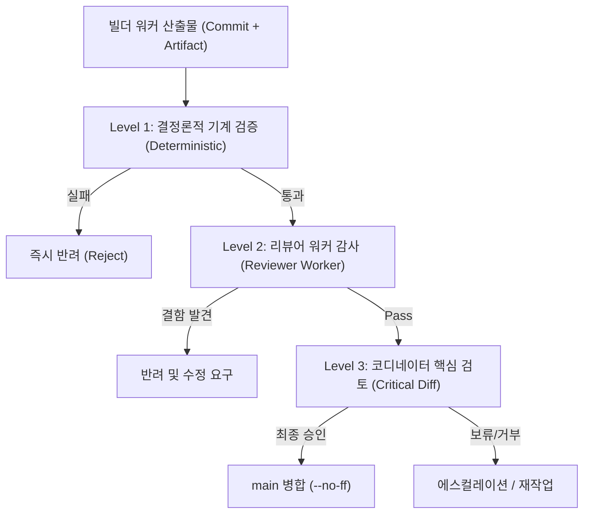

# Orca Task Capsule v2 및 보고 계약 규약

> **작성일**: 2026-08-15
> **버전**: v2.0.0
> **상태**: 확정 정본
> **대상**: Orca 코디네이터, 빌더 워커, 리뷰어 워커, 감사 에이전트
> **상위 설계**: [`orca_coordinator_token_optimization_v2.md`](orca_coordinator_token_optimization_v2.md)
> **관련 문서**: [`orca_orchestration_playbook.md`](orca_orchestration_playbook.md), [`agent_worker_launch_reference.md`](agent_worker_launch_reference.md), [`../../.agents/skills/orca-section-coordination/SKILL.md`](../../.agents/skills/orca-section-coordination/SKILL.md)

---

## 1. 개요 및 목적

Orca Task Capsule v2는 다중 에이전트 협업 환경에서 코디네이터의 컨텍스트 예산을 극대화하고 워커 모델의 불필요한 탐색을 제거하기 위해 정의된 **자족적 실행 계약(Self-Contained Execution Contract)**입니다.

과거 체계에서는 워커가 시작 시 저장소 전역 문서(`README.md`, `SKILLS.md`, `REFACTORING_DESIGN.md`)를 중복 정독하면서 토큰 낭비, TPM 초과, 오래된 baseline 수치로 인한 컨텍스트 오염이 발생했습니다. v2에서는 코디네이터가 작업에 필요한 모든 문맥을 사전에 압축하여 Task Capsule 형태로 워커에 주입하고, 워커는 좁은 실행 범위 내에서 작업을 완수합니다.

### 1.1 핵심 원칙

| 원칙 | 내용 |
| --- | --- |
| **자족적 캡슐 (Self-Contained)** | 워커는 Task Capsule과 지정된 `allowed_read_files`만으로 작업을 완수할 수 있어야 합니다. |
| **기본 거부 탐색 (Deny-by-Default Search)** | 저장소 전체 grep/탐색은 기본 금지되며, `search_scope`에 명시된 경로로 제한됩니다. |
| **컴팩트 보고 (Compact Outcome Index)** | `worker_done` 및 `review_done`은 수천 줄의 로그나 diff를 포함하지 않고 정형화된 JSON 요약만 전달합니다. |
| **수명주기 명령과 아티팩트 분리** | 상세 분석 문서는 파일 아티팩트로 보존하되, Orca 수명주기 완료 통보는 반드시 `orca orchestration send --type worker_done` 명령으로 수행합니다. |
| **3단계 검증 (3-Tier Verification)** | 기계적 결정론 검증 -> 리뷰어 워커 검증 -> 코디네이터 핵심 diff 검토 순으로 검증을 진행합니다. |

---

## 2. Task Capsule v2 스키마 사양

Task Capsule v2는 언어 중립적인 YAML 포맷을 사용하며, 코디네이터가 워커를 Dispatch할 때 전달합니다. 템플릿 파일은 [`.agents/templates/task_capsule_v2.yaml`](../../.agents/templates/task_capsule_v2.yaml)에 위치합니다.

### 2.1 표준 YAML 스키마

```yaml
schema: ORCA_TASK_CAPSULE_V2
version: "2.0.0"
mode: worker # worker | reviewer | investigator | benchmarker
run_id: "<run_id>"
task_id: "<task_id>"
role: "builder" # builder | investigator | reviewer | benchmarker | documenter

objective: >
  한 문단으로 명확하고 측정 가능한 작업 완료 상태를 정의합니다.

why_now: >
  현재 이 작업이 필요한 이유와 선행/후속 맥락을 1~3문장으로 기술합니다.

ground_truth:
  - fact: "확정된 운영 지표 또는 아키텍처 사실"
    evidence: "docs/context/CURRENT_STATE.md"
    recheck: false

allowed_read_files:
  - "src/..."
  - "tests/..."

allowed_write_files:
  - "src/..."
  - "tests/..."

search_scope:
  mode: deny_by_default # deny_by_default | allowed_globs
  allowed_globs: []

forbidden:
  - "README.md 전체 재독 금지"
  - "SKILLS.md 전체 재독 금지"
  - "docs/design/REFACTORING_DESIGN.md 전체 재독 금지"
  - "DB 스키마 및 원본 데이터 변경 금지"
  - "main 브랜치 직접 수정 및 커밋 금지"
  - "Pull Request 생성 금지"

shared_resources:
  - resource: docker # docker | db | serving_model_root | features_py | main_merge
    ownership: none # exclusive | read_only | none

required_change:
  - "요구되는 구체적 코드 또는 문서 변경 사항 1"
  - "요구되는 구체적 코드 또는 문서 변경 사항 2"

acceptance:
  - "구체적 완료 조건 및 기능/성능 만족 기준"

verification_commands:
  - "uv run pytest tests/ -q"
  - "python3 scripts/validate_agent_rules.py --quiet"

artifact_paths:
  - "docs/analysis/<task_name>.md"

escalate_when:
  - "allowed_write_files 범위를 벗어난 파일 수정이 필요한 경우"
  - "ground_truth와 실제 코드/동작이 충돌하는 경우"
  - "새로운 외부 패키지/의존성 추가가 필요한 경우"
  - "DB 스키마 변경 또는 데이터 삭제가 필요한 경우"
  - "공유 자원의 동시 점유 충돌이 발생한 경우"
  - "테스트 실패 원인이 Task 범위 밖의 레거시 결함인 경우"

return_contract: ORCA_WORKER_DONE_V2 # ORCA_WORKER_DONE_V2 | ORCA_REVIEW_DONE_V2
```

### 2.2 필드별 정의 및 제약 사항

| 필드명 | 타입 | 필수 | 설명 |
| --- | --- | --- | --- |
| `schema` | string | 예 | 반드시 `ORCA_TASK_CAPSULE_V2` |
| `version` | string | 예 | 스키마 버전 (`2.0.0`) |
| `mode` | enum | 예 | `worker`, `reviewer`, `investigator`, `benchmarker` |
| `run_id` | string | 예 | 바인딩된 Orca Run ID |
| `task_id` | string | 예 | 할당된 Orca Task ID |
| `role` | string | 예 | 담당 역할명 (예: `Antigravity Gemini Flash High`) |
| `objective` | string | 예 | 작업의 최종 완료 상태를 기술한 단일 문단 |
| `why_now` | string | 예 | 작업 착수 이유 및 상위 의존성 맥락 (1~3문장) |
| `ground_truth` | list[object] | 예 | 이미 검증된 불변 사실 목록. `recheck: false` 명시로 재조사 방지 |
| `allowed_read_files` | list[string] | 예 | 워커가 읽을 수 있는 파일 또는 경로 glob 목록 |
| `allowed_write_files` | list[string] | 예 | 워커가 생성/수정할 수 있는 파일 목록 (최소 범위 격리) |
| `search_scope` | object | 예 | `mode: deny_by_default` 기본 적용. 허용 glob 외 전역 탐색 차단 |
| `forbidden` | list[string] | 예 | 절대 금지 항목 (전역 문서 재독, DB 변경, main 직접 수정 등) |
| `shared_resources` | list[object] | 예 | Docker, DB, 서빙 모델 루트 등 공유 자원의 소유권 수준 |
| `required_change` | list[string] | 예 | 구체적으로 수행해야 하는 변경 항목 목록 |
| `acceptance` | list[string] | 예 | 객관적으로 검증 가능한 완료 판정 기준 |
| `verification_commands` | list[string] | 예 | 워커가 로컬에서 실행하고 통과해야 하는 검증 명령어 |
| `artifact_paths` | list[string] | 선택 | 생성될 상세 보고서/벤치마크 데이터 파일 경로 |
| `escalate_when` | list[string] | 예 | 자의적 판단 대신 코디네이터에게 에스컬레이션해야 하는 조건 |
| `return_contract` | enum | 예 | 반환 보고 형식 (`ORCA_WORKER_DONE_V2` 또는 `ORCA_REVIEW_DONE_V2`) |

---

## 3. Worker Done v2 계약 (`ORCA_WORKER_DONE_V2`)

빌더/조사 워커가 작업을 마쳤을 때 코디네이터에게 반환하는 구조화 계약입니다. 템플릿 파일은 [`.agents/templates/worker_done_v2.json`](../../.agents/templates/worker_done_v2.json)에 위치합니다.

### 3.1 JSON 스키마

```json
{
  "schema": "ORCA_WORKER_DONE_V2",
  "version": "2.0.0",
  "task_id": "<task_id>",
  "dispatch_id": "<dispatch_id>",
  "status": "succeeded",
  "branch": "kwanbum217/feat-example",
  "commit": "<commit_sha>",
  "commit_count": 1,
  "changed_files": [
    "src/example.py",
    "tests/test_example.py"
  ],
  "verification": [
    {
      "command": "uv run pytest tests/test_example.py -q",
      "result": "5 passed"
    },
    {
      "command": "python3 scripts/validate_agent_rules.py --quiet",
      "result": "PASS (6/6)"
    }
  ],
  "metrics": {
    "before": null,
    "after": null
  },
  "verdict": "candidate",
  "blocking_issues": [],
  "remaining_risks": [],
  "artifacts": [
    "docs/analysis/example_report.md"
  ],
  "reproduce": [
    "uv run pytest tests/test_example.py -q"
  ]
}
```

### 3.2 아티팩트 보고서와 Orca 수명주기 완료 통보의 관계 (중요)

> **규약 핵심 원칙**:
> 상세 분석 문서(Artifact Report)는 Orca 수명주기 `worker_done` 통보를 **보강(augment)**하는 것이며, 결코 **대체(replace)**할 수 없습니다.

1. **파일 아티팩트의 역할**:
   - 수십~수백 줄의 상세 분석 결과, 벤치마크 표, 로그 분석, 설계 판단 근거는 `docs/analysis/`, `docs/ops/`, `data/benchmarks/` 등의 파일 아티팩트로 저장소에 커밋합니다.
2. **Orca 수명주기 명령의 역할**:
   - 작업 완료 시 반드시 CLI 명령(`orca orchestration send --type worker_done ...`)을 실행해야만 Orca 런타임 상의 Task 상태가 `completed`로 전환되고 코디네이터가 후속 DAG 작업을 디스패치할 수 있습니다.
   - CLI의 `--body`에는 3문장 이내의 핵심 요약(수행 내역, 발견 사항, 잔여 리스크)을 기재하고, payload에 `reportPath` 또는 `artifacts`를 명시하여 코디네이터가 필요한 경우에만 아티팩트를 열어보도록 합니다.
3. **금지 사항**:
   - 아티팩트 파일만 작성하고 `orca orchestration send --type worker_done`을 호출하지 않은 채 세션을 종료하는 행위 금지.
   - 반대로 CLI 명령의 `--body`에 수백 줄의 마크다운 보고서나 diff 전체를 붙여넣어 코디네이터 컨텍스트를 오염시키는 행위 금지.

### 3.3 Worker Done 작성 금지 규칙

- 터미널 원시 출력(stdout/stderr) 전체를 본문에 복사하지 않습니다.
- `git diff` 전체 텍스트를 본문에 복사하지 않습니다.
- 테스트 통과를 객관적 수치 없이 자연어 주장으로만 표현하지 않습니다.
- 코드 변경이 요구된 작업에서 `commit_count: 0`인 상태로 `status: "succeeded"`를 전송하지 않습니다.
- 워커 스스로 `main` 병합 권한을 행사하거나 완료를 확정하지 않습니다.

---

## 4. Review Done v2 계약 (`ORCA_REVIEW_DONE_V2`)

독립된 리뷰어 워커가 빌더의 산출물을 검토한 후 코디네이터에게 보고하는 구조화 계약입니다. 템플릿 파일은 [`.agents/templates/review_done_v2.json`](../../.agents/templates/review_done_v2.json)에 위치합니다.

### 4.1 JSON 스키마

```json
{
  "schema": "ORCA_REVIEW_DONE_V2",
  "version": "2.0.0",
  "task_id": "<task_id>",
  "dispatch_id": "<dispatch_id>",
  "verdict": "pass",
  "blocking_issues": [],
  "unverified_claims": [],
  "missing_tests": [],
  "requested_context": [],
  "commands_to_verify": [
    "git diff --stat main...HEAD",
    "uv run pytest tests/ -q",
    "python3 scripts/validate_agent_rules.py --quiet"
  ]
}
```

### 4.2 리뷰어의 7대 핵심 감사 기준

리뷰어는 코드 스타일이나 사소한 선호도가 아닌 다음 7대 위험 요소를 우선적으로 검증합니다.

1. **Acceptance Criteria 미충족**: Task Capsule의 완료 조건이 실제 코드/테스트에 구현되었는지 여부.
2. **기능 및 성능 회귀 (Regression)**: 기존 동작을 깨뜨리거나 레이턴시 게이트를 위반하는지 여부.
3. **데이터 무손실 원칙 (G1)**: DB 스키마 변형, 컬럼 삭제, 모델 체크섬/ChromaDB 무결성 훼손 여부.
4. **Train/Serve Skew**: ML 특징 생성 로직이 `src/ml/features.py` 단일 함수를 벗어났는지 여부.
5. **동시성 및 비동기 (Async/Concurrency) 결함**: 이벤트 루프 블로킹, 레이스 컨디션, 연결 풀 누수 여부.
6. **주장과 테스트의 불일치**: 워커가 보고서에 주장한 성능/통과 건수가 실제 테스트와 부합하는지 여부.
7. **스코프 초과 수정 (Out-of-Scope Modifications)**: `allowed_write_files` 외의 파일이나 무관한 모듈을 수정했는지 여부.

---

## 5. 3단계 검증 프로세스 (3-Tier Verification)



### Level 1: 결정론적 기계 검증 (Deterministic Verification)

코디네이터는 diff를 정독하기 전에 최소 검증 명령을 먼저 실행합니다.

```bash
git diff --stat main...HEAD
git diff --name-only main...HEAD
uv run pytest <targeted-tests> -q
python3 scripts/validate_agent_rules.py --quiet
```

하나라도 실패하면 즉시 워커에 작업을 반려합니다.

### Level 2: 리뷰어 워커 감사 (Reviewer Worker)

독립된 리뷰어 모델이 Task Capsule, `git diff`, 테스트 결과를 교차 검증하여 `ORCA_REVIEW_DONE_V2`를 작성합니다.

### Level 3: 코디네이터 핵심 검토 (Coordinator Critical Review)

코디네이터는 전체 코드가 아닌 다음 핵심 변경 지점만 선별하여 검토합니다.

- 새로운 분기 조건문 및 알고리즘
- DB 쿼리, 데이터 변환/삭제 경로
- 모델 레지스트리 및 승격 게이트 코드
- 공유 자원 동기화 및 비동기 루프
- 리뷰어가 지적한 `blocking_issues` 및 경계값

---

## 6. 에스컬레이션 및 실시간 통신 규약

### 6.1 에스컬레이션 (`escalation`)

워커는 `escalate_when` 조건에 해당할 경우 작업을 자의적으로 확장하지 않고 즉시 에스컬레이션합니다.

```bash
orca orchestration send --from <worker_handle> --dispatch-capability <dcap> \
  --type escalation --subject "Blocked: <사유>" \
  --body "<상세 차단 내역 및 필요한 추가 스코프>" \
  --task-id <task_id>
```

### 6.2 블로킹 질문 (`ask`)

워커는 코디네이터의 결정이 필요한 항목에 대해 `orca orchestration ask`를 사용하며 응답이 올 때까지 블로킹 대기합니다.

```bash
orca orchestration ask --from <worker_handle> --dispatch-capability <dcap> \
  --question "<질문 내용>" \
  --options "<선택지1,선택지2>" \
  --timeout-ms 600000
```

> **주의**: `AskUserQuestion` 도구는 로컬 UI에 갇히므로 절대 호출하지 않고 CLI `orca orchestration ask`를 사용합니다.

### 6.3 하트비트 (`heartbeat`)

워커는 5분 이상 소요되는 활성 작업 중에 정기적으로 하트비트를 전송하여 생존 상태를 코디네이터에 알립니다.

```bash
orca orchestration send --from <worker_handle> --dispatch-capability <dcap> \
  --type heartbeat --subject "alive" \
  --task-id <task_id> --dispatch-id <dispatch_id> \
  --phase "implementing"
```

---

## 7. 정합성 검증 기준

본 규약의 정합성은 다음 기준을 통해 기계적으로 검증됩니다.

1. **템플릿 정합성**: `.agents/templates/` 아래의 3개 템플릿(`task_capsule_v2.yaml`, `worker_done_v2.json`, `review_done_v2.json`)이 본 규약 스키마와 완벽히 일치해야 합니다.
2. **스킬 미러 3종 일치**: `.agents/skills/orca-section-coordination/SKILL.md`, `.claude/skills/orca-section-coordination/SKILL.md`, `.opencode/skills/orca-section-coordination/SKILL.md` 파일이 상호 100% 바이트 단위로 동일해야 합니다 (`cmp -s`).
3. **규칙 검증 통과**: `python3 scripts/validate_agent_rules.py --quiet` 검사에서 6/6 항목이 모두 PASS해야 합니다.
4. **Git 체크 통과**: `git diff --check` 검사에서 후행 공백 및 포맷 위반이 없어야 합니다.
