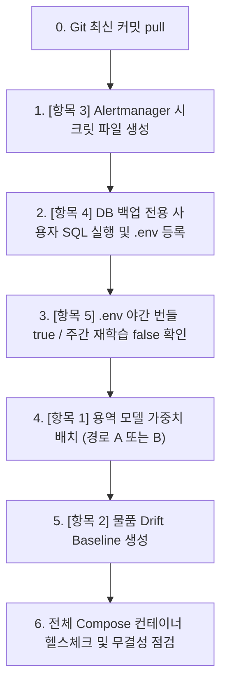

# 운영 환경 반영 체크리스트 (2026-09-16)

> **작성일**: 2026-09-16
> **작성자**: Orca Worker (`task_8a01a21151c2`)
> **기준 커밋**: `261fa9a8`
> **목적**: 2026-09-15 세션에서 로컬 개발 환경 검증을 마쳤으나 운영 서버에는 미반영된 잔여 항목 5건의 정확한 반영 절차, 선행 조건, 확인 방법, 롤백 방안을 단일 문서로 제공합니다.

---

## 1. 개요 및 전체 요약

2026-09-15 세션에서는 용역 낙찰률 모델 승격, 물품 drift baseline 생성, Alertmanager warning 수신기 분리, 백업 전용 DB 계정 분리, 운영 야간 번들 기본값 활성화를 완료했습니다.

그러나 보안 파일(`docker/secrets/*`), 가중치 아티팩트(`model.bin`, `ml_registry/`), DB 사용자 권한은 Git 추적 대상이 아니므로 코드 배포(Git pull)만으로는 운영 환경에 반영되지 않습니다. 배포 담당자는 본 체크리스트의 순서와 절차에 따라 운영 환경에 단계별로 반영해야 합니다.

### 1.1 반영 대상 5개 항목 요약

| 번호 | 항목 | 대상 시스템 | 로컬 상태 | 운영 필요 작업 |
| :---: | --- | --- | --- | --- |
| **1** | 용역 모델 승격 (`v_20260915_133523_756`) | `app`, `worker` (`ml_registry`, `data/model_files`) | 로컬 세대 등록 및 LIVE 포인터 갱신 완료 | 운영 가중치 배치 및 포인터 정합성 확보 (경로 A/B 중 선택) |
| **2** | 물품(Thng) Drift Baseline 생성 | `worker` (`ml_registry/quantum_leap_v25_pro/baseline`) | 로컬 18,069건 기반 baseline 생성 완료 | 운영 DB 기반 worker 컨테이너 내부 명령 실행 및 아티팩트 생성 |
| **3** | Alertmanager Warning 수신기 시크릿 파일 | `alertmanager` (`docker/secrets/alertmanager_slack_warning_url`) | 로컬 더미/테스트 파일 존재 | 운영 Slack warning 웹훅 URL 시크릿 파일 생성 (0600) |
| **4** | 백업 전용 DB 계정 (`bidbox_backup`) 생성 | `db` (MySQL 8), `backup` 컨테이너 | SQL 작성 및 compose 배선 완료 | 운영 MySQL 계정/권한 생성 SQL 실행 및 `.env` 주입 |
| **5** | 운영 야간 번들 크론 기본값 (`true`) 확인 | `worker` 컨테이너 환경변수 | Compose 기본값 `true` 반영 완료 | 운영 배포 환경변수 무결성 점검 및 워커 재기동 |

---

## 2. 항목별 운영 반영 상세 절차

---

### [항목 1] 용역 낙찰률 모델 승격 (`servc_institution_v1`)

#### 1. 차이점 (로컬 상태 vs 운영 상태)
- **로컬 상태**: 2026-09-14 개찰분까지 포함된 925,054행 데이터셋으로 재학습한 `v_20260915_133523_756` 아티팩트가 생성되었고, 세대 디렉터리(`data/model_files/servc_institution_v1/generations/v_20260915_133523_756_20260915_135842_a4470852/`)와 `LIVE` 포인터가 Git에 커밋되어 있습니다.
- **운영 상태**: 가중치 바이너리(`model.bin`, `model_q*.bin`) 및 `ml_registry`는 `.gitignore` 대상이므로 Git pull 시 가중치 파일이 존재하지 않으며, 운영 서버는 기존 구버전(`v_20260807_043210_535`)을 서빙하고 있거나 가중치 파일 부재로 오류가 발생할 수 있습니다.
- **주의사항**: 슬롯 루트의 `data/model_files/servc_institution_v1/metadata.json`은 레거시 하위 호환 파일(구버전 기록)이 남아 있으므로 서빙 버전 판단 기준으로 삼지 말아야 합니다. 서빙 버전 판단의 단일 진실 원천은 `data/model_files/servc_institution_v1/LIVE` 포인터와 `LIVE`가 가리키는 `generations/<세대>/metadata.json`입니다.

#### 2. 운영 반영 경로 비교 (경로 A vs 경로 B)

운영 환경에서 용역 서빙 모델을 최신화하는 경로는 다음 두 가지가 있습니다.

| 비교 항목 | 경로 A: 운영 재학습 및 승격 파이프라인 재현 | 경로 B: 로컬 세대 디렉터리 아티팩트 복사 |
| --- | --- | --- |
| **개념** | 운영 DB에서 최신 데이터 추출 -> 재학습 -> 판정 파일 생성 -> 승격 스크립트 실행 | 로컬에서 검증 완료된 세대 디렉터리(`generations/<세대_ID>`) 및 가중치를 운영 서버로 SCP/rsync 복사 |
| **장점** | 운영 환경의 독립적 재현성 보장, 운영 데이터 정합성 자체 검증 | 네트워크 복사만으로 즉시 적용 가능 (학습 시간 545초 및 CPU 자원 소모 없음) |
| **단점** | 운영 서버 CPU 부하 유발, 약 10분 소요, 학습 시점 DB 상태에 따른 사소한 차이 가능성 | 모델 아티팩트 전송을 위한 수동 파일 전송 채널 필요 |
| **선행 조건** | 운영 DB 최신 데이터 수집 완료, `worker` 컨테이너 가용 | 운영 서버와 로컬 간 보안 파일 전송 경로 확보 |
| **검증 방법** | `uv run python scripts/promote_model.py status` 및 API 예측 호출 | `LIVE` 파일 내용과 세대 디렉터리 내 `metadata.json`, `model.bin` 무결성 확인 및 API 실측 |
| **되돌리기** | `uv run python scripts/promote_model.py rollback --model servc_institution_v1` (승격 시 남긴 `data/model_backups` 복원) | **rollback 을 쓰지 않습니다.** 복사 전에 보존한 `LIVE` 값을 다시 써 직전 운영 세대로 되돌립니다 |

#### 3. 선행 조건
- 운영 코드베이스 최신 커밋 반영 (`git pull`)
- 운영 DB에 2026-09-14 개찰분까지 데이터가 정상 적재되어 있거나(경로 A), 로컬 세대 아티팩트가 준비되어 있을 것(경로 B)
- 상세 승격 근거 및 쌍대 검증 수치는 [`docs/design/servc_freshness_retrain_20260915.md`](../design/servc_freshness_retrain_20260915.md) 및 [`docs/ops/model_promotion_runbook.md`](model_promotion_runbook.md) 참조

#### 4. 운영에서 실행할 정확한 명령

##### [선택 1: 경로 A 채택 시 (권장 재현 절차)]
> **주의 (실행 환경 및 데이터셋 구축 경로)**:
> - `scripts/` 디렉터리에는 데이터셋을 만드는 독립 실행 스크립트(`build_feature_store.py`)가 존재하지 않습니다. 데이터셋 재구축은 `src/tasks/retrain_task.py`의 `run_retrain_pipeline_task`(내부적으로 `src/ml/dataset.py`의 `build_training_dataset` 호출) 파이프라인을 통해 수행됩니다.
> - 운영 환경의 MySQL(`db`)은 보안 정책상 호스트 포트를 개방하지 않고 내부 브리지 네트워크(`internal`)에만 바인딩되므로, DB 조회가 필요한 재학습 명령은 호스트가 아닌 `worker` 컨테이너 내부에서 실행해야 합니다.

```bash
# 1. 재학습 파이프라인 실행 (운영 DB 기반 데이터셋 빌드 및 모델 재학습, worker 컨테이너 내부 실행)
docker compose -f docker-compose.prod.yml exec worker python -c "
import asyncio
from src.tasks.retrain_task import run_retrain_pipeline_task
result = asyncio.run(run_retrain_pipeline_task({}, trigger_source='manual_rollout', category_code='Servc'))
print('재학습 파이프라인 실행 결과:', result)
"

# [대안: 데이터셋 Parquet 생성과 retrain_servc_from_parquet.py 를 분리 실행할 경우]
# 1-1. Feature Store 데이터셋 구축 (src/ml/dataset.py build_training_dataset 직접 호출)
# docker compose -f docker-compose.prod.yml exec worker python -c "
# from src.app.core.db import SessionLocal
# from src.ml.dataset import build_training_dataset
# db = SessionLocal()
# try:
#     df = build_training_dataset(db, category_code='Servc', require_announcement=False)
#     print(f'데이터셋 구축 완료: {len(df):,}행')
# finally:
#     db.close()
# "
# 1-2. Parquet 기반 재학습 실행 (545초 소요 예상)
# docker compose -f docker-compose.prod.yml exec worker python scripts/retrain_servc_from_parquet.py --category Servc --parquet data/feature_store/dataset_Servc.parquet

# 2. 승격 예행 및 상태 확인
docker compose -f docker-compose.prod.yml exec worker python scripts/promote_model.py status
# (또는 호스트에서 실행 시: uv run python scripts/promote_model.py status)

# 3. 운영 승격 집행
docker compose -f docker-compose.prod.yml exec worker python scripts/promote_model.py promote --model servc_institution_v1 --category Servc --apply
# (또는 호스트에서 실행 시: uv run python scripts/promote_model.py promote --model servc_institution_v1 --category Servc --apply)

# 4. 애플리케이션 및 워커 컨테이너 재기동
docker compose -f docker-compose.prod.yml restart app worker
```

##### [선택 2: 경로 B 채택 시 (신속 이관 절차)]
> **전송 대상 필수 아티팩트 목록**:
> 1. `model.bin`: 메인 LightGBM 가중치 파일
> 2. `model_q10.bin` ~ `model_q90.bin`: 9개 분위수 회귀 모델 가중치 파일
> 3. `metadata.json`: 세대 메타데이터 및 성능 지표 파일
> 4. `LIVE`: 최신 세대 ID(`v_20260915_133523_756_20260915_135842_a4470852`)를 가리키는 포인터 파일

**운영 서버에서 실행**:
```bash
# 운영 서버에서 실행
# 0. [필수] 운영 서버에서 현재 LIVE 값을 먼저 보존합니다.
#    경로 B 는 promote() 를 거치지 않아 data/model_backups 에 백업이 생기지
#    않습니다. 이 값이 유일한 되돌리기 근거입니다.
cp data/model_files/servc_institution_v1/LIVE \
   data/model_files/servc_institution_v1/LIVE.before_20260916
```

**로컬에서 실행**:
```bash
# 로컬에서 실행
# 1. 로컬 환경에서 운영 서버로 세대 아티팩트 디렉터리 및 LIVE 포인터 실제 복사/전송 (rsync 또는 scp 사용)
# [원본 경로]: data/model_files/servc_institution_v1/generations/v_20260915_133523_756_20260915_135842_a4470852/
# [대상 경로]: ${PROD_HOST}:${PROD_PROJECT_ROOT}/data/model_files/servc_institution_v1/generations/v_20260915_133523_756_20260915_135842_a4470852/
rsync -avz \
  data/model_files/servc_institution_v1/generations/v_20260915_133523_756_20260915_135842_a4470852/ \
  ${PROD_HOST}:${PROD_PROJECT_ROOT}/data/model_files/servc_institution_v1/generations/v_20260915_133523_756_20260915_135842_a4470852/

rsync -avz \
  data/model_files/servc_institution_v1/LIVE \
  ${PROD_HOST}:${PROD_PROJECT_ROOT}/data/model_files/servc_institution_v1/LIVE

# (참고: scp 명령 사용 시)
# scp -rp data/model_files/servc_institution_v1/generations/v_20260915_133523_756_20260915_135842_a4470852 ${PROD_HOST}:${PROD_PROJECT_ROOT}/data/model_files/servc_institution_v1/generations/
# scp -p data/model_files/servc_institution_v1/LIVE ${PROD_HOST}:${PROD_PROJECT_ROOT}/data/model_files/servc_institution_v1/LIVE
```

**운영 서버에서 실행**:
```bash
# 운영 서버에서 실행
# 2. 운영 서버에서 전송받은 파일의 권한 설정 (0644)
chmod 644 data/model_files/servc_institution_v1/generations/v_20260915_133523_756_20260915_135842_a4470852/*
chmod 644 data/model_files/servc_institution_v1/LIVE

# 3. 전송 후 아티팩트 무결성 확인 (빈 디렉터리 여부 및 필수 파일 존재 검증)
test -f data/model_files/servc_institution_v1/generations/v_20260915_133523_756_20260915_135842_a4470852/model.bin || { echo "[오류] model.bin 누락"; exit 1; }
test -f data/model_files/servc_institution_v1/generations/v_20260915_133523_756_20260915_135842_a4470852/metadata.json || { echo "[오류] metadata.json 누락"; exit 1; }
test "$(cat data/model_files/servc_institution_v1/LIVE)" = "v_20260915_133523_756_20260915_135842_a4470852" || { echo "[오류] LIVE 포인터 불일치"; exit 1; }
echo "가중치 파일 및 LIVE 포인터 무결성 확인 완료"

# 4. 애플리케이션 및 워커 컨테이너 재기동
docker compose -f docker-compose.prod.yml restart app worker
```

#### 5. 실행 후 확인 방법
- **확인 명령**:
  ```bash
  # 서빙 포인터 확인 (슬롯 루트 metadata.json 이 아닌 LIVE 파일 확인)
  cat data/model_files/servc_institution_v1/LIVE

  # LIVE 가 가리키는 세대 메타데이터 버전 확인
  cat data/model_files/servc_institution_v1/generations/$(cat data/model_files/servc_institution_v1/LIVE)/metadata.json | grep '"version"'

  # 승격 도구 현황 점검
  uv run python scripts/promote_model.py status

  # 운영 컨테이너 실측 예측 API 호출 테스트
  docker compose -f docker-compose.prod.yml exec app python -c "
  from src.ml.singleton_predictor import SingletonPredictor
  p = SingletonPredictor()
  m = p.get_model('servc_institution_v1')
  meta = p.get_model_metadata('servc_institution_v1')
  print('Loaded version:', meta.get('version'))
  assert meta.get('version') == 'v_20260915_133523_756', '버전 불일치'
  print('Predictor check passed.')
  "
  ```
- **기대 출력**:
  - `LIVE` 파일 내용: `v_20260915_133523_756_20260915_135842_a4470852`
  - 세대 `metadata.json`: `"version": "v_20260915_133523_756"`
  - Python 실측: `Loaded version: v_20260915_133523_756`, `Predictor check passed.`

#### 6. 실패 시 되돌리기 (Rollback)

**되돌리기는 어느 경로로 적용했느냐에 따라 다릅니다.** `promote_model.py rollback` 은
`promote()` 가 `data/model_backups` 에 남긴 백업을 복원합니다. 경로 B 는 파일 복사만
하므로 그 백업이 없으며, rollback 을 부르면 복원할 대상이 없거나 엉뚱한 세대로 돌아갑니다.

```bash
# [경로 A 로 적용한 경우] 정본 되돌리기: 승격 시 남긴 백업을 원자 복원합니다.
docker compose -f docker-compose.prod.yml exec worker \
  python scripts/promote_model.py rollback --model servc_institution_v1

# [경로 B 로 적용한 경우] 0 단계에서 보존한 LIVE 값을 되돌립니다.
#   전송한 세대 디렉터리는 지우지 않고 남겨 둡니다. 포인터만 되돌리면 충분합니다.
test -f data/model_files/servc_institution_v1/LIVE.before_20260916 \
  || { echo "[오류] 보존한 LIVE 값이 없어 되돌릴 수 없습니다"; exit 1; }
cp data/model_files/servc_institution_v1/LIVE.before_20260916 \
   data/model_files/servc_institution_v1/LIVE

# [공통] 애플리케이션 및 워커 컨테이너 재기동
docker compose -f docker-compose.prod.yml restart app worker
```

---

### [항목 2] 물품(Thng) Drift Baseline 생성

#### 1. 차이점 (로컬 상태 vs 운영 상태)
- **로컬 상태**: `scripts/generate_drift_baseline.py`를 실행하여 2026-05-26 제도 변경(낙찰하한율 2%p 인상) 이후 개찰 데이터(18,069건, 특징 34개) 기반의 baseline(`b_20260915_thng_post_regime`)이 `ml_registry/quantum_leap_v25_pro/baseline/`에 생성 완료되었습니다.
- **운영 상태**: `ml_registry`는 `.gitignore` 대상이므로 운영 서버에는 신규 baseline 아티팩트가 생성되어 있지 않습니다.

#### 2. 선행 조건
- 운영 MySQL 데이터베이스 기동 및 접근 가능 상태 (`db` 컨테이너 healthy)
- 운영 DB 내 물품(`Thng`) 입찰/개찰 데이터가 2026-05-26부터 2026-09-06 이상 축적되어 있을 것 (최소 1,000건 이상 필요)

#### 3. 운영에서 실행할 정확한 명령
운영 MySQL (`db`)은 보안 정책상 호스트 포트를 개방하지 않고 내부 브리지 네트워크(`internal`)에만 바인딩되므로, DB 조회가 필요한 본 명령은 반드시 `worker` 컨테이너 내부에서 실행해야 합니다.

```bash
# 1. Dry-run 으로 대상 건수 및 특징 수 확인 (파일 쓰기 없음, worker 컨테이너 내부 실행)
docker compose -f docker-compose.prod.yml exec worker python scripts/generate_drift_baseline.py \
    --category Thng \
    --start-at 2026-05-26 \
    --end-at 2026-09-06 \
    --baseline-version b_20260915_thng_post_regime \
    --model-name quantum_leap_v25_pro

# 2. 실제 baseline 아티팩트 기록 (--write 명시, worker 컨테이너 내부 실행)
docker compose -f docker-compose.prod.yml exec worker python scripts/generate_drift_baseline.py \
    --category Thng \
    --start-at 2026-05-26 \
    --end-at 2026-09-06 \
    --baseline-version b_20260915_thng_post_regime \
    --model-name quantum_leap_v25_pro \
    --write
```

#### 4. 실행 후 확인 방법
- **확인 명령**:
  ```bash
  # 생성된 baseline 디렉터리 및 아티팩트 확인
  ls -la ml_registry/quantum_leap_v25_pro/baseline/

  # 메타데이터 확인 (baseline 식별자 및 표본 수)
  cat ml_registry/quantum_leap_v25_pro/baseline/metadata.json | grep -E '("baseline_version"|"sample_count"|"features_count")'
  ```
- **기대 출력**:
  - `distributions.json`, `metadata.json` 파일 존재
  - `"baseline_version": "b_20260915_thng_post_regime"`
  - 표본 수 18,000건 내외, 특징 수 34개

#### 5. 실패 시 되돌리기 (Rollback)
```bash
# baseline 디렉터리 제거 (기존 백업본이 존재할 경우 원복, 없으면 디렉터리 정리)
rm -rf ml_registry/quantum_leap_v25_pro/baseline
# 백업본이 ml_registry/quantum_leap_v25_pro/.baseline_backup 에 있는 경우:
if [ -d "ml_registry/quantum_leap_v25_pro/.baseline_backup" ]; then
    mv ml_registry/quantum_leap_v25_pro/.baseline_backup ml_registry/quantum_leap_v25_pro/baseline
fi
```

---

### [항목 3] Alertmanager Warning 수신기 시크릿 파일 준비

#### 1. 차이점 (로컬 상태 vs 운영 상태)
- **로컬 상태**: `docker/alertmanager.yml`과 `docker-compose.prod.yml`에 `slack-warning` 수신기 매핑(`docker/secrets/alertmanager_slack_warning_url`)이 정의되어 있습니다.
- **운영 상태**: `docker/secrets/` 디렉터리는 보안상 `.gitignore`로 제외되어 있으므로, 운영 호스트에 `alertmanager_slack_warning_url` 파일이 실제로 생성되어 있지 않으면 `alertmanager` 컨테이너가 볼륨 마운트 실패로 기동되지 않습니다.

#### 2. 선행 조건
- 운영 환경의 Slack Warning 수신용 Incoming Webhook URL 확보
- 호스트에 `docker/secrets/` 디렉터리 존재 여부 확인
- 상세 명세는 [`docs/ops/alerting.md`](alerting.md) 3장 참조 (주의: `alertmanager_slack_url` critical 경로는 수정하지 않음)

#### 3. 운영에서 실행할 정확한 명령
```bash
# 1. 시크릿 디렉터리 생성
mkdir -p docker/secrets

# 2. warning 웹훅 URL 단일 문자열로 파일 생성 (개행 없이 기록, 실제 URL 주입)
echo -n "${PROD_SLACK_WARNING_WEBHOOK_URL}" > docker/secrets/alertmanager_slack_warning_url

# 3. 소유자 읽기/쓰기 전용 보안 권한 (0600) 부여
chmod 600 docker/secrets/alertmanager_slack_warning_url

# 4. alertmanager 컨테이너 재기동
docker compose -f docker-compose.prod.yml up -d alertmanager
```

#### 4. 실행 후 확인 방법
- **확인 명령**:
  ```bash
  # 파일 권한 및 크기 확인 (비어 있지 않고 0600 이어야 함)
  ls -l docker/secrets/alertmanager_slack_warning_url

  # alertmanager 컨테이너 로그에서 설정 로드 성공 확인
  docker compose -f docker-compose.prod.yml logs --tail=50 alertmanager

  # alertmanager 헬스체크 확인
  docker compose -f docker-compose.prod.yml ps alertmanager
  ```
- **기대 출력**:
  - 권한: `-rw------- 1 ... docker/secrets/alertmanager_slack_warning_url`
  - 로그: 에러 없이 `Completed loading of configuration file` 출력
  - 상태: `Up` (healthy)

#### 5. 실패 시 되돌리기 (Rollback)
> **주의 (바인드 마운트 제약)**: `docker-compose.prod.yml`이 `./docker/secrets/alertmanager_slack_warning_url`을 파일 바인드 마운트(`:ro`)하므로, 해당 파일을 삭제(`rm`)하면 Alertmanager 기동이 실패하거나 도커가 그 경로에 디렉터리를 생성하는 결함이 발생합니다. 시크릿 파일은 삭제하지 않고 그대로 유지하며, `docker/alertmanager.yml` 설정 파일에서 warning 수신기를 되돌립니다. `slack-slo` critical 경로는 건드리지 않습니다.

```bash
# 1. Alertmanager 설정 파일(docker/alertmanager.yml)에서 warning 수신기를 local-hold 로 변경
# [편집 대상 파일]: docker/alertmanager.yml (routes 내 receiver: slack-warning 을 receiver: local-hold 로 변경)
sed -i.bak 's/receiver: slack-warning/receiver: local-hold/' docker/alertmanager.yml

# 2. alertmanager 컨테이너 재기동하여 변경된 설정 적용
docker compose -f docker-compose.prod.yml up -d alertmanager

# 3. alertmanager 로그에서 설정 로드 정상 완료 확인
docker compose -f docker-compose.prod.yml logs --tail=30 alertmanager
```

---

### [항목 4] 백업 전용 DB 계정 (`bidbox_backup`) 생성 및 권한 부여

#### 1. 차이점 (로컬 상태 vs 운영 상태)
- **로컬 상태**: 백업 최소권한 분리를 위해 `scripts/create_backup_db_user.sql`이 작성되었고, `docker-compose.prod.yml`의 `backup` 서비스가 `BACKUP_DB_USER` 및 `BACKUP_DB_PASSWORD`를 요구하도록 배선되었습니다.
- **운영 상태**: 운영 MySQL 서버에 `bidbox_backup` 계정이 생성되지 않았으며, `.env`에 `BACKUP_DB_USER`/`BACKUP_DB_PASSWORD` 환경변수가 설정되지 않아 백업 서비스가 연결에 실패합니다.

#### 2. 선행 조건
- 운영 MySQL 루트 계정(`root`) 비밀번호 확인
- `bidbox_backup` 계정에 부여할 안전한 무작위 비밀번호 생성
- 상세 권한 정책은 [`docs/ops/backup_least_privilege.md`](backup_least_privilege.md) 및 [`docs/ops/environment_variables.md`](environment_variables.md) 참조 (스키마 변경 없음)

#### 3. 운영에서 실행할 정확한 명령
```bash
# 0. [필수] 아래 명령들은 ${MYSQL_ROOT_PASSWORD} 를 호스트 셸에서 확장합니다.
#    compose 는 .env 를 스스로 보간하지만 exec 인자와 sed 치환은 그렇지
#    않습니다. 먼저 읽지 않으면 빈 비밀번호로 mysql 이 실패합니다.
set -a; . ./.env; set +a

# 1. 안전한 임의의 비밀번호 생성 (예: 32자 난수)
NEW_BACKUP_PASS=$(openssl rand -hex 16)

# 2. 운영 MySQL 루트 권한으로 백업 전용 최소 권한 사용자 생성
# (scripts/create_backup_db_user.sql 의 IDENTIFIED BY 치환 실행)
docker compose -f docker-compose.prod.yml exec -T db mysql -u root -p"${MYSQL_ROOT_PASSWORD}" <<EOF
CREATE USER IF NOT EXISTS 'bidbox_backup'@'%' IDENTIFIED BY '${NEW_BACKUP_PASS}';
GRANT SELECT, SHOW VIEW, TRIGGER, LOCK TABLES, EVENT ON \`procurement\`.* TO 'bidbox_backup'@'%';
GRANT PROCESS ON *.* TO 'bidbox_backup'@'%';
FLUSH PRIVILEGES;
EOF

# 3. 운영 .env 파일에 백업 계정 환경변수 주입
cat <<EOF >> .env

# Backup Service Least Privilege DB User (Added 2026-09-16)
BACKUP_DB_USER=bidbox_backup
BACKUP_DB_PASSWORD=${NEW_BACKUP_PASS}
EOF

# 4. backup 서비스 컨테이너 재생성 및 기동
docker compose -f docker-compose.prod.yml up -d backup
```

#### 4. 실행 후 확인 방법
- **확인 명령**:
  ```bash
  # MySQL 내 권한 정상 부여 확인
  docker compose -f docker-compose.prod.yml exec -T db mysql -u root -p"${MYSQL_ROOT_PASSWORD}" -e "SHOW GRANTS FOR 'bidbox_backup'@'%';"

  # backup 서비스에서 수동 덤프 1회 실행 확인 (dry-run 또는 실행)
  docker compose -f docker-compose.prod.yml exec backup python scripts/backup_recovery.py backup --execute

  # backup 서비스 로그 및 헬스체크 확인
  docker compose -f docker-compose.prod.yml ps backup
  docker compose -f docker-compose.prod.yml logs --tail=30 backup
  ```
- **기대 출력**:
  - `GRANT SELECT, SHOW VIEW, TRIGGER, LOCK TABLES, EVENT ON \`procurement\`.* TO 'bidbox_backup'@'%'`
  - `GRANT PROCESS ON *.* TO 'bidbox_backup'@'%'`
  - 덤프 실행 결과: `snapshot_*` 정상 생성 완료
  - 컨테이너 상태: `Up` (healthy)

#### 5. 실패 시 되돌리기 (Rollback)
> **주의 (필수 환경변수 보간 제약)**: `docker-compose.prod.yml`의 `backup` 서비스는 `BACKUP_DB_USER` 및 `BACKUP_DB_PASSWORD`를 `${VAR:?...}` 필수 보간으로 정의하므로, `.env`에서 이 변수들을 삭제(`d`)하면 Compose 보간 단계에서 기동이 즉시 실패하며 공용 계정으로 자동 강등되지 않습니다. 따라서 변수를 삭제하지 않고 기존 애플리케이션 공용 계정(`DB_USER`, `DB_PASSWORD`) 값을 두 변수에 주입하여 백업 서비스를 복구합니다. 이는 최소 권한 분리 원칙을 일시적으로 되돌려 비상 복구하는 조치입니다.

```bash
# 0. [필수] 치환에 쓸 ${DB_USER} 와 ${DB_PASSWORD} 를 호스트 셸에 읽어 들입니다.
#    읽지 않으면 BACKUP_DB_* 가 빈 값이 되어 ${VAR:?} 필수 보간으로
#    backup 서비스 기동이 실패합니다.
set -a; . ./.env; set +a

# 1. .env 내 BACKUP_DB_USER / BACKUP_DB_PASSWORD 를 기존 공용 DB 계정 값으로 설정
sed -i.bak "s/^BACKUP_DB_USER=.*/BACKUP_DB_USER=${DB_USER}/" .env
sed -i.bak "s/^BACKUP_DB_PASSWORD=.*/BACKUP_DB_PASSWORD=${DB_PASSWORD}/" .env

# 2. backup 서비스 컨테이너 재생성 및 재기동
docker compose -f docker-compose.prod.yml up -d backup

# 3. 백업 서비스 수동 덤프 1회 정상 동작 검증
docker compose -f docker-compose.prod.yml exec backup python scripts/backup_recovery.py backup --execute

# 4. 필요 시 신규 생성했던 bidbox_backup 전용 DB 사용자 삭제 (선택 사항)
# docker compose -f docker-compose.prod.yml exec -T db mysql -u root -p"${MYSQL_ROOT_PASSWORD}" -e "DROP USER IF EXISTS 'bidbox_backup'@'%';"
```

---

### [항목 5] 운영 야간 번들 기본값 (`AUTOMATION_NIGHTLY_SCHEDULE_ENABLED=true`) 반영

#### 1. 차이점 (로컬 상태 vs 운영 상태)
- **로컬 상태**: `docker-compose.prod.yml`의 `worker` 환경변수 기본값으로 `AUTOMATION_NIGHTLY_SCHEDULE_ENABLED=true`가 반영되어 커밋되었습니다.
- **운영 상태**: 사용자 확정 결정에 따라 운영 환경은 **`AUTOMATION_NIGHTLY_SCHEDULE_ENABLED=true`**, **`ML_WEEKLY_RETRAIN_ENABLED=false`** 상태를 유지해야 합니다. 기존 운영 `.env`에 `AUTOMATION_NIGHTLY_SCHEDULE_ENABLED=false`가 하드코딩되어 있거나 누락되어 있을 수 있으므로 확인이 필요합니다.

#### 2. 선행 조건
- 사용자 확정 정책 확인: 야간 번들(`AUTOMATION_NIGHTLY_SCHEDULE_ENABLED`)은 `true` 활성화, 주간 재학습(`ML_WEEKLY_RETRAIN_ENABLED`)은 `false` 비활성화 유지 (설계 변경 제안 금지)
- Arq 워커 설정 및 크론 스케줄 등록 상태 점검

#### 3. 운영에서 실행할 정확한 명령
```bash
# 1. 변경 전 .env 원본 백업
cp .env .env.backup_$(date +%Y%m%d_%H%M%S)

# 2. 운영 .env 파일 내 설정 확인 및 수정
# AUTOMATION_NIGHTLY_SCHEDULE_ENABLED=true 보장 (기존 설정 치환 또는 신규 추가)
if grep -q '^AUTOMATION_NIGHTLY_SCHEDULE_ENABLED=' .env; then
  sed -i.bak 's/^AUTOMATION_NIGHTLY_SCHEDULE_ENABLED=.*/AUTOMATION_NIGHTLY_SCHEDULE_ENABLED=true/' .env
else
  echo 'AUTOMATION_NIGHTLY_SCHEDULE_ENABLED=true' >> .env
fi

# ML_WEEKLY_RETRAIN_ENABLED=false 보장 (기존 설정 치환 또는 신규 추가)
if grep -q '^ML_WEEKLY_RETRAIN_ENABLED=' .env; then
  sed -i.bak 's/^ML_WEEKLY_RETRAIN_ENABLED=.*/ML_WEEKLY_RETRAIN_ENABLED=false/' .env
else
  echo 'ML_WEEKLY_RETRAIN_ENABLED=false' >> .env
fi

# 3. 워커 컨테이너 재기동하여 환경변수 적용
docker compose -f docker-compose.prod.yml up -d worker
```

#### 4. 실행 후 확인 방법
- **확인 명령**:
  ```bash
  # 워커 컨테이너 내부 환경변수 확인
  docker compose -f docker-compose.prod.yml exec worker env | grep -E '(AUTOMATION_NIGHTLY_SCHEDULE_ENABLED|ML_WEEKLY_RETRAIN_ENABLED)'

  # 다음 02:00 이후 워커 로그에서 야간 스케줄 비활성화 문구 부재 및 정상 실행 확인
  docker compose -f docker-compose.prod.yml logs --tail=100 worker | grep -E '(nightly_schedule_task|야간 스케줄)'
  ```
- **기대 출력**:
  - 컨테이너 env: `AUTOMATION_NIGHTLY_SCHEDULE_ENABLED=true`, `ML_WEEKLY_RETRAIN_ENABLED=false`
  - 02:00 스케줄 실행 시 워커 로그에 `야간 스케줄이 비활성화되어 있어 건너뜁니다.` 문구가 출력되지 않고 정상 실행됨

#### 5. 실패 시 되돌리기 (Rollback)
```bash
# 1. 백업 파일로 원복하는 대안
# cp .env.backup_<TIMESTAMP> .env

# 2. 명시적으로 false 를 작성하여 compose 기본값(true)을 이기도록 설정
if grep -q '^AUTOMATION_NIGHTLY_SCHEDULE_ENABLED=' .env; then
  sed -i.bak 's/^AUTOMATION_NIGHTLY_SCHEDULE_ENABLED=.*/AUTOMATION_NIGHTLY_SCHEDULE_ENABLED=false/' .env
else
  echo 'AUTOMATION_NIGHTLY_SCHEDULE_ENABLED=false' >> .env
fi

docker compose -f docker-compose.prod.yml up -d worker
```

---

## 3. 배포 실행 순서 및 통합 점검 매트릭스

운영 배포 시 서비스 다운타임을 최소화하고 구성 누락을 방지하기 위한 권장 실행 순서입니다.



### 3.1 통합 점검 명령

모든 반영 작업을 완료한 후 운영 서버에서 최종적으로 다음 명령을 실행하여 전체 시스템의 준비 상태를 검증합니다.

```bash
# 1. Compose 전체 서비스 구동 상태 확인
docker compose -f docker-compose.prod.yml ps

# 2. FastAPI 준비도 엔드포인트 실측
docker compose -f docker-compose.prod.yml exec app python -c "
import json, urllib.request
res = urllib.request.urlopen('http://localhost:8000/api/v1/health/ready', timeout=5)
data = json.load(res)
assert data['status'] == 'ready', f'준비 상태 아님: {data}'
print('Production readiness check PASSED:', data['status'])
"

# 3. 워커 하트비트 정상 갱신 확인
docker compose -f docker-compose.prod.yml exec worker python -c "
import redis, os, json
r = redis.from_url(os.environ['REDIS_URL'])
hb = r.get('bidbox:worker:heartbeat')
assert hb is not None, '워커 하트비트 부재'
print('Worker heartbeat check PASSED')
"
```

---

## 4. 참고 문서 및 운영 런북

- 운영 배포 가이드: [`docs/ops/production_deployment.md`](production_deployment.md)
- 운영 Compose 네트워크 및 Readiness: [`docs/ops/production_compose_runbook.md`](production_compose_runbook.md)
- 모델 승격 및 롤백 런북: [`docs/ops/model_promotion_runbook.md`](model_promotion_runbook.md)
- 백업 최소 권한 운영 명세: [`docs/ops/backup_least_privilege.md`](backup_least_privilege.md)
- 알람 라우팅 및 Alertmanager 명세: [`docs/ops/alerting.md`](alerting.md)
- 환경변수 단일 명세: [`docs/ops/environment_variables.md`](environment_variables.md)
- 용역 최신 데이터 재학습 판정: [`docs/design/servc_freshness_retrain_20260915.md`](../design/servc_freshness_retrain_20260915.md)
- 백업 계정 생성 SQL 스크립트: [`scripts/create_backup_db_user.sql`](../../scripts/create_backup_db_user.sql)
