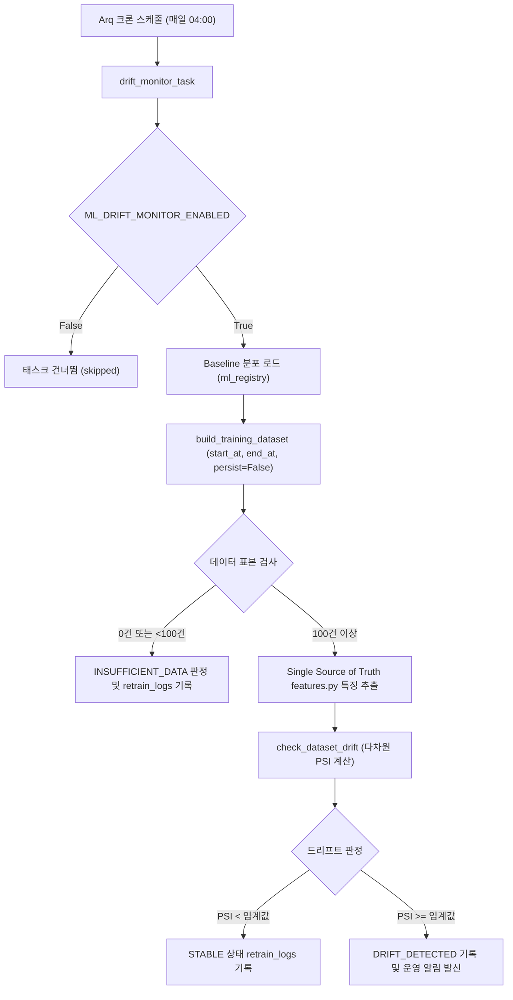

# PSI 드리프트 모니터링 운영 및 평가 윈도우 사양서

> **작성일**: 2026-09-03
> **상태**: 확정 (Active)
> **관련 모듈**: `src/ml/monitoring.py`, `src/ml/dataset.py`, `src/tasks/scheduled_tasks.py`
> **관련 테스트**: `tests/test_drift_monitor_window.py`, `tests/test_psi_drift_wiring.py`, `tests/test_drift_subgroup.py`

---

## 1. 개요

PSI(Population Stability Index) 드리프트 모니터링은 프로덕션 서빙 중인 기계학습 모델의 입력 데이터 분포 변화를 주기적으로 감지하여 모델 성능 저하를 사전에 예방하는 MLOps 모니터링 시스템입니다.

매일 04:00에 실행되는 `drift_monitor_task`는 운영 환경의 최근 N일 평가 데이터를 수집하여, 학습 시점에 고정된 기준 분포(Baseline)와의 다차원 PSI를 계산하고 드리프트 발생 여부를 판정합니다.

---

## 2. 평가 윈도우 기반 데이터 쿼리

### 2.1 윈도우 필터링 계약

모니터링 대상 데이터는 전체 이력이 아닌 최근 지정된 기간(`evaluation_window_days`, 기본값 7일)의 데이터로 한정됩니다.

- **기준 시각**: `now = utcnow()`
- **구간 계산**: `start_at = now - timedelta(days=evaluation_window_days)`, `end_at = now`
- **구간 형태**: `[start_at, end_at)` 반열림 구간 (Left-closed, Right-open)
  - `start_at` (시작 경계): **포함** (`BidResult.rl_openg_dt >= start_at`)
  - `end_at` (종료 경계): **제외** (`BidResult.rl_openg_dt < end_at`)
- **필터링 컬럼**: 실제 개찰일시인 `BidResult.rl_openg_dt` 기준

### 2.2 함수 시그니처 확장 (`src/ml/dataset.py`)

`build_training_dataset` 함수는 하위 호환성을 유지하면서 날짜 필터링과 비파괴 옵션을 지원합니다.

```python
def build_training_dataset(
    db_session: Session,
    category_code: str,
    output_dir: str = DEFAULT_OUTPUT_DIR,
    *,
    require_announcement: bool = True,
    limit: int | None = None,
    start_at: datetime | str | None = None,
    end_at: datetime | str | None = None,
    persist: bool = True,
) -> pd.DataFrame:
```

- `start_at` (기본값 `None`): 지정 시 해당 개찰일시 이상의 데이터만 조회
- `end_at` (기본값 `None`): 지정 시 해당 개찰일시 미만의 데이터만 조회
- `start_at=None`, `end_at=None` 인 경우 기존과 동일하게 전체 이력을 조회하여 기존 학습 파이프라인(`retrain_task.py`)과의 100% 호환성을 보장합니다.

---

## 3. 비파괴 관측 원칙 (Non-destructive Monitoring)

모니터링은 데이터의 상태를 관측하는 작업이어야 하며, 관측 행위 자체가 운영 데이터셋을 변경해서는 안 됩니다.

- `persist=True` (기본값): 학습 경로에서 사용되며, 정제된 데이터를 `output_dir/dataset_{category}.parquet` 파일로 캐싱합니다.
- `persist=False` (모니터링 전용): `drift_monitor_task`에서 사용되며, Parquet 캐시 파일을 디스크에 쓰지 않고 메모리 상의 `pd.DataFrame`만 반환합니다.
- 이로써 주기적 모니터링이 모델 학습용 Parquet 캐시를 덮어쓰거나 훼손하는 문제를 원천 차단합니다.

---

## 4. 표본 유효성 및 부족 처리

평가 윈도우가 좁아지면(예: 최근 7일) 특정 카테고리의 공고/낙찰 건수가 부족할 수 있습니다. 시스템은 표본 부족을 정상(STABLE)으로 오인하지 않고 명시적인 상태로 기록합니다.

| 상황 | 판정 상태 | 처리 내용 |
| --- | --- | --- |
| 윈도우 내 데이터 0건 (`df_raw.empty`) | `INSUFFICIENT_DATA` | `retrain_logs`에 사유 및 평가 윈도우 정보 기록, 알림 미발신 |
| 특징별 유효 표본 < 100건 (`DEFAULT_MIN_SAMPLES`) | `INSUFFICIENT_DATA` | 개별 특징 및 전체 상태 `INSUFFICIENT_DATA` 판정, 알림 미발신 |
| 표본 100건 이상 & 모든 특징 PSI < 임계값 | `STABLE` | 정상 상태, `retrain_logs`에 기록 |
| 표본 100건 이상 & 1개 이상 특징 PSI >= 임계값 | `DRIFT_DETECTED` | `retrain_logs`에 기록 및 `notify_drift_detected` 알림 발신 |

---

## 5. 결측 집단(Subgroup) 분리 평가

용역(Servc) 등 일부 모델에서 낙찰하한율(`lwlt_rate`)이 존재하는 공고와 비예가 등으로 결측된 공고 간의 분포 차이를 반영하기 위해 집단별 분리 평가를 수행합니다.

- **with_lwlt (`0.0`)**: 낙찰하한율 보유 집단 (PSI 임계값: `0.20`, 최소 표본: 100건)
- **missing_lwlt (`1.0`)**: 낙찰하한율 결측 집단 (PSI 임계값: `0.25` 완화, 최소 표본: 100건)
- **종합 판정**: 두 집단 중 어느 한쪽이라도 DRIFT_DETECTED인 경우 전체 모델이 DRIFT_DETECTED로 판정되며, 결측 집단만 드리프트인 경우 `"missing_lwlt_only"` 라벨로 알림을 발신합니다.

---

## 6. 운영 아키텍처 및 안전 장치



- **인간 개입 원칙**: 드리프트가 감지되어도 자동 재학습이나 자동 모델 승격은 절대 발생하지 않으며, 운영 담당자에게 알림만 발신합니다.
- **단일 특징 생성 원천**: `src/ml/features.py` 단일 모듈을 통해 baseline과 recent feature의 일관성을 유지합니다.

---

## 7. 검증 및 테스트 방법

```bash
# 윈도우 쿼리 및 비파괴 모니터링 단위/통합 테스트
uv run pytest tests/test_drift_monitor_window.py -v

# 전체 드리프트 모니터링 관련 테스트
uv run pytest tests/test_drift_monitor_window.py tests/test_psi_drift_wiring.py tests/test_drift_subgroup.py -v
```
