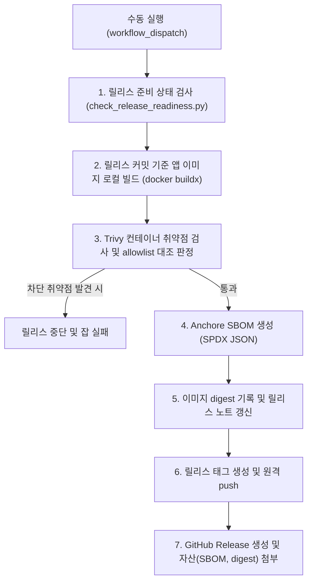

# 릴리스 절차

> **작성일**: 2026-09-03
> **수정일**: 2026-09-16
> **상태**: 운용 준비
> **정본 버전**: `pyproject.toml`의 `[project].version`

---

## 1. 운영 원칙

릴리스 버전은 `pyproject.toml`의 `[project].version` 하나만 읽습니다. 태그는 그 값에 `v` 접두사를 붙인 문자열로 자동 파생하므로, 워크플로 또는 문서에 특정 버전 값을 따로 적지 않습니다. PEP 440 사전 릴리스 버전은 SemVer 태그 형식으로 자동 정규화됩니다.

릴리스 시작 방식은 `workflow_dispatch`입니다. `main` 병합마다 자동 릴리스가 발생하면 담당자가 배포 시점을 통제할 수 없으므로, 담당자가 GitHub Actions에서 명시적으로 워크플로를 시작해야 합니다. Pull Request를 전제로 하지 않으며, 이 저장소의 1인 작업 및 직접 병합 규칙을 따릅니다.

---

## 2. 릴리스 실행 절차

릴리스 워크플로는 태그 생성 이전에 이미지 빌드, 취약점 스캔, SBOM 생성 및 이미지 digest 기록을 먼저 완료하여 결함이 있는 이미지가 태그나 릴리스로 발행되지 않도록 차단합니다.



1. 작업 브랜치에서 변경을 완료하고 `main`에 병합합니다.
2. `main`의 CI가 성공할 때까지 기다립니다.
3. GitHub Actions의 `Release` 워크플로에서 `Run workflow`를 선택하고 `main`을 대상 브랜치로 지정합니다.
4. 워크플로가 릴리스 준비 상태를 검사합니다(`scripts/check_release_readiness.py`).
5. 직전 릴리스 태그 이후의 커밋을 커밋 type별로 묶은 릴리스 노트를 생성합니다.
6. 릴리스 커밋 기반으로 운영 애플리케이션 컨테이너 이미지를 로컬 빌드(`docker buildx build --load`)합니다. 태그는 릴리스 태그(`refac-bid-box:${RELEASE_TAG}`)를 지정하며, Dockerfile의 target은 운영 compose(`docker-compose.prod.yml`)의 app 서비스와 동일하게 맞춥니다.
7. Trivy로 이미지의 OS/라이브러리 취약점을 스캔하고, `scripts/filter_trivy_results.py` 및 `.github/vulnerability-allowlist.yml`과 대조하여 판정합니다. 차단 취약점(CRITICAL/HIGH) 발견 시 잡이 즉시 실패하며 태그 및 릴리스가 생성되지 않습니다.
8. Anchore SBOM 액션(`anchore/sbom-action`)으로 이미지의 소프트웨어 자재명세서(SPDX JSON)를 생성합니다.
9. 빌드된 이미지의 ID 및 sha256 digest를 `image-digest.txt` 파일로 기록하고, 릴리스 노트 끝에 이미지 digest를 한 줄 덧붙입니다.
10. 모든 사전 검증 및 산출물 생성이 완료되면 버전에서 태그를 파생하고 태그를 원격에 push합니다.
11. 생성된 SBOM 파일(`refac-bid-box-sbom.spdx.json`) 및 이미지 digest 파일(`image-digest.txt`)을 GitHub 릴리스 자산으로 첨부하여 GitHub Release를 생성합니다.

---

## 3. 릴리스 산출물 및 자산

릴리스 실행 시 GitHub Release에 게시 및 첨부되는 공식 산출물 명세는 다음과 같습니다.

| 산출물 | 형식 / 파일명 | 설명 | 첨부 / 기록 위치 |
| --- | --- | --- | --- |
| 릴리스 태그 | `refs/tags/v<version>` | `pyproject.toml` 버전 기반 파생 Git 태그 (사전 릴리스는 SemVer 정규화) | 원격 Git 저장소 태그 |
| 릴리스 노트 | Markdown (`release-notes.md`) | 직전 태그 이후 커밋의 type별 분류 내역 및 하단 이미지 digest 라인 | GitHub Release 본문 |
| 이미지 SBOM | `refac-bid-box-sbom.spdx.json` | 애플리케이션 컨테이너 이미지 패키지·라이브러리 전체 명세서 (SPDX JSON) | GitHub Release 첨부 자산 |
| 이미지 Digest | `image-digest.txt` | 빌드된 운영 컨테이너 이미지의 Image ID 및 sha256 digest 기록 텍스트 | GitHub Release 첨부 자산 |
| 배포 이미지 식별자 | 텍스트 라인 (`Image Digest: <sha256:...>`) | 배포 이미지의 변조 방지 및 추적을 위한 고유 다이제스트 한 줄 표기 | 릴리스 노트 최하단 |

---

## 4. 릴리스 준비 상태 게이트

`scripts/check_release_readiness.py`가 다음 네 조건을 모두 확인합니다. 하나라도 실패하면 종료 코드 1을 반환하고 태그 생성 단계로 진행하지 않습니다.

| 검사 | 기준 |
| --- | --- |
| 작업 트리 | 추적·미추적 변경이 모두 없어야 합니다. |
| 브랜치 | 현재 브랜치가 `main`이어야 합니다. |
| 태그 중복 | 파생된 릴리스 태그가 로컬 저장소에 없어야 합니다. 전체 이력을 checkout하여 원격 태그도 조회합니다. |
| CI | 대상 커밋의 가장 최근 `CI` 워크플로 실행이 `completed` 및 `success`여야 합니다. |

CI 확인에는 GitHub Actions가 제공하는 `GITHUB_TOKEN`, `GITHUB_REPOSITORY`, `GITHUB_API_URL`을 사용합니다. CI 실행을 찾지 못하거나 실행 중이거나 실패한 경우 모두 게이트를 통과하지 못합니다.

---

## 5. 릴리스 노트 구성

노트는 새 태그를 만들기 전에 직전 `v` 태그와 현재 HEAD 사이의 커밋을 읽어 생성합니다. 커밋 제목의 `type: subject` 또는 `type(scope): subject` 형식을 해석하고 다음 순서로 묶습니다.

| type | 노트 묶음 |
| --- | --- |
| `feat` | `feat` |
| `fix` | `fix` |
| `docs` | `docs` |
| `refactor` | `refactor` |
| `chore` | `chore` |
| `test` | `test` |
| `ci` | `ci` |
| 그 외 | `기타` |

직전 태그가 없으면 저장소의 전체 커밋을 대상으로 합니다. 커밋 type 규약을 지키면 다음 릴리스에서 변경 유형별 이력을 바로 확인할 수 있습니다.

---

## 6. 사전 릴리스 (Prerelease) 지원

정식 릴리스 발행 이전에 배포 파이프라인 전체(빌드, Trivy 스캔, allowlist 판정, SBOM 생성, 다이제스트 기록, 릴리스 자산 첨부)를 사전 검증하기 위해 사전 릴리스 경로를 지원합니다.

### 6.1 버전 표기 및 태그 대응 규칙

Python 패키징 표준(PEP 440)에 따른 사전 릴리스 버전은 Git 및 컨테이너 생태계 표준인 SemVer 태그 형식으로 자동 정규화됩니다. 정식 릴리스 버전은 기존과 동일하게 접두사 `v`만 결합합니다.

| 분류 | PEP 440 버전 (`pyproject.toml`) | 정규화 Git 태그 | 설명 |
| --- | --- | --- | --- |
| 릴리스 후보 | `0.1.0rc1` | `v0.1.0-rc.1` | 배포 직전 최종 검증 후보 (Release Candidate) |
| 베타 | `1.2.0b2` | `v1.2.0-beta.2` | 주요 기능 통합 후 외부/통합 테스트 버전 |
| 알파 | `2.0.0a1` | `v2.0.0-alpha.1` | 기능 개발 및 초기 통합 단계 사전 공개 |
| 정식 릴리스 | `0.1.0` | `v0.1.0` | 정규 프로덕션 릴리스 (단순 접두사 부착) |

### 6.2 활용 목적 및 실행 순서

1. **활용 목적**: 첫 정식 릴리스(`v0.1.0`) 발행 전 비공개 초안(Draft) 또는 사전 릴리스 태그로 실제 컨테이너 이미지 빌드, Trivy 취약점 게이트, SBOM 생성 절차를 완전하게 통과시키고 검증할 때 사용합니다.
2. **실행 순서**:
   - `pyproject.toml`의 `[project].version`을 사전 릴리스 버전(예: `0.1.0rc1`)으로 지정하여 `main`에 병합합니다.
   - `main` 브랜치의 CI 성공을 확인한 뒤 `Release` 워크플로를 수동 실행(`workflow_dispatch`)합니다.
   - `scripts/check_release_readiness.py`가 버전을 감지하여 태그를 `v0.1.0-rc.1`로 정규화하고, `is_prerelease=true`를 GitHub Output으로 내보냅니다.
   - 워크플로는 `IS_PRERELEASE` 값이 참일 때만 `gh release create` 명령에 `--prerelease` 플래그를 추가합니다 (초안/공개 경로 모두 적용).
   - 정식 릴리스(`0.1.0`) 실행 시에는 `--prerelease` 플래그가 명령줄에 포함되지 않습니다.

### 6.3 직전 태그 탐색(`_previous_release_tag`) 영향

- `scripts/check_release_readiness.py`의 `_previous_release_tag`는 Git의 버전 역순 정렬(`git -c versionsort.suffix=- tag --list "v*" --sort=-version:refname`)을 사용하여 직전 릴리스 태그를 결정합니다.
- **`versionsort.suffix` 지정은 필수입니다.** 그것이 없으면 Git 기본 `version:refname` 정렬은 `v0.1.0-rc.1`을 정식 태그 `v0.1.0`보다 **높게** 둡니다. 그 상태로 다음 버전 노트를 만들면 직전 태그로 사전 릴리스가 뽑혀 정식 릴리스에서 이미 발행한 커밋이 다시 들어갑니다. `versionsort.suffix=-`를 주면 `-`로 시작하는 접미사가 사전 릴리스로 취급되어 `v0.1.0-rc.1`이 `v0.1.0`보다 낮아집니다. 회귀 검사는 `tests/test_release_readiness.py`의 `test_prerelease_tag_does_not_become_previous_tag_of_later_release`입니다.
- 따라서 후속 정식 릴리스(`v0.1.0`) 발행 시 직전 태그로 `v0.1.0-rc.1`이 선택되어, 사전 릴리스 이후 새롭게 추가된 커밋들만 릴리스 노트 본문으로 집계됩니다.
- 반대로 첫 번째 릴리스로 사전 릴리스를 발행할 경우 이전 태그가 없으므로 저장소의 전체 커밋 이력이 첫 릴리스 노트로 자동 작성됩니다.

---

## 7. 수동 복구 및 금지 사항

- 준비 상태 게이트를 우회하여 태그를 만들거나 GitHub Release를 생성하지 않습니다.
- 이미지를 외부 레지스트리에 푸시하거나 로그인하지 않습니다 (로컬 로드 빌드 및 취약점 검사 전용).
- 취약점 스캔(Trivy) 및 SBOM 생성이 완료되기 전에 태그를 생성하거나 원격에 push하지 않습니다.
- 이 작업에서는 실제 태그를 생성하거나 원격에 push하지 않았습니다. 실제 태그 생성은 담당자가 `workflow_dispatch`를 실행할 때만 수행됩니다.
- Pull Request 생성은 이 저장소의 운영 규칙에 어긋납니다.
- 이미지 서명은 이 절차에 포함하지 않습니다. Docker 데몬과 키 관리 방침을 먼저 결정해야 하므로 후속 미결 항목입니다.

---

## 8. 검증 명령

변경 후 다음 명령을 실행합니다.

```bash
uv run pytest tests/test_release_workflow.py -q
uv run actionlint
uv run pytest tests/ -q -m 'not data_assets'
python3 scripts/validate_agent_rules.py --quiet
```

격리 워크트리에는 원본 모델 가중치와 `chroma_db`가 없으므로 `data_assets` 표시는 이 검증에서 제외합니다. 이 환경에서 해당 자산 존재 검사 두 건이 실패하는 것은 릴리스 자동화 결함이 아닙니다.
