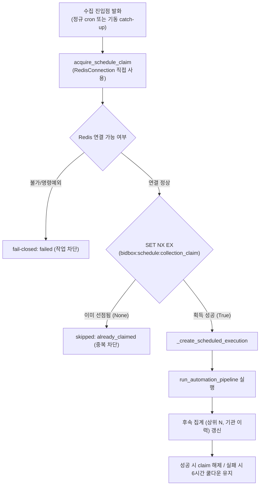

# Arq 스케줄러 및 기동 시 수집 따라잡기 운영 명세서

> **작성일**: 2026-09-03
> **상태**: 운영 정본
> **대상 모듈**: `src/tasks/worker.py`, `src/tasks/scheduled_tasks.py`, `src/app/core/config.py`

---

## 1. 개요

본 문서는 refac_bid_box 프로젝트의 정기 크론 스케줄 구조 및 워커 프로세스 오프라인 중 누락된 수집을 복구하기 위한 **기동 시 스케줄 따라잡기(Startup Catch-up)** 메커니즘을 정의합니다.

기존 모놀리식의 Harness 야간 파이프라인 및 Airflow 주간 재학습 DAG는 Arq 크론 기반 비동기 워커로 단일화되었습니다. 그러나 Arq 크론은 프로세스가 실행 중인 상태에서 정해진 시각(02:00 등)이 도래해야만 발화하며, 개발 장비 오프라인 등으로 워커가 중지되어 있는 동안 누락된 스케줄은 자동으로 소급 실행되지 않는 한계가 있었습니다.

이에 따라 프로세스 기동 시점에 마지막 수집 시각을 확인하고, 임계를 초과한 경우 누락된 수집을 안전하게 백그라운드로 보충 실행하는 따라잡기 메커니즘을 도입하였습니다.

---

## 2. 정기 크론 스케줄 구조

워커 프로세스는 `src.tasks.worker.WorkerSettings`에 정의된 크론 규칙에 따라 주기적인 자동화 작업을 수행합니다.

| 스케줄 태스크 | 발화 시각 | 기본 활성 여부 | 주요 작업 내용 |
| --- | --- | :---: | --- |
| `development_data_refresh_task` | 매일 02:00 | **True** | 개발 DB 최신화 (공고/낙찰 수집, KB 갱신, 상위 N/기관이력 집계) |
| `nightly_schedule_task` | 매일 02:00 | **False** | 운영 전체 야간 번들 (수집, KB, 예측, 전체 검증, 집계 갱신) |
| `weekly_retrain_task` | 매주 월 03:00 | **False** | 카테고리별 모델 자동 재학습 파이프라인 (fan-out) |
| `drift_monitor_task` | 매일 04:00 | **False** | 7일 윈도우 개찰 데이터 기반 다차원 PSI 드리프트 모니터링 |
| `backup_schedule_task` | 매일 03:00 | **False** | MySQL/ChromaDB/가중치 정기 통합 스냅샷 백업 |

- `development_data_refresh_task`와 `nightly_schedule_task`는 상호 배타적입니다. `AUTOMATION_NIGHTLY_SCHEDULE_ENABLED=True`인 경우 `development_data_refresh_task`는 `skipped:nightly_schedule_enabled`로 안전하게 건너뜁니다.
- 개발 환경 및 도커 컴포즈 표준 구성에서는 가벼운 `development_data_refresh_task`가 기본 활성화(True)되며, 전체 검증·재학습을 수반하는 `nightly_schedule_task`는 비활성화(False)됩니다.

---

## 3. 기동 시 수집 따라잡기 및 공통 Redis 원자 claim 아키텍처



### 3.1 6대 설계 원칙

1. **명시적 활성화 (Disabled by Default)**:
   - 기동만으로 대량의 공고/낙찰 데이터를 외부 API로부터 수집하는 무거운 작업이 자동 발화되는 것은 의도치 않은 리소스 점유를 유발합니다.
   - 따라서 `AUTOMATION_SCHEDULE_CATCHUP_ENABLED`의 기본값은 `False`이며, 컨테이너 환경변수나 `.env`를 통해 명시적으로 켠 경우에만 동작합니다.

2. **Redis SET NX EX 기반 공통 원자 claim 및 고유 소유 토큰 (Atomic Claim & Unique Ownership Token)**:
   - `CacheLayer`는 Redis 장애 시 프로세스 로컬 메모리로 degrade하므로 분산 단일 실행 가드로 사용할 수 없습니다.
   - 따라서 `RedisConnection`을 직접 사용하여 `SET bidbox:schedule:collection_claim payload EX {ttl} NX` 단일 원자 명령으로 실행 권한을 선점합니다.
   - 각 실행은 획득 시 발급되는 UUID 고유 소유 토큰(`token`)을 payload에 포함합니다.
   - 해제(`release_schedule_claim`)는 단순 DEL이나 GET 후 DEL 조합이 아니라 Redis Lua 스크립트(`RELEASE_SCHEDULE_CLAIM_SCRIPT`)를 통한 **단일 원자 비교-삭제**로 수행됩니다. 이를 통해 이전 실행(stale owner)이 지연 후 완료될 때 TTL 만료 뒤 새로 생성된 후속 실행의 claim을 잘못 삭제하는 경합을 원천 차단합니다.

3. **공통 정규 진입점 단일 가드 (Shared Entrypoint Guard & Zero Self-Collision)**:
   - 정규 cron 2종(`nightly_schedule_task`, `development_data_refresh_task`)과 기동 따라잡기가 동일한 claim 키(`bidbox:schedule:collection_claim`)와 TTL 계약을 공유합니다.
   - 따라잡기 진입점(`run_schedule_catchup_task`)은 바깥에서 별도로 claim을 획득하지 않고 호출 대상 스케줄 태스크 내부의 원자 claim을 그대로 재사용하여 자기 충돌(self-collision)과 우회 경로를 방지합니다.

4. **Redis 장애 시 무조건 차단 (Fail-Closed Policy)**:
   - Redis 서버 미가용, 연결 순단, 타임아웃, 명령 오류 발생 시 작업을 허용(fail-open)하지 않고 즉시 작업을 중단(fail-closed, `redis_unavailable` / `command_error`)합니다.
   - `run_automation_pipeline` 및 후속 집계 함수가 절대 호출되지 않도록 엄격히 보장합니다.

5. **비차단 백그라운드 기동 (Non-blocking Startup)**:
   - 데이터 수집 및 집계 파이프라인은 네트워크 및 DB 상황에 따라 수십 분이 소요될 수 있습니다.
   - 워커의 `_on_startup` 훅에서 동기(`await`)로 대기하지 않고, `asyncio.create_task`를 통해 비동기 백그라운드 태스크로 분리 실행합니다.
   - 따라잡기 작업 중 예외가 발생하더라도 워커 프로세스의 생존과 다른 Arq 큐 작업 처리에 일절 영향을 주지 않도록 예외를 완전 격리합니다.

6. **성공 해제 및 실패/부분실패 쿨다운 유지 (Success-Only Release & Failure Cooldown)**:
   - 외부 API 장애, 네트워크 순단 등으로 수집이 실패한 상태에서 워커 컨테이너가 재시작을 반복할 경우, 매 기동마다 수집을 재시도하여 외부 API 쿼터를 소진하거나 부하를 가중시키는 사고가 발생할 수 있습니다.
   - 파이프라인 실행 중 예외 발생뿐만 아니라, 파이프라인이 예외 없이 `status=failed` 또는 `partial` 결과 dict를 반환한 경우, 그리고 후속 집계 실패로 `partial_success`가 된 경우에도 claim을 해제하지 않고 유지합니다.
   - 오직 파이프라인 및 후속 집계가 전량 정상 완료(`status == "success"`)된 경우에만 자기 토큰으로 claim을 해제합니다. 실패 시에는 claim 키가 TTL(`AUTOMATION_SCHEDULE_CATCHUP_COOLDOWN_HOURS`, 기본 6시간) 동안 유지되어 재시작 루프에 의한 반복 수집을 완벽히 방어합니다.

---

## 4. 환경 변수 및 설정 명세

| 설정 키 | 타입 | 기본값 | 설명 |
| --- | :---: | :---: | --- |
| `AUTOMATION_DATA_REFRESH_SCHEDULE_ENABLED` | bool | `True` | 개발 DB 최신화 크론 활성화 (기본 경로) |
| `AUTOMATION_NIGHTLY_SCHEDULE_ENABLED` | bool | `False` | 운영 전체 야간 번들 크론 활성화 |
| `AUTOMATION_SCHEDULE_CATCHUP_ENABLED` | bool | `False` | 기동 시 누락 수집 따라잡기 활성화 |
| `AUTOMATION_SCHEDULE_CATCHUP_THRESHOLD_HOURS` | int | `24` | 수집 누락 판정 기준 경과 시간 (시간 단위) |
| `AUTOMATION_SCHEDULE_CATCHUP_COOLDOWN_HOURS` | int | `6` | 재시작 루프 방어 재시도 쿨다운 (시간 단위) |

---

## 5. 관측성 및 실행 이력 추적

따라잡기 판정 및 실행 결과는 구조화 로그와 Redis 캐시 상태 원장에 완벽히 기록됩니다.

1. **구조화 로그**:
   - 판정 시점: `스케줄 따라잡기 판정: needed={bool}, reason={str}, details={dict}`
   - 실행 착수: `스케줄 따라잡기 실행 시작 (target_task={task}, details={dict})`
   - 판단 근거(마지막 수집 시각, 경과 시간, 임계값 등)가 항상 로그에 명시되어 사후 감사(Audit)가 가능합니다.

2. **Redis 상태 원장 및 단일 실행 claim**:
   - 실행 claim 키: `bidbox:schedule:collection_claim` (SET NX EX, TTL 기본 6시간)
     - 페이로드 스키마:
       ```json
       {
         "owner": "nightly_schedule",
         "token": "4f9b8c2e0a1b4c6d8e9f0a1b2c3d4e5f",
         "claimed_at": "2026-09-03T02:00:00+00:00",
         "ttl": 21600
       }
       ```
     - `nightly_schedule_task`, `development_data_refresh_task`, 기동 따라잡기가 공통 사용
     - 분산 환경 다중 워커 및 동시 스케줄 발화 시 단일 실행 보장
     - Redis 장애 시 fail-closed 정책으로 비정상 중복 수집 원천 차단
     - 정상 완료 시 자기 토큰 비교를 통한 원자적 해제 (`RELEASE_SCHEDULE_CLAIM_SCRIPT`)
   - 스케줄 결과 원장 키: `bidbox:worker:schedules`
   - 필드 `schedule_catchup`:
     ```json
     {
       "last_run_at": "2026-09-03T18:45:00+00:00",
       "success": true
     }
     ```
