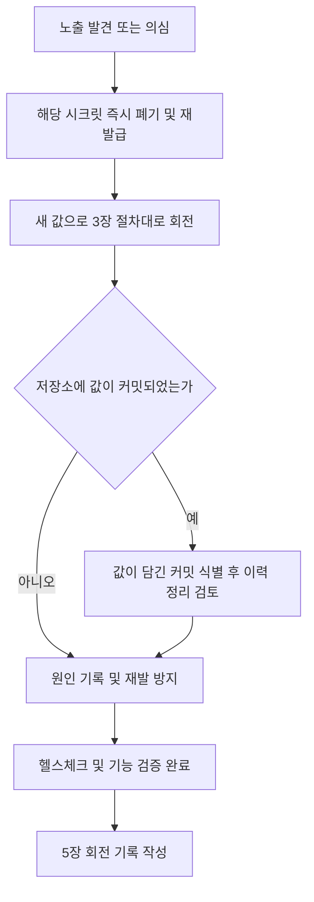

# 시크릿 회전 런북 (Secret Rotation Runbook)

> **작성일**: 2026-09-27
> **버전**: v1.0.0
> **적용 범위**: refac_bid_box 운영 환경의 모든 시크릿
> **핵심 원칙**: 시크릿 값은 `.env` 에만 존재한다. 본 문서를 포함한 어떤 문서·커밋·로그에도 값을 적지 않으며, 변수 이름만 다룬다.

---

## 1. 개요와 원칙

본 런북은 정기 회전과 노출 사고 대응의 절차 정본이다. 모든 시크릿은 다음 원칙을 따른다.

1. **단일 보관소**: 시크릿 값은 프로젝트 루트의 `.env` 에만 둔다. `.env` 는 gitignore 대상이며, 커밋 스캔(pre-commit gitleaks 훅)과 CI 검사(`lint-and-validate` 잡의 gitleaks 단계)가 저장소 유출을 차단한다.
2. **값 비기록**: 문서, 커밋 메시지, 이슈, 채팅에 시크릿 값을 절대 적지 않는다. 예시가 필요하면 `change-me-...` 자리표시자만 쓴다.
3. **회전 후 검증 필수**: 회전은 새 값 반영과 서비스 재시작, 헬스체크 확인까지 완료해야 끝난다. 5장의 기록 양식에 이름과 결과만 남긴다.
4. **노출 의심 시 즉시 폐기**: 회전 주기와 무관하게 노출이 의심되면 그 시점에 즉시 회전한다.

---

## 2. 시크릿 목록, 보관 위치, 회전 주기

| 시크릿 | 용도 | 보관 위치 | 영향 서비스 | 회전 주기 권고 |
| --- | --- | --- | --- | --- |
| `SECRET_KEY` | 세션 서명 및 CSRF 암호화 | `.env` | web, worker | 90일 |
| `MYSQL_ROOT_PASSWORD` | MySQL root 관리자 | `.env` | db, web, worker | 90일 |
| `DB_PASSWORD` | 운영 앱 DB 계정 (`DB_USER` 계정) | `.env` | db, web, worker, backup | 90일 |
| `BACKUP_DB_PASSWORD` | 백업 전용 DB 계정 (`BACKUP_DB_USER` 계정) | `.env` | backup | 90일 |
| `DATABASE_URL` | SQLAlchemy 연결 문자열 (위 비밀번호를 포함) | `.env` | web, worker, backup | 함께 회전 |
| `MEILI_MASTER_KEY` | Meilisearch 인증 | `.env` | meili, web, worker | 90일 |
| `GEMINI_API_KEY` | Google Gemini 대체 LLM 인증 | `.env` | web, worker | 90일 |
| `G2B_SERVICE_KEY` | 조달청 공공데이터 수집 API 인증 (`serviceKey` 호환 변수 포함) | `.env` | worker | 180일 또는 발급처 정책 |
| `MLOPS_WEBHOOK_URL` | MLOps 경보 Slack 웹훅 | `.env` | web, worker | 180일 |
| `ALERTMANAGER_SLACK_WEBHOOK_URL` | Alertmanager SLO 알람 Slack 웹훅 | `.env` | alertmanager | 180일 |
| `GF_SECURITY_ADMIN_PASSWORD` | Grafana 관리자 로그인 | `.env` | grafana | 90일 |

보관 구조 참고: `docker-compose.yml` 과 `docker-compose.prod.yml` 은 `${...}` 형식으로 `.env` 값을 읽어 컨테이너 환경변수로 주입한다. 운영 compose 는 `SECRET_KEY`, `MEILI_MASTER_KEY`, `DB_PASSWORD`, `MYSQL_ROOT_PASSWORD`, `GF_SECURITY_ADMIN_PASSWORD` 를 `:?` 문법으로 필수 강제한다. 조달청 키는 `src/app/services/api_collector.py` 의 `get_service_key()` 가 `G2B_SERVICE_KEY` (호환 순서: `serviceKey`, `SERVICE_KEY`) 로 읽는다.

---

## 3. 회전 절차 (시크릿별)

모든 절차는 운영 `.env` 백업(값을 임시로 옮겨두는 용도, 회전 후 삭제)을 제외하고 다음 순서를 따른다.

### 3.1 `SECRET_KEY`

1. 새 값 생성: `python3 -c "import secrets; print(secrets.token_urlsafe(48))"`
2. 반영: `.env` 의 `SECRET_KEY` 교체. compose 가 web, worker 에 주입한다.
3. 재시작: `docker compose -f docker-compose.prod.yml up -d web worker`
4. 검증: `curl -fsS http://localhost:8000/api/v1/health` 200 확인, 로그인 후 세션 유지 확인
5. 주의: 키가 바뀌면 기존 세션과 서명 쿠키가 전부 무효화된다. 사용자 재로그인이 예상된다.

### 3.2 DB 비밀번호 (`DB_PASSWORD`, `MYSQL_ROOT_PASSWORD`, `BACKUP_DB_PASSWORD`)

1. 새 값 생성: `python3 -c "import secrets; print(secrets.token_urlsafe(32))"`
2. DB 계정 변경 (컨테이너 내부, 현재 비밀번호로 접속):
   - 앱 계정: `.env` 의 `DB_USER` 계정에 `ALTER USER` 실행
   - 백업 계정: `.env` 의 `BACKUP_DB_USER` 계정에 `ALTER USER` 실행
   - root: `mysql -u root -p` 접속 후 root 계정 `ALTER USER` 실행
3. 반영: `.env` 의 `DB_PASSWORD`, `MYSQL_ROOT_PASSWORD`, `BACKUP_DB_PASSWORD` 및 `DATABASE_URL`, 백업용 `DATABASE_URL` 내 비밀번호 부분 교체
4. 재시작: `docker compose -f docker-compose.prod.yml up -d web worker backup db`
5. 검증: `docker compose -f docker-compose.prod.yml ps` 에서 db, web, worker, backup 컨테이너 healthy 확인, `curl -fsS http://localhost:8000/api/v1/health` 200 확인, 백업 1회 수동 실행 성공 확인
6. 주의: `MYSQL_ROOT_PASSWORD` 는 최초 초기화 때만 적용되는 값이므로, 실제 root 비밀번호는 2번 절차의 `ALTER USER` 로 바꿔야 한다. `.env` 와 실제 계정 상태가 어긋나면 헬스체크가 실패한다.

### 3.3 `MEILI_MASTER_KEY`

1. 새 값 생성: `openssl rand -hex 32`
2. 반영: `.env` 의 `MEILI_MASTER_KEY` 교체
3. 재시작: `docker compose -f docker-compose.prod.yml up -d meili web worker`
4. 검증: meili 컨테이너 healthy 확인, 공고·낙찰 검색 API 응답 200 확인 (`MEILI_ENABLED=true` 환경 기준)
5. 주의: 마스터 키 변경으로 기존 API 키가 무효화되며, 인덱스 데이터는 보존된다.

### 3.4 `GEMINI_API_KEY`

1. 새 값 발급: Google AI Studio 에서 기존 키 폐기 후 재발급
2. 반영: `.env` 의 `GEMINI_API_KEY` 교체
3. 재시작: `docker compose -f docker-compose.prod.yml up -d web worker`
4. 검증: LLM 대체 경로 진단(의도 분류 또는 요약 1회 호출) 성공 확인

### 3.5 `G2B_SERVICE_KEY` (및 호환 `serviceKey`)

1. 새 값 발급: 공공데이터포털(data.go.kr) 마이페이지에서 기존 인증키 재발급
2. 반영: `.env` 의 `G2B_SERVICE_KEY` 교체. 운영에서 `serviceKey` 호환 변수를 함께 쓰는 경우 같은 값으로 교체
3. 재시작: `docker compose -f docker-compose.prod.yml up -d worker`
4. 검증: 공고 목록 조회 수집 1회 수동 실행 성공 확인
5. 주의: 발급처 정책상 주기 재발급이 요구되면 본 표의 주기를 따른다.

### 3.6 Slack 웹훅 (`MLOPS_WEBHOOK_URL`, `ALERTMANAGER_SLACK_WEBHOOK_URL`)

1. 새 값 발급: Slack 앱 설정에서 기존 웹훅 삭제 후 신규 생성
2. 반영: `.env` 의 해당 변수 교체
3. 재시작: `docker compose -f docker-compose.prod.yml up -d web worker alertmanager`
4. 검증: 테스트 알림 1회 발송되어 Slack 채널 수신 확인

### 3.7 `GF_SECURITY_ADMIN_PASSWORD`

1. 새 값 생성: `python3 -c "import secrets; print(secrets.token_urlsafe(24))"`
2. 반영: `.env` 의 `GF_SECURITY_ADMIN_PASSWORD` 교체
3. 재시작: `docker compose -f docker-compose.prod.yml up -d grafana`
4. 검증: 새 비밀번호로 Grafana 로그인 확인
5. 주의: 관리자 계정이 이미 생성된 이후에는 환경변수만 바꿔도 계정 비밀번호가 바뀌지 않는다. Grafana UI 에서 직접 비밀번호를 같은 값으로 변경하거나, UI 변경을 우선하고 `.env` 를 일치시킨다.

---

## 4. 노출 시 대응

노출 판단 기준: 시크릿이 커밋·로그·스크린샷·메신저·외부 저장소에 나타났거나, 나타났을 가능성을 배제할 수 없는 경우.

1. **폐기 우선**: 대응의 첫 단계는 항상 발급처에서 기존 값을 폐기하는 것이다. 폐기가 먼저다.
2. **커밋된 경우**: 값이 담긴 커밋 해시와 파일 경로를 식별한다. 값 자체는 다시 기록하지 않는다. 이력 정리(강제 푸시 수반)는 공유 브랜치 영향을 검토한 뒤 진행하고, 정리 후에도 값은 이미 폐기된 것으로 본다.
3. **게이트 확인**: 회전 후 `uv run pre-commit run gitleaks --all-files` 로 저장소 스캔이 깨끗한지 확인한다. 탐지가 뜨면 오탐 여부를 판정하고, 오탐이면 `.gitleaks.toml` 에 규칙·경로·사유를 남겨 허용한다. 실제 시크릿이면 허용 목록에 넣지 않고 회전 절차로 되돌아간다.
4. **전체 이력 점검**: 사고 규모 파악이 필요하면 `gitleaks git --redact --config .gitleaks.toml .` 으로 전체 이력을 검사한다.

---

## 5. 회전 기록 양식

회전이 끝날 때마다 아래 양식으로 이름과 결과만 기록한다. 값·값 일부는 기록 금지다.

| 날짜 | 시크릿 | 사유 (정기/노출) | 검증 결과 | 담당 |
| --- | --- | --- | --- | --- |
| YYYY-MM-DD | 변수 이름 | 정기 90일 | 헬스체크 및 기능 검증 통과 | 담당자 |

---

## 6. 관련 정본

- 시크릿 스캔 설정: `.gitleaks.toml` (오탐 허용 목록과 사유)
- pre-commit 훅: `.pre-commit-config.yaml` 의 gitleaks 훅
- CI 검사: `.github/workflows/ci.yml` 의 `lint-and-validate` 잡 gitleaks 단계
- 환경 변수 정의: `.env.example` 과 `docs/ops/environment_variables.md`
