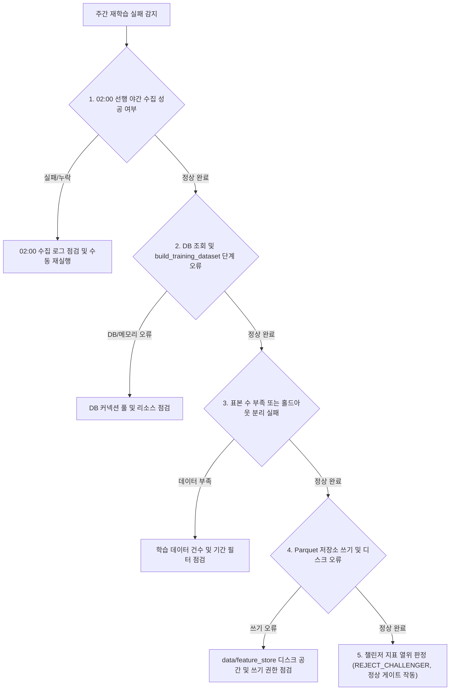

# 주간 재학습 검증 및 데이터셋 출처 가이드

> **작성일**: 2026-09-16
> **작성자**: 코디네이터/워커 조율팀
> **기준 커밋**: 261fa9a8
> **대상 컴포넌트**: `scripts/retrain_servc_from_parquet.py`, `src/tasks/retrain_task.py`, `src/tasks/scheduled_tasks.py`

---

## 1. 두 경로 비교

용역(`Servc`) 재학습은 Arq 크론 기반의 정기 주간 파이프라인과 로컬 오프라인 검증 스크립트라는 두 가지 경로가 공존합니다. 두 경로는 데이터셋을 읽어오는 출처와 저장 위치, 그리고 승격 처리 방식이 근본적으로 다릅니다.

| 경로 이름 | 진입점 | 데이터셋 출처 | 쓰는 위치 | 승격 여부 | 언제 쓰는가 |
| --- | --- | --- | --- | --- | --- |
| **주간 자동 재학습 파이프라인** | `src/tasks/scheduled_tasks.py::weekly_retrain_task` -> `src/tasks/retrain_task.py::run_retrain_pipeline_task` | **MySQL DB** (`build_training_dataset`으로 개찰 완료 공고 및 이력 실시간 조회·집계) | 기본 feature store (`data/feature_store/dataset_{category}.parquet`, 예: `data/feature_store/dataset_Servc.parquet`) 및 `ml_registry` | **자동 승격하지 않음** (챌린저 모델 등록 및 판정 권고 기록, 알림 발신. 승격은 운영자 수동) | 매주 월요일 03:00 KST 정기 실행. 축적된 최신 입찰/낙찰 데이터를 반영한 주간 정기 재학습 및 성능 드리프트/비교 검증 |
| **캐시 Parquet 기반 오프라인 재학습** | `scripts/retrain_servc_from_parquet.py` | **로컬 Parquet 파일** (기본값: `data/feature_store/dataset_{category}.parquet` 또는 `--parquet` 지정 경로, DB 접근 없음) | `ml_registry/{model_name}/{version}` (Parquet 파일은 덮어쓰지 않고 읽기만 수행) | **승격하지 않음** (`ml_registry`에만 등록 후 지표 및 현행 champion 비교표 출력. 채택 시 `src.ml.promotion.promote` 별도 호출) | 하이퍼파라미터 변경 검증, 모델 아키텍처 실험, DB 연결 없이 빠른 오프라인 재학습 검증이 필요할 때 |

### 두 경로의 데이터셋 불일치 함정

- **2026-09-15 승격 모델 (`v_20260915_133523_756`)**: 별도 디렉터리인 `data/feature_store/servc_rebuild_20260915/dataset_Servc.parquet` (925,054행, 개찰 2026-09-14 분까지 반영)로 학습하여 승격되었습니다.
- **기본 feature store (`data/feature_store/dataset_Servc.parquet`)**: 2026-08-03 시점 파일로 남아 있습니다.
- 만약 이 차이를 인지하지 못하고 `scripts/retrain_servc_from_parquet.py`를 기본 인자로 다시 실행하면, 6주 이상 묵은 오래된 데이터로 학습이 수행되면서도 아무런 경고가 발생하지 않는 위험이 있었습니다.
- 따라서 오프라인 스크립트 실행 전 데이터셋의 신선도를 기계적으로 강제하는 가드가 필수적입니다.

---

## 2. 첫 주간 재학습 결과 확인 절차

개발 환경(`docker-compose.yml`)에는 `ML_WEEKLY_RETRAIN_ENABLED=true`, `ML_WEEKLY_RETRAIN_CATEGORIES=Servc`로 설정되어 있으며, 운영 환경(`docker-compose.prod.yml`)은 기본적으로 `false`로 격리되어 있습니다. 첫 주간 재학습이 수행된 직후(월요일 03:00 KST 이후) 다음 절차에 따라 결과를 확인합니다.

### 2.1 확인 시점 및 선행 조건

1. **02:00 KST 선행 야간 수집 (`nightly_schedule_task`)**:
   - 02:00에 실행되는 수집 번들이 성공하여 DB에 신규 입찰·낙찰 데이터가 최신화되었는지 확인합니다.
2. **03:00 KST 주간 재학습 (`weekly_retrain_task`)**:
   - Arq 워커에 의해 `run_retrain_pipeline_task(trigger_source="weekly_schedule", category_code="Servc")`가 트리거됩니다.
   - DB에서 데이터를 새로 조회하여 `data/feature_store/dataset_Servc.parquet`을 갱신하고 모델 학습을 진행합니다.

### 2.2 재학습 실행 이력 (`retrain_logs`) 조회

반드시 읽기 전용 쿼리 실행기를 통해 단일 SELECT 문으로 실행 이력을 조회합니다.

```bash
uv run python scripts/db_readonly_query.py --sql "SELECT id, trigger_source, champion_version, challenger_version, status, created_at FROM retrain_logs ORDER BY id DESC LIMIT 5"
```

확인 사항:
- `trigger_source`가 `weekly_schedule`로 기록되었는지 확인합니다.
- `challenger_version`이 새로 발급되었는지 확인합니다.
- `status` 필드에 판정 결과(`REJECT_CHALLENGER` 또는 `PROCEED_CHALLENGER` / `HOLD`)가 정상적으로 기록되었는지 확인합니다.

### 2.3 알림 수신 확인

- 태스크 완료 시 `notify_retrain_result`가 발신하는 슬랙/웹훅 알림을 확인합니다.
- 알림 내용에 트리거 출처(`weekly_schedule`), 카테고리(`Servc`), 학습 표본 수, 챌린저 지표 vs 챔피언 지표 비교 내용이 포함되어 있는지 점검합니다.

### 2.4 기본 Feature Store 갱신 확인

기본 feature store 파일의 갱신 여부를 파일 메타데이터로 확인합니다.

```bash
# 파일 수정 시각 확인 (월요일 03:00 KST 이후로 변경되었는지 확인)
ls -l data/feature_store/dataset_Servc.parquet
```

확인 사항:
- 파일 수정 시각이 주간 재학습 실행 시각(03:00 KST) 전후로 갱신되었는지 확인합니다.
- 행 수가 2026-08-03 기준(약 91.8만 행)에서 최신 개찰분이 추가된 92.5만 행 이상으로 증가했는지 확인합니다.

### 2.5 자동 승격되지 않았음을 확인하는 방법

시스템 설계 원칙상 주간 재학습은 신규 챌린저 모델을 자동으로 승격시키지 않습니다.

1. **서빙 모델 메타데이터 확인**:
   - `src/ml/promotion.py::load_serving_metrics("servc_institution_v1")` 또는 `ml_registry/servc_institution_v1/serving_models.json`을 확인하여 현행 champion 버전(예: `v_20260915_133523_756`)이 그대로 유지되고 있는지 확인합니다.
2. **권고 확인 후 수동 승격 판단**:
   - 알림이나 `retrain_logs`의 권고가 `PROCEED_CHALLENGER`라 하더라도, 운영자가 홀드아웃 지표 및 쌍대 비교를 검토한 후 명시적으로 승격 함수를 호출해야만 서빙 모델이 교체됩니다.

---

## 3. 신선도 가드의 동작과 우회 방법

`scripts/retrain_servc_from_parquet.py`에는 오래된 Parquet 데이터로 조용히 학습되는 것을 차단하는 기계적 신선도 가드가 적용되어 있습니다.

### 3.1 동작 방식

1. **검사 시점**:
   - 파일 존재 여부를 확인한 직후, 실제 Parquet 파일을 메모리에 로드하거나 `--min-rows`를 검사하기 전에 가장 먼저 실행됩니다.
2. **허용 임계값**:
   - `--max-parquet-age-days` 인자로 제어하며, 기본값은 **14일**입니다.
3. **차단 조건 및 출력**:
   - 대상 Parquet 파일의 수정 시각(`mtime`)이 현재 시각 기준 `max_parquet_age_days`를 초과하면, 학습 프로세스를 시작하지 않고 **종료 코드 1**로 즉시 중단합니다.
   - 출력되는 안내 메시지:
     ```text
     [오류] 오래된 parquet 파일입니다: <파일경로>
     파일 수정 날짜: <YYYY-MM-DD HH:MM:SS> (경과 일수: <경과일>일, 허용 기준: 14일)
     기본 feature store 를 갱신하려면 DB 경로로 build_training_dataset 을 먼저 돌려야 합니다.
     기존 parquet 으로 강제 진행하려면 --allow-stale-parquet 플래그를 사용하십시오.
     ```
4. **인자 유효성 검사**:
   - `--max-parquet-age-days`에 0 이하(예: `0`, `-1`)를 전달하면 검사를 비활성화하는 것으로 처리하지 않고, **인자 오류(종료 코드 2)**로 즉시 거부합니다.

### 3.2 우회 방법

과거 특정 시점의 데이터셋 재현이나 오프라인 실험 목적상 불가피하게 오래된 Parquet을 사용해야 하는 경우:

- `--allow-stale-parquet` 플래그를 추가하여 실행합니다:
  ```bash
  .venv/bin/python scripts/retrain_servc_from_parquet.py --allow-stale-parquet
  ```
  이 경우 `[경고]` 메시지만 표준 출력으로 표시되며 학습이 정상 진행됩니다.
- 또는 허용 경과 일수를 명시적으로 늘려서 지정할 수 있습니다:
  ```bash
  .venv/bin/python scripts/retrain_servc_from_parquet.py --max-parquet-age-days 60
  ```

---

## 4. 실패했을 때의 판단 순서

주간 재학습 실행 과정에서 실패가 감지되었을 때 순서대로 다음 항목을 점검합니다.



1. **02:00 선행 야간 수집 성공 여부 확인**:
   - 02:00 야간 수집(`nightly_schedule_task`)이 실패하면 DB에 신규 개찰 데이터가 누락되어 옛 데이터로 재학습되거나 데이터셋 빌드 시 오류가 발생할 수 있습니다. `PipelineExecution` 테이블에서 야간 스케줄 상태를 먼저 확인합니다.
2. **DB 조회 및 `build_training_dataset` 오류 확인**:
   - Arq 워커 로그(`worker.log`)에서 DB 커넥션 풀 고갈, 쿼리 타임아웃, 대용량 조인 중 OOM(메모리 초과)이 발생했는지 확인합니다.
3. **학습 표본 수 부족 및 홀드아웃 분리 실패 확인**:
   - `df_train.empty`인 경우 태스크가 `skipped` 상태로 종료되고 알림이 전송됩니다.
   - 표본 수가 너무 적어 홀드아웃을 분리하지 못했을 경우(`holdout_is_overfit=True`), 과적합 방지를 위해 판정 결과가 자동으로 `REJECT_CHALLENGER`로 강제됩니다.
4. **Parquet 저장소 쓰기 및 디스크 권한 확인**:
   - `data/feature_store/` 디렉터리에 대한 쓰기 권한이 없거나, 디스크 용량이 고갈되어 Parquet 저장 중 I/O 에러가 발생했는지 점검합니다.
5. **챌린저 지표 열위 판정 확인 (`REJECT_CHALLENGER`)**:
   - 재학습 자체는 성공했으나 현행 챔피언 대비 RMSE/MAE 개선 폭이 미달하거나 R2 점수가 낮아 `REJECT_CHALLENGER`로 판정된 경우는 시스템 장애가 아니며, 엄격한 모델 검증 게이트가 정상 작동한 것입니다.
